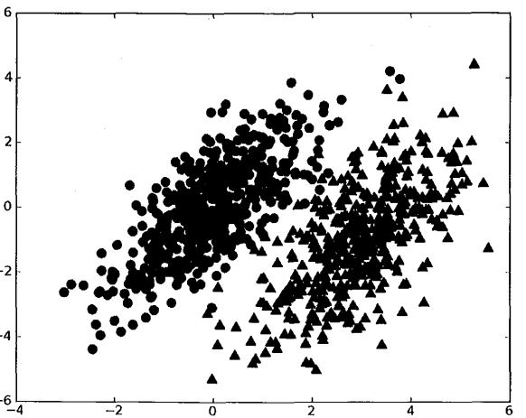
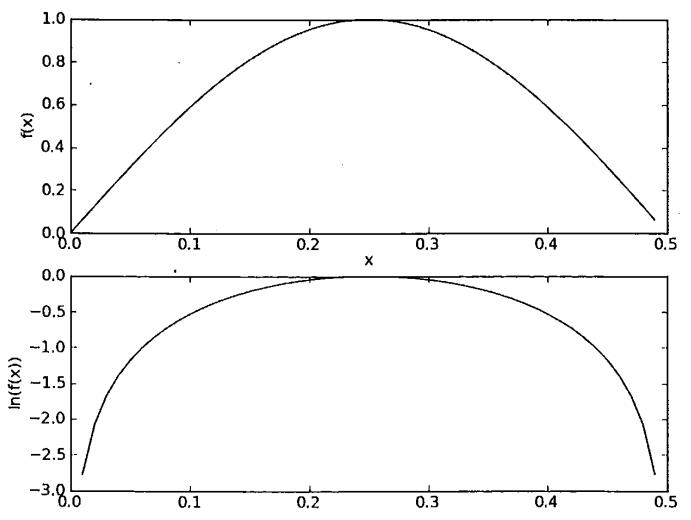

# 朴素贝叶斯

​      朴素贝叶斯分类是一种十分简单的分类算法，叫它朴素贝叶斯分类是因为这种方法的思想真的很朴素，朴素贝叶斯的思想基础是这样的：对于给出的待分类项，求解在此项出现的条件下各个类别出现的概率，哪个最大，就认为此待分类项属于哪个类别。通俗来说，就好比这么个道理，你在街上看到一个黑人，我问你你猜这哥们哪里来的，你十有八九猜非洲。为什么呢？因为黑人中非洲人的比率最高，当然人家也可能是美洲人或亚洲人，但在没有其它可用信息下，我们会选择条件概率最大的类别，这就是朴素贝叶斯的思想基础。

## 基于贝叶斯决策理论的分类方法

* 优点：在数据较少的情况下仍然有效，可以处理多类别问题。
* 缺点：对于输入数据的准备方式比较敏感。
* 使用数据类型：标称型数据。

### 贝叶斯决策论



现在又圆点（类别1），三角形（类别2）。

可以定义贝叶斯分类准则为：

* 如果$p(c_{1}|x,y)=\frac{p(x,y|c_{1})}{p(x,y)}>p(c_{2}|x,y)=\frac{p(x,y|c_{2})}{p(x,y)}$ , 那么属于类别1。
* 如杲$p(c_{1}|x,y)=\frac{p(x,y|c_{1})}{p(x,y)}<p(c_{2}|x,y)=\frac{p(x,y|c_{2})}{p(x,y)}$ , 那么属于类别2。


这些符号所代表的具体意义是：给定某个由$x,y$表示的数据点，那么该数据点来自类别1或2的概率是多少？ 

最后我们使用$w$表示一个向量，它由多个数值组成。有公式$p(c_{i}|w)=\frac{p(w|c_{i})p(c_{i})}{p(w)}$

如果将$w$展开为一个个独立特征，那么可以将上述概率写作$p(w_{0},w_{1},w_{2},....w_{N}|c_{i})$。这里假设所有的特征属性相互独立，该假设也称为*条件独立性假设*。我们可以将上述公式化简为：$p(w_{0}|c_{i})p(w_{1}|c_{i})...p(w_{N}|c_{i})$

## 使用朴素贝叶斯进行文档分类

朴素贝叶斯的一般过程

* 收集数据 ：可以使用任何方法。
* 准备数据：需要数值型或者布尔型数据。
* 分析数据：有大量特征时，绘制特征作用不大，此时使用直方图效果更好。
* 训练算法：计算不同的独立特征的条件概率。
* 测试算法：计算错误率。
* 使用算法：一个常见的朴素贝叶斯应用是文档分类。可以在任意的分类场景中使用朴素贝叶斯命类器，不一定非要是文本。

伪代码如下

```
计算每个类别中的文档数目
对每篇训练文档：
	对每个类别：
		如果词条出现文档中-》增加该词条的计数值
		增加所有词条的计数值
	对每个类别：
		对每个词条：
			将该词条的数目除以总词条数目得到条件概率
回每个类别的条件概率 
```


```python
from numpy import *


def loadDataSet():
    postingList = [['my', 'dog', 'has', 'flea', 'problems', 'help', 'please'],
                   ['maybe', 'not', 'take', 'him', 'to', 'dog', 'park', 'stupid'],
                   ['my', 'dalmation', 'is', 'so', 'cute', 'I', 'love', 'him'],
                   ['stop', 'posting', 'stupid', 'worthless', 'garbage'],
                   ['mr', 'licks', 'ate', 'my', 'steak', 'how', 'to', 'stop', 'him'],
                   ['quit', 'buying', 'worthless', 'dog', 'food', 'stupid']]
    classVec = [0, 1, 0, 1, 0, 1]  # 1 is abusive, 0 not
    return postingList, classVec


def createVocabList(dataSet):
    vocabSet = set([])  # create empty set
    for document in dataSet:
        vocabSet = vocabSet | set(document)  # union of the two sets
    return list(vocabSet)


def setOfWords2Vec(vocabList, inputSet):
    returnVec = [0] * len(vocabList)
    for word in inputSet:
        if word in vocabList:
            returnVec[vocabList.index(word)] = 1
        else:
            print("the word: %s is not in my Vocabulary!" % word)
    return returnVec


def trainNB0(trainMatrix, trainCategory):
    numTrainDocs = len(trainMatrix)
    # 所有词的数量
    numWords = len(trainMatrix[0])
    # A事件（标记为1）发生的概率
    pAbusive = sum(trainCategory) / float(numTrainDocs)
    # 生成一个numWords的矩阵，用于记录训练集的标记
    p0Num = zeros(numWords)
    p1Num = zeros(numWords)  # change to ones()
    # 用于记录训练集标记的总和
    p0Denom = 0
    p1Denom = 0  # change to 2.0
    for i in range(numTrainDocs):
        if trainCategory[i] == 1:
            # 如果词条出现文档中-》增加该词条的计数值
            p1Num += trainMatrix[i]
            # 增加所有词条的计数值
            p1Denom += sum(trainMatrix[i])
        else:
            p0Num += trainMatrix[i]
            p0Denom += sum(trainMatrix[i])
    # 将该词条的数目除以总词条数目得到条件概率
    p1Vect = p1Num / p1Denom  # change to log()
    p0Vect = p0Num / p0Denom  # change to log()
    # p(w|0),p(w|1)
    return p0Vect, p1Vect, pAbusive

if __name__ == '__main__':
    # 生成训练集数据
    listOPosts, listClasses = loadDataSet()
    # 创建词的列表
    myVocabList = createVocabList(listOPosts)
    myVocabList = sorted(myVocabList)
    # 遍历每一篇文章，对每一篇文章都创建词向量
    trainMat = [setOfWords2Vec(myVocabList, postinDoc) for postinDoc in listOPosts]
    for i in trainNB0(trainMat, listClasses):
        print(i)
```

运行结果。词汇表中的第9个词是garbage, 其在类别1中出现2次 ，而在类别0中从未出现。对应的条件概率分别为0.05263158与0.0。 文档属于侮辱类的概率pAb为0. 5。

```
[ 0.04166667  0.04166667  0.          0.04166667  0.04166667  0.04166667
  0.04166667  0.          0.          0.04166667  0.04166667  0.08333333
  0.04166667  0.04166667  0.04166667  0.04166667  0.          0.04166667
  0.125       0.          0.          0.04166667  0.          0.04166667
  0.          0.04166667  0.04166667  0.04166667  0.          0.
  0.04166667  0.        ]
[ 0.          0.          0.05263158  0.          0.          0.10526316
  0.          0.05263158  0.05263158  0.          0.          0.05263158
  0.          0.          0.          0.          0.05263158  0.          0.
  0.05263158  0.05263158  0.          0.05263158  0.          0.05263158
  0.          0.          0.05263158  0.15789474  0.05263158  0.05263158
  0.10526316]
0.5
```

### 算法改进

* 利用贝叶斯分类器对文档进行分类时，要计算多个概率的乘积以获得文档属于某个类别的概率 ，即计算$p(w_{0}|c_{i})p(w_{1}|c_{i})...p(w_{N}|c_{i})$ 。如果其中一个概率值为0 , 那么最后的乘积也为0。为降低这种影响，可以将所有词的出现数初始化为1，并将分母初始化为2。这种方法我们称之为*拉普拉斯平滑*。

  ``` 
  p0Num = ones(numWords)
  ...
  p0Denom = 2.0
  ```

* 下溢出，这是由于太多很小的数相乘造成的。在计算$p(w_{0}|c_{i})p(w_{1}|c_{i})...p(w_{N}|c_{i})$的时候，由于大部分因子都非常小。

  ```
  p1Vect = log(p1Num / p1Denom)
  ```

  ```
  [-2.56494936 -2.56494936 -3.25809654 -2.56494936 -2.56494936 -2.56494936
   -2.56494936 -3.25809654 -3.25809654 -2.56494936 -2.56494936 -2.15948425
   -2.56494936 -2.56494936 -2.56494936 -2.56494936 -3.25809654 -2.56494936
   -1.87180218 -3.25809654 -3.25809654 -2.56494936 -3.25809654 -2.56494936
   -3.25809654 -2.56494936 -2.56494936 -2.56494936 -3.25809654 -3.25809654
   -2.56494936 -3.25809654]
  [-3.04452244 -3.04452244 -2.35137526 -3.04452244 -3.04452244 -1.94591015
   -3.04452244 -2.35137526 -2.35137526 -3.04452244 -3.04452244 -2.35137526
   -3.04452244 -3.04452244 -3.04452244 -3.04452244 -2.35137526 -3.04452244
   -3.04452244 -2.35137526 -2.35137526 -3.04452244 -2.35137526 -3.04452244
   -2.35137526 -3.04452244 -3.04452244 -2.35137526 -1.65822808 -2.35137526
   -2.35137526 -1.94591015]
  0.5
  ```

  


最后我们将刚刚的二分类算法作改进，使其支持多个分类。

```python
def trainNB0(trainMatrix, trainCategory, class_num):
    numTrainDocs = len(trainMatrix)
    # 所有词的数量
    numWords = len(trainMatrix[0])
    # 生成一个numWords的矩阵，用于记录训练集的标记
    num = [ones(numWords) for i in range(class_num)]
    # 用于记录训练集标记的总和
    Demon = [2 for i in range(class_num)]
    for i in range(numTrainDocs):
        num[trainCategory[i]] += trainMatrix[i]
        Demon[trainCategory[i]] += sum(trainMatrix[i])
    vect = []
    for i in range(class_num):
        vect.append(log(num[i] / Demon[i]))
    return vect


def classifyNB(vec2Classify, vect):
    # 数组乘法
    temp = [sum(vec2Classify * each_vect) for each_vect in vect]
    return temp.index(max(temp))


if __name__ == '__main__':
    # 生成训练集数据
    listOPosts, listClasses = loadDataSet()
    # 创建词的列表
    myVocabList = createVocabList(listOPosts)
    myVocabList = sorted(myVocabList)
    # 遍历每一篇文章，对每一篇文章都创建词向量
    trainMat = [setOfWords2Vec(myVocabList, postinDoc) for postinDoc in listOPosts]
    vect = trainNB0(trainMat, listClasses, 2)
    print(vect)

    testEntry = ['love', 'my', 'dalmation']
    thisDoc = array(setOfWords2Vec(myVocabList, testEntry))
    print(testEntry, 'classified as: ', classifyNB(thisDoc, vect))
    testEntry = ['stupid', 'garbage']
    thisDoc = array(setOfWords2Vec(myVocabList, testEntry))
    print(testEntry, 'classified as: ', classifyNB(thisDoc, vect))
```

