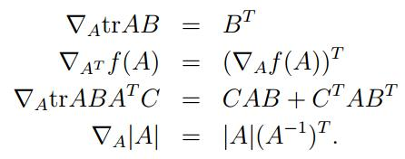

# 线性回归

我们看到一个例子：

在这里假设$x$是一个在$R^{2}$里面的两位向量。比如，$x_{1}^{i}$是训练集里面的Living area。

为了执行监督学习，我们设定一个函数$h$，我们称之为假设函数（hypotheses）。我们先假设一个线性函数：

$h_{\theta}(x)=\theta_{0}+\theta_{1}x_{1}+\theta_{2}x_{2}$

在这里$\theta_{i}$是一个参数（也称为权重），代表函数从X到Y映射的线性函数的空间。

我们令$x_{0}=1$，则有：

$h(x)=\sum_{n}^{i=0}\theta_{i}x_{i}=\theta^{T}x$

$n$代表训练集输入的属性维度数。

我们假设$y$是正确的结果则我们希望，$\frac{1}{2}\sum_{i=1}^{m}(h_{\theta}(x)-y)^{2}$尽可能小。所以我们定义

$J(\theta)=\frac{1}{2}\sum_{i=1}^{m}(h_{\theta}(x)-y)^{2}$

## LMS算法

我们当然希望找到最小的$J(\theta)$，所以我们使用一些搜索算算法。在这里我们梯度下降（gradient descent）算法。

$\theta_{j}:=\theta_{j}-\alpha \frac{\partial }{\partial\theta_{j} }J(\theta)$

:=是右边等于左边，如果有学过编程，这个:=就是编程里面的等号。

我们称$\alpha$为学习速率（learning rate），在这里为下降的速率。

我们首先对$J(\theta)$求偏导。

最后我们有：$\theta_{j}:=\theta_{j}-\alpha (y^{(i)}-h_{\theta}(x^{(i)}))x_{j}^{(i)}$

这被称为LMS更新法则（LMS update rule），又叫做**Widrow-Hoff learning rule**. 当training example不止一份集合的时候，有下面的算法。

Repeat until convergence{

​	$\theta_{j}:=\theta_{j}-\alpha\sum_{i=1}^{m} (y^{(i)}-h_{\theta}(x^{(i)}))x_{j}^{(i)}$

}

batch gradient descent 

Repeat until convergence{

​	for j=1 to m{

​		$\theta_{j}:=\theta_{j}-\alpha\sum_{i=1}^{m} (y^{(i)}-h_{\theta}(x^{(i)}))x_{j}^{(i)}$

​	}

}

这个算法最明显的优点是收敛快，所以随机梯度下降比批量梯度下降受欢迎，特别是数据量多的时候。这里的随机是指梯度下降的方向比较随机，每次并不意味着朝着梯度的方向下降。

# 标准方程

梯度下降给了我们一种方法去最小化$J$。让我们讨论第二种方法。

## 矩阵求导

假设$f$函数是一个以$R^{m*n}$（m*n矩阵）输入，实数输出的函数。

假设有一个矩阵$A=\begin{bmatrix}A_{11} &A_{12} \\ A_{21} &A_{22} \end{bmatrix}$,以及一个函数$f(A)=\frac{3}{2}A_{11}+5A_{12}^{2}+A_{21}A_{22}$。则有：$\bigtriangledown _{A}f(A)=\begin{bmatrix}\frac{3}{2} &10A_{12} \\ A_{22} &A_{21} \end{bmatrix}$

同时对于矩阵的轨迹，我们有如下定理。

$trABC = trCAB = trBCA $

$trABCD = trDABC = trCDAB = trBCDA $

$trA = trA^{T} $

$tr(A + B) = trA + trB $

$tr aA = atrA $

假设有一个函数$f$将m*n的矩阵映射到一个实数。

假设有一个训练样本。对于每一行都是一个独立的样本。

假设$\overrightarrow{y}$是m维的矩阵表示输出。

当$h_{\theta}(x^{(i)})=(x^(i))^{T}\theta$

我们也知道一个定理$z^{T}z=\sum_{i}z_{i}^{2}$

$\frac{1}{2}(X\theta-\overrightarrow{y})^{T}(X\theta-\overrightarrow{y})=\frac{1}{2}\sum_{i=1}^{m}(h_{\theta}(x)-y)^{2}=J(\theta)$

我们对这个等式求导。

我们称之为正常方程组（normal equations）

所以，使得$J(\theta)$最小的$\theta$为$\theta=(X^{T}X)^{-1}X^{T}\overrightarrow{y}$

