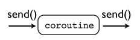

# Part0 介绍生成器与协程

## 生成器

### 生成器
生成器就是一个不停生成结果的函数。
```py
def countdown(n):
    while n > 0:
        yield n
            n -= 1

>>> for i in countdown(5): ...
print i, ...
5 4 3 2 1 >>>
```
不同于其他函数直接`return`一个值，生成器通过`yield`表达式不停生成结果。

当调用生成器函数的时候，它会创建一个生成器Obejct，而不是运行函数。
```py
>>> x = countdown(10)
>>> x
<generator object at 0x58490> >>>
```
### 生成器函数
生成器函数只会在你调用`next()`函数的时候执行。
```py
>>> x = countdown(10)
>>> x
<generator object at 0x58490>
>>> x.next()
Counting down from 10
10
```

`yield`返回一个值，并且挂起函数。通过调用`next()`函数，被挂起的函数从上一次被挂起的地方从新开始执行，直到遇到下一个`yiled`。当其无数据可以返回的时候，抛出一个`StopIteration`错误。

```py
>>> x.next()
9
>>> x.next() 
8
...
>>> x.next()
1
>>> x.next()
Traceback (most recent call last):
  File "<stdin>", line 1, in ?
StopIteration
```

### 例子

#### Python版的"tail -f"

```py
import time
def follow(thefile):
    thefile.seek(0,2)      # Go to the end of the file
    while True:
         line = thefile.readline()
         if not line:
             time.sleep(0.1)    # Sleep briefly
             continue
         yield line

 # Example use
 if __name__ == '__main__':
     logfile = open("access-log")
     for line in follow(logfile):
         print line,
```

#### 生成器流水线

一个很吊的程序就是将多个生成器配置成流水线。就像Unix shell中的pipe。


```py
def grep(pattern,lines):
    for line in lines:
        if pattern in line:
             yield line
             
if __name__ == '__main__':
    from follow import follow

    # Set up a processing pipe : tail -f | grep python
    logfile  = open("access-log")
    loglines = follow(logfile)
    pylines  = grep("python",loglines)

    # Pull results out of the processing pipeline
    for line in pylines:
        print line,
```

## 协程

你可以向生成器发送数据。

### 协程的执行

协程的执行就像生成器一样。你可以通过`next()`或`send()`调用它。

```PY
def countdown(n):
    print "Counting down from", n
    while n >= 0:
        newvalue = (yield n)
        # If a new value got sent in, reset n with it
        if newvalue is not None:
            n = newvalue
        else:
            n -= 1

# The holy grail countdown
c = countdown(5)
for x in c:
    print x
    if x == 5:
        c.send(3)
# 5
# 2
# 1
# 0
```

所有的协程都必须先调用`.next()`方法（或者`send(None)`）。这会执行至第一个`yiled`那里，这时候，它已经准备好接收数据了。

通过一个装饰器，我们可以避免每次开始的`next()`调用。

```py
def coroutine(func):
    def start(*args,**kwargs):
        cr = func(*args,**kwargs)
        cr.next()
        return cr
    return start

# Example use
if __name__ == '__main__':
    @coroutine
    def grep(pattern):
        print "Looking for %s" % pattern
        while True:
            line = (yield)
            if pattern in line:
                print line,

    g = grep("python")
    # Notice how you don't need a next() call here
    g.send("Yeah, but no, but yeah, but no")
    g.send("A series of tubes")
    g.send("python generators rock!")
```

### 协程的关闭

```py
>>> g = grep("python") 
>>> g.next()	# Prime it
Looking for python 
>>> g.send("Yeah, but no, but yeah, but no") 
>>> g.send("A series of tubes") 
>>> g.send("python generators rock!") 
python generators rock! 
>>> g.close()

@coroutine
def grep(pattern):
    print "Looking for %s" % pattern
    try:
        while True:
            line = (yield)
            if pattern in line:
                print line,
    except GeneratorExit:
        print "Going away. Goodbye"

# Example use
if __name__ == '__main__':
    g = grep("python")
    g.send("Yeah, but no, but yeah, but no\n")
    g.send("A series of tubes\n")
    g.send("python generators rock!\n")
    g.close()
```

### 抛出异常

你可以在协程的内部抛出异常

```py
>>> g = grep("python") 
>>> g.next()	# Prime it
Looking for python 
>>> g.send("python generators rock!") 
python generators rock! 
>>> g.throw(RuntimeError,"You're hosed") 
Traceback (most recent call last): 
  File "<stdin>", line 1, in <module> 
  File "<stdin>", line 4, in grep 
RuntimeError: You're hosed
```

## 协程与生成器

- 尽管相似，但是协程与生成器是两个不同的概念。
- 生成器生成用于迭代的值。
- 协同程序趋向于使用值。

# Part 1 协程，管道和数据流

## 管道(Pipeline)

协程可以用来连接管道


你只需要将多个协程像链条一样连接起来，在各个协程之间通过`send()`来连接。

### 源数据(Pipeline Sources)

管道需要源数据来作为输入，源数据驱动整个管道。


一般来说，源数据不是一个协程。

### 管道水槽(Pipeline Sinks)

管道必须有一个终点，称其为管道水槽。


```py
coroutine 
def sink(): 
    try:
        while True:
            item = (yield) # Receive an item
            ...
    except GeneratorExit:
        # Done ...
```
#### "tail -f"Pipeline版


`follow()`驱动整个管道，将数据`send()`到`printer()`协程。

```py
from coroutine import coroutine

# A data source.  This is not a coroutine, but it sends
# data into one (target)

import time
def follow(thefile, target):
    thefile.seek(0,2)      # Go to the end of the file
    while True:
         line = thefile.readline()
         if not line:
             time.sleep(0.1)    # Sleep briefly
             continue
         target.send(line)

# A sink.  A coroutine that receives data

@coroutine
def printer():
    while True:
         line = (yield)
         print line,

# Example use
if __name__ == '__main__':
    f = open("access-log")
    follow(f,printer())
```

### 管道过滤(Pipeline Filters)

有一种可以接收并发送的管道。比如过滤器，转换器，转发器等。



```py
@coroutine
def filter(target): 
    while True:
        item = (yield)
        # Transform/filter item 
        ...
        # Send it along to the next stage 
        target.send(item)
```

#### 过滤器例子

```py
from coroutine import coroutine

# A data source.  This is not a coroutine, but it sends
# data into one (target)

import time
def follow(thefile, target):
    thefile.seek(0,2)      # Go to the end of the file
    while True:
         line = thefile.readline()
         if not line:
             time.sleep(0.1)    # Sleep briefly
             continue
         target.send(line)

# A filter.

@coroutine
def grep(pattern,target):
    while True:
        line = (yield)           # Receive a line
        if pattern in line:
            target.send(line)    # Send to next stage

# A sink.  A coroutine that receives data

@coroutine
def printer():
    while True:
         line = (yield)
         print line,

# Example use
if __name__ == '__main__':
    # Hooking it up
    f = open("access-log")
    follow(f,
           grep('python',
           printer()))
```


## 生成器与协程


生成器通过迭代(iteration)将数据拉(pull)到管道，协程通过`send()`将数据推(push)到管道。

#### 例子

你可以绑定多个协程到管道。


```py
from coroutine import coroutine

# A data source.  This is not a coroutine, but it sends
# data into one (target)

import time
def follow(thefile, target):
    thefile.seek(0,2)      # Go to the end of the file
    while True:
         line = thefile.readline()
         if not line:
             time.sleep(0.1)    # Sleep briefly
             continue
         target.send(line)

# A filter.
@coroutine
def grep(pattern,target):
    while True:
        line = (yield)           # Receive a line
        if pattern in line:
            target.send(line)    # Send to next stage

# A sink.  A coroutine that receives data
@coroutine
def printer():
    while True:
         line = (yield)
         print line,

# Broadcast a stream onto multiple targets
@coroutine
def broadcast(targets):
    while True:
        item = (yield)
        for target in targets:
            target.send(item)

# Example use
if __name__ == '__main__':
    f = open("access-log")
    
    follow(f,
       broadcast([grep('python',printer()),
                  grep('ply',printer()),
                  grep('swig',printer())])
           )
    # A more disturbing variation...
    p = printer()
    follow(f,
       broadcast([grep('python',p),
                  grep('ply',p),
                  grep('swig',p)])
           )

```


# Part 2 协程与事件指派(Coroutines and Event Dispatching) 

## 事件处理(Event Handling)

协程可以用来编写各种各样的部件以处理事件流。

## XML解析

#### SAX方法

在Python中，一种古老的解析XML的方法:SAX。

SAX是一个事件驱动的接口。


```PY
import xml.sax

class MyHandler(xml.sax.ContentHandler):
    def startElement(self,name,attrs):
        print "startElement", name
    def endElement(self,name):
        print "endElement", name
    def characters(self,text):
        print "characters", repr(text)[:40]

xml.sax.parse("allroutes.xml",MyHandler())
```

#### 从SAX到协程

它并不做什么，只是向目标发送事件。

```PY
import xml.sax

class EventHandler(xml.sax.ContentHandler):
    def __init__(self,target):
        self.target = target
    def startElement(self,name,attrs):
        self.target.send(('start',(name,attrs._attrs)))
    def characters(self,text):
        self.target.send(('text',text))
    def endElement(self,name):
        self.target.send(('end',name))

# example use
if __name__ == '__main__':
    from coroutine import *

    @coroutine
    def printer():
        while True:
            event = (yield)
            print event

    xml.sax.parse("allroutes.xml",
                  EventHandler(printer()))
```

### 事件流


### 实现

我们要把巴士信息提取出来


```PY
from coroutine import *

@coroutine
def buses_to_dicts(target):
    while True:
        event, value = (yield)
        # Look for the start of a <bus> element
        if event == 'start' and value[0] == 'bus':
            busdict = { }
            fragments = []
            # Capture text of inner elements in a dict
            while True:
                event, value = (yield)
                if event == 'start':   fragments = []
                elif event == 'text':  fragments.append(value)
                elif event == 'end':
                    if value != 'bus': 
                        busdict[value] = "".join(fragments)
                    else:
                        target.send(busdict)
                        break
```

#### 状态机

先前的代码通过实现一个简单的状态机。


**状态A：寻找bus**

```py
    while True:
        event, value = (yield)
        # Look for the start of a <bus> element
        if event == 'start' and value[0] == 'bus':
```

**转态B：收集bus的属性**

```py
            while True:
                event, value = (yield)
                if event == 'start':   fragments = []
                elif event == 'text':  fragments.append(value)
                elif event == 'end':
                    if value != 'bus': 
                        busdict[value] = "".join(fragments)
                    else:
                        target.send(busdict)
                        break
```

#### 过滤元素

过滤符合的元素并发送出去。

```py
@coroutine
def filter_on_field(fieldname,value,target):
    while True:
        d = (yield)
        if d.get(fieldname) == value:
            target.send(d)
```

#### 处理元素

提取出元素之后，将其打印出来。

```py
@coroutine
def bus_locations():
    while True:
        bus = (yield)
        print "%(route)s,%(id)s,\"%(direction)s\","\
              "%(latitude)s,%(longitude)s" % bus 
```

####  将其Hooking起来

找出前往North Bound的22号汽车

```py
xml.sax.parse("allroutes.xml", 
    EventHandler(
    buses_to_dicts( filter_on_field("route","22",
    filter_on_field("direction","North Bound", bus_locations())))
))
```

# Part 3 从数据处理到并发编程(From Data Processing to Concurrent Programming)

- 协程类似于生成器
- 您可以创建小型处理组件的集合，并将它们连接在一起
- 您可以通过设置管道，数据流图表等来处理数据。

## 共同的特点

- 你向协程发送数据
- 你向线程发送数据（通过队列）
- 你向进程发送数据（通过消息）

## 基本并发

你可以通过添加额外的层(layers)将协程封装在线程或进程里面。


### 以线程为例子

`threaded`函数用于接收消息，并将其发送给`target`(通过队列)

```PY
from threading import Thread
from Queue import Queue
from coroutine import *

@coroutine
def threaded(target):
    messages = Queue()
    # pulling items out of the message queue and
    # sending them to the target
    def run_target():
        while True:
            item = messages.get()
            if item is GeneratorExit:
                target.close()
                return
            else:
                target.send(item)
    Thread(target=run_target).start()
    # recevice items and pass them into the tread(via the queue)
    try:
        while True:
            item = (yield)
            messages.put(item)
    except GeneratorExit:
        messages.put(GeneratorExit)

# Example use

if __name__ == '__main__':
    import xml.sax
    from cosax import EventHandler
    from buses import *
    
    # hooking things up
    xml.sax.parse("allroutes.xml", EventHandler(
                    buses_to_dicts(
                    threaded(
                         filter_on_field("route","22",
                         filter_on_field("direction","North Bound",
                         bus_locations()))
                    ))))
                 
```


### 以进程为例子

可以将两个协程用文件或管道连接起来。


```py
import cPickle as pickle
from coroutine import *

@coroutine
def sendto(f):
    try:
        while True:
            item = (yield)
            pickle.dump(item,f)
            f.flush()
    except StopIteration:
        f.close()

def recvfrom(f,target):
    try:
        while True:
            item = pickle.load(f)
            target.send(item)
    except EOFError:
        target.close()


# Example use
if __name__ == '__main__':
    import xml.sax
    from cosax import EventHandler
    from buses import *

    import subprocess
    p = subprocess.Popen(['python','busproc.py'],
                         stdin=subprocess.PIPE)

    xml.sax.parse("allroutes.xml",
                  EventHandler(
                          buses_to_dicts(
                          sendto(p.stdin))))
```


### 环境与实现

- 通过协程，你可以把实现与它的执行环境分离开。
- 协程即是实现。
- 环境即是你选择的线程，进程等。

### 隐藏的危险

如果你调用`send()`在一个正在执行的协程上，你的程序会奔溃。

当多个线程向同一个协程发送数据的时候，可能会造成程序奔溃。

```py
from cobroadcast import *
from cothread import threaded

p = printer()
target = broadcast([threaded(grep('foo',p)),
                    threaded(grep('bar',p))])

# Adjust the count if this doesn't cause a crash
for i in xrange(10):
    target.send("foo is nice\n")
    target.send("bar is bad\n")

del target
del p
```

# Part 4 Coroutines as Tasks

在并发编程里面，可分割的问题被称作任务(tasks)。

任务有一下几个特性：

- 独立的控制流（Independent control flow）
- 内部状态（Internal state）
- 可以被调度（scheduled）（挂起/恢复）
- 可以与其他任务交流（Can communicate with other tasks）

我们看看协程是否符合以上几点：

- 协程有独立的控制流，协程就像其他函数一样有自己的代码段。
- 协程有内部状态，它有自己的内部变量。
- `yiled`挂起，`send()`恢复，`close()`关闭。
- 协程可以通过`send()`方法与其他协程交流。

# Part 5 A Crash Course in Operating Systems

 略，这个应放在前面

# Part 7 Let's Build an Operating System

我们的挑战：

- 建立一个多任务“操作系统”
- 仅仅使用Python代码
- 没有多线程
- 没有多进程
- 是由生成器/协程


## 定义Tasks

Takes是协程的一个装饰层(wrapper)，它只会运行`run()`方法。

```py
class Task(object):
    taskid = 0
    def __init__(self,target):
        Task.taskid += 1
        self.tid     = Task.taskid   # Task ID
        self.target  = target        # Target coroutine
        self.sendval = None          # Value to send

    # Run a task until it hits the next yield statement
    def run(self):
        return self.target.send(self.sendval)
        
# ------------------------------------------------------------
#                       == Example ==
# ------------------------------------------------------------
if __name__ == '__main__':
    
    # A simple generator/coroutine function
    def foo():
        print "Part 1"
        yield
        print "Part 2"
        yield

    t1 = Task(foo())
    print "Running foo()"
    t1.run()
    print "Resuming foo()"
    t1.run()
    
    """
    Result
    Part 1
    Part 2
    """

    # If you call t1.run() one more time, you get StopIteration.
    # Uncomment the next statement to see that.
    # t1.run()
```

## 调度器 Scheduler

```py
from Queue import Queue

class Scheduler(object):
    def __init__(self):
        # A queue of tasks that are ready to run
        self.ready   = Queue()   
        
        # A dictionary that keeps track of all active tasks (each task has a unique integer task ID)
        self.taskmap = {}
        
    # Introduces a new task to the scheduler
    def new(self,target):
        newtask = Task(target)
        self.taskmap[newtask.tid] = newtask
        self.schedule(newtask)
        return newtask.tid
    

    # Put a task onto the ready queue. This makes it available to run.
    def schedule(self,task):
        self.ready.put(task)

    # The main scheduler loop. It pulls tasks off the queue and runs them to the next yield.
    def mainloop(self):
        while self.taskmap:
            task = self.ready.get()
            result = task.run()
            self.schedule(task)

# ------------------------------------------------------------
#                      === Example ===
# ------------------------------------------------------------
if __name__ == '__main__':
    
    # Two tasks
    def foo():
        while True:
            print "I'm foo"
            yield

    def bar():
        while True:
            print "I'm bar"
            yield    
        
    # Run them
    sched = Scheduler()
    sched.new(foo())
    sched.new(bar())
    sched.mainloop()
    
    """
    Result
    I'm foo
    I'm bar 
    I'm foo 
    I'm bar 
    I'm foo 
    I'm bar
    """
```

正如所料，`yiled`了一个软中断。每一个任务都执行到`yiled`语句处，此后，调度器从新获得控制权并切换其他任务。

## Task的退出

不能直接通过`return`退出，这会抛出`StopIteration`异常。我们可以在调度器里添加`exit()`方法。

```py

class Scheduler(object):
    ...
    def exit(self,task):
        print "Task %d terminated" % task.tid
        del self.taskmap[task.tid]
    ...
    def mainloop(self):
         while self.taskmap:
            task = self.ready.get()
            try:
                result = task.run()
            # Catch task exit and cleanup
            except StopIteration:
                self.exit(task)
                continue
            self.schedule(task)

# ------------------------------------------------------------
#                      === Example ===
# ------------------------------------------------------------
if __name__ == '__main__':
    def foo():
        for i in xrange(3):
            print "I'm foo"
            yield

    def bar():
        for i in xrange(5):
            print "I'm bar"
            yield

    sched = Scheduler()
    sched.new(foo())
    sched.new(bar())
    sched.mainloop()
    
    """
    Result
    I'm foo
    I'm bar 
    I'm foo 
    I'm bar 
    I'm foo 
    I'm bar 
    Task 1 terminated
    I'm bar 
    I'm bar
    Task 2 terminated 
    """
```

## 系统调用 System Calls

在真正的操作系统里，软中断(traps)是程序执行的求系统的服务，我们称之为系统调用(syscalls)。

在我们的代码里面，调度器(scheduler)就是一个操作系统，而`yiled`就是一个软中断。

为了请求调度器的服务，takes将会`yiled`一个值。

```PY
class Scheduler(object):
    ...
    def mainloop(self):
         while self.taskmap:
            task = self.ready.get()
            try:
                result = task.run()
                
                # Look at the result yielded by the task. 
                # If it's a SystemCall, do some setup and run the system call on behalf of the task.
                if isinstance(result,SystemCall):
                # These attributes hold information about the environment (current task and scheduler)
                    result.task  = task
                    result.sched = self
                    result.handle()
                    continue
                    
            except StopIteration:
                self.exit(task)
                continue
            self.schedule(task)

# ------------------------------------------------------------
#                   === System Calls ===
# ------------------------------------------------------------

# System Call base class. All system operations will be implemented by inheriting from this class.
class SystemCall(object):
    def handle(self):
        pass

# Return a task's ID number
class GetTid(SystemCall):
    def handle(self):
        self.task.sendval = self.task.tid
        self.sched.schedule(self.task)

# ------------------------------------------------------------
#                      === Example ===
# ------------------------------------------------------------
if __name__ == '__main__':

    def foo():
        mytid = yield GetTid()
        for i in xrange(5):
            print "I'm foo", mytid
            yield

    def bar():
        mytid = yield GetTid()
        for i in xrange(3):
            print "I'm bar", mytid
            yield

    sched = Scheduler()
    sched.new(foo())
    sched.new(bar())
    sched.mainloop()

    """
    Result
    I'm foo 1
    I'm bar 2 
    I'm foo 1 
    I'm bar 2 
    I'm foo 1 
    I'm bar 2 
    I'm foo 1 
    Task 2 terminated
    I'm foo 1
    Task 1 terminated 
    """
```

`GetTid.handle()`将task的`sendval`改为tid，然后将其从新放入队列，当下一个loop的时候，takes的`run()`方法会`send()`会tid的值。

## 任务管理器 Task Management

真正的操作系统对“保护”有着很强的意识（比如内存保护）。

应用程序只能通过软中断的方式连接系统的内核

- 任务看不见调度器
- 任务看不见其他任务
- `yiled`是唯一的接口

让我们来做一个任务管理器，它具有以下功能：

- 创建新的任务
- 杀死存在的任务
- 等待任务的退出

这些都模仿线程或进程的功能。

```py
# Create a new task
class NewTask(SystemCall):
    def __init__(self,target):
        self.target = target
    def handle(self):
        tid = self.sched.new(self.target)
        self.task.sendval = tid
        self.sched.schedule(self.task)

# Kill a task
class KillTask(SystemCall):
    def __init__(self,tid):
        self.tid = tid
    def handle(self):
        task = self.sched.taskmap.get(self.tid,None)
        if task:
            task.target.close() 
            self.task.sendval = True
        else:
            self.task.sendval = False
        self.sched.schedule(self.task)

# ------------------------------------------------------------
#                      === Example ===
# ------------------------------------------------------------
if __name__ == '__main__':
    def foo():
        mytid = yield GetTid()
        while True:
            print "I'm foo", mytid
            yield

    def main():
        child = yield NewTask(foo())    # Launch new task
        for i in xrange(5):
            yield
        yield KillTask(child)           # Kill the task
        print "main done"

    sched = Scheduler()
    sched.new(main())
    sched.mainloop()
    
    """
    Result
    I'm foo 2
    I'm foo 2 
    I'm foo 2 
    I'm foo 2 
    I'm foo 2
    Task 2 terminated 
    main done
    Task 1 terminated
    """
```

## 任务等待

```PY
class Scheduler(object):
    def __init__(self):
        ...
        # This is a holding area for tasks that are waiting. A dict mapping task ID to tasks waiting for exit.
        self.exit_waiting = {}
        ...
    def exit(self,task):
        print "Task %d terminated" % task.tid
        del self.taskmap[task.tid]
        # Notify other tasks waiting for exit
        # When a task exits, we pop a list of all waiting tasks off out of the waiting area and
        for task in self.exit_waiting.pop(task.tid,[]):
            self.schedule(task)

    def waitforexit(self,task,waittid):
        if waittid in self.taskmap:
            self.exit_waiting.setdefault(waittid,[]).append(task)
            return True
        else:
            return False
            
# ------------------------------------------------------------
#                   === System Calls ===
# ------------------------------------------------------------
# Wait for a task to exit
class WaitTask(SystemCall):
    def __init__(self,tid):
        self.tid = tid
    def handle(self):
        result = self.sched.waitforexit(self.task,self.tid)
        self.task.sendval = result
        # If waiting for a non-existent task,
        # return immediately without waiting
        if not result:
            self.sched.schedule(self.task)
            
# ------------------------------------------------------------
#                      === Example ===
# ------------------------------------------------------------
if __name__ == '__main__':
    def foo():
        for i in xrange(5):
            print "I'm foo"
            yield

    def bar():
        for i in xrange(5):
            print "I'm bar"
            yield

    def main():
        child = yield NewTask(foo())
        # print "Waiting for child"
        # yield WaitTask(child)
        # print "Child done"
        child2 = yield NewTask(bar())

    sched = Scheduler()
    sched.new(main())
    sched.mainloop()
    
    """
    Result
    I'm foo
    I'm foo
    I'm bar
    Task 1 terminated
    I'm foo
    I'm bar
    I'm foo
    I'm bar
    I'm foo
    I'm bar
    Task 2 terminated
    I'm bar
    Task 3 terminated
    """
    
    # If you use WaitTask
    def main():
        child = yield NewTask(foo())
        print "Waiting for child"
        yield WaitTask(child)
        print "Child done"
        child2 = yield NewTask(bar())
        
    """
    Result
    I'm foo
    Waiting for child
    I'm foo
    I'm foo
    I'm foo
    I'm foo
    Task 2 terminated
    Child done
    I'm bar
    Task 1 terminated
    I'm bar
    I'm bar
    I'm bar
    I'm bar
    Task 3 terminated
    """
```

上例中，tid=1是`main`，tid=2是`foo`，tid=3是`bar`。在执行`main`的`yield WaitTask(child)`是，将当前的`task`(tid=1)放入`self.exit_waiting`中，然后一直等待tid=2执行完毕，`exit()`的时候，将原先放入`self.exit_waiting`的出队，放入调度器中。

## 任务之间的通信

任务之间的通信只能用task ID，通过调度器进行。


