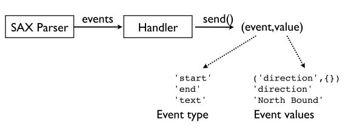

# Part0 介绍生成器与协程

## 生成器

### 生成器
生成器就是一个不停生成结果的函数。
```py
def countdown(n):
    while n > 0:
        yield n
            n -= 1

>>> for i in countdown(5): ...
print i, ...
5 4 3 2 1 >>>
```
不同于其他函数直接`return`一个值，生成器通过`yield`表达式不停生成结果。

当调用生成器函数的时候，它会创建一个生成器Obejct，而不是运行函数。
```py
>>> x = countdown(10)
>>> x
<generator object at 0x58490> >>>
```
### 生成器函数
生成器函数只会在你调用`next()`函数的时候执行。
```py
>>> x = countdown(10)
>>> x
<generator object at 0x58490>
>>> x.next()
Counting down from 10
10
```

`yield`返回一个值，并且挂起函数。通过调用`next()`函数，被挂起的函数从上一次被挂起的地方从新开始执行，直到遇到下一个`yiled`。当其无数据可以返回的时候，抛出一个`StopIteration`错误。

```py
>>> x.next()
9
>>> x.next() 
8
...
>>> x.next()
1
>>> x.next()
Traceback (most recent call last):
  File "<stdin>", line 1, in ?
StopIteration
```

### 例子

#### Python版的"tail -f"

```py
import time
def follow(thefile):
    thefile.seek(0,2)      # Go to the end of the file
    while True:
         line = thefile.readline()
         if not line:
             time.sleep(0.1)    # Sleep briefly
             continue
         yield line

 # Example use
 if __name__ == '__main__':
     logfile = open("access-log")
     for line in follow(logfile):
         print line,
```

#### 生成器流水线

一个很吊的程序就是将多个生成器配置成流水线。就像Unix shell中的pipe。


```py
def grep(pattern,lines):
    for line in lines:
        if pattern in line:
             yield line
             
if __name__ == '__main__':
    from follow import follow

    # Set up a processing pipe : tail -f | grep python
    logfile  = open("access-log")
    loglines = follow(logfile)
    pylines  = grep("python",loglines)

    # Pull results out of the processing pipeline
    for line in pylines:
        print line,
```

## 协程

你可以向生成器发送数据。

### 协程的执行

协程的执行就像生成器一样。你可以通过`next()`或`send()`调用它。

```PY
def countdown(n):
    print "Counting down from", n
    while n >= 0:
        newvalue = (yield n)
        # If a new value got sent in, reset n with it
        if newvalue is not None:
            n = newvalue
        else:
            n -= 1

# The holy grail countdown
c = countdown(5)
for x in c:
    print x
    if x == 5:
        c.send(3)
# 5
# 2
# 1
# 0
```

所有的协程都必须先调用`.next()`方法（或者`send(None)`）。这会执行至第一个`yiled`那里，这时候，它已经准备好接收数据了。

通过一个装饰器，我们可以避免每次开始的`next()`调用。

```py
def coroutine(func):
    def start(*args,**kwargs):
        cr = func(*args,**kwargs)
        cr.next()
        return cr
    return start

# Example use
if __name__ == '__main__':
    @coroutine
    def grep(pattern):
        print "Looking for %s" % pattern
        while True:
            line = (yield)
            if pattern in line:
                print line,

    g = grep("python")
    # Notice how you don't need a next() call here
    g.send("Yeah, but no, but yeah, but no")
    g.send("A series of tubes")
    g.send("python generators rock!")
```

### 协程的关闭

```py
>>> g = grep("python") 
>>> g.next()	# Prime it
Looking for python 
>>> g.send("Yeah, but no, but yeah, but no") 
>>> g.send("A series of tubes") 
>>> g.send("python generators rock!") 
python generators rock! 
>>> g.close()

@coroutine
def grep(pattern):
    print "Looking for %s" % pattern
    try:
        while True:
            line = (yield)
            if pattern in line:
                print line,
    except GeneratorExit:
        print "Going away. Goodbye"

# Example use
if __name__ == '__main__':
    g = grep("python")
    g.send("Yeah, but no, but yeah, but no\n")
    g.send("A series of tubes\n")
    g.send("python generators rock!\n")
    g.close()
```

### 抛出异常

你可以在协程的内部抛出异常

```py
>>> g = grep("python") 
>>> g.next()	# Prime it
Looking for python 
>>> g.send("python generators rock!") 
python generators rock! 
>>> g.throw(RuntimeError,"You're hosed") 
Traceback (most recent call last): 
  File "<stdin>", line 1, in <module> 
  File "<stdin>", line 4, in grep 
RuntimeError: You're hosed
```

## 协程与生成器

- 尽管相似，但是协程与生成器是两个不同的概念。
- 生成器生成用于迭代的值。
- 协同程序趋向于使用值。

# Part 1 协程，管道和数据流

## 管道(Pipeline)

协程可以用来连接管道


你只需要将多个协程像链条一样连接起来，在各个协程之间通过`send()`来连接。

### 源数据(Pipeline Sources)

管道需要源数据来作为输入，源数据驱动整个管道。


一般来说，源数据不是一个协程。

### 管道水槽(Pipeline Sinks)

管道必须有一个终点，称其为管道水槽。


```py
coroutine 
def sink(): 
    try:
        while True:
            item = (yield) # Receive an item
            ...
    except GeneratorExit:
        # Done ...
```
#### "tail -f"Pipeline版


`follow()`驱动整个管道，将数据`send()`到`printer()`协程。

```py
from coroutine import coroutine

# A data source.  This is not a coroutine, but it sends
# data into one (target)

import time
def follow(thefile, target):
    thefile.seek(0,2)      # Go to the end of the file
    while True:
         line = thefile.readline()
         if not line:
             time.sleep(0.1)    # Sleep briefly
             continue
         target.send(line)

# A sink.  A coroutine that receives data

@coroutine
def printer():
    while True:
         line = (yield)
         print line,

# Example use
if __name__ == '__main__':
    f = open("access-log")
    follow(f,printer())
```

### 管道过滤(Pipeline Filters)

有一种可以接收并发送的管道。比如过滤器，转换器，转发器等。


```py
@coroutine
def filter(target): 
    while True:
        item = (yield)
        # Transform/filter item 
        ...
        # Send it along to the next stage 
        target.send(item)
```

#### 过滤器例子

```py
from coroutine import coroutine

# A data source.  This is not a coroutine, but it sends
# data into one (target)

import time
def follow(thefile, target):
    thefile.seek(0,2)      # Go to the end of the file
    while True:
         line = thefile.readline()
         if not line:
             time.sleep(0.1)    # Sleep briefly
             continue
         target.send(line)

# A filter.

@coroutine
def grep(pattern,target):
    while True:
        line = (yield)           # Receive a line
        if pattern in line:
            target.send(line)    # Send to next stage

# A sink.  A coroutine that receives data

@coroutine
def printer():
    while True:
         line = (yield)
         print line,

# Example use
if __name__ == '__main__':
    # Hooking it up
    f = open("access-log")
    follow(f,
           grep('python',
           printer()))
```


## 生成器与协程


生成器通过迭代(iteration)将数据拉(pull)到管道，协程通过`send()`将数据推(push)到管道。

#### 例子

你可以绑定多个协程到管道。


```py
from coroutine import coroutine

# A data source.  This is not a coroutine, but it sends
# data into one (target)

import time
def follow(thefile, target):
    thefile.seek(0,2)      # Go to the end of the file
    while True:
         line = thefile.readline()
         if not line:
             time.sleep(0.1)    # Sleep briefly
             continue
         target.send(line)

# A filter.
@coroutine
def grep(pattern,target):
    while True:
        line = (yield)           # Receive a line
        if pattern in line:
            target.send(line)    # Send to next stage

# A sink.  A coroutine that receives data
@coroutine
def printer():
    while True:
         line = (yield)
         print line,

# Broadcast a stream onto multiple targets
@coroutine
def broadcast(targets):
    while True:
        item = (yield)
        for target in targets:
            target.send(item)

# Example use
if __name__ == '__main__':
    f = open("access-log")
    
    follow(f,
       broadcast([grep('python',printer()),
                  grep('ply',printer()),
                  grep('swig',printer())])
           )
    # A more disturbing variation...
    p = printer()
    follow(f,
       broadcast([grep('python',p),
                  grep('ply',p),
                  grep('swig',p)])
           )

```


# Part 2 协程与事件指派(Coroutines and Event Dispatching) 

## 事件处理(Event Handling)

协程可以用来编写各种各样的部件以处理事件流。

## XML解析

#### SAX方法

在Python中，一种古老的解析XML的方法:SAX。

SAX是一个事件驱动的接口。


```PY
import xml.sax

class MyHandler(xml.sax.ContentHandler):
    def startElement(self,name,attrs):
        print "startElement", name
    def endElement(self,name):
        print "endElement", name
    def characters(self,text):
        print "characters", repr(text)[:40]

xml.sax.parse("allroutes.xml",MyHandler())
```

#### 从SAX到协程

它并不做什么，只是向目标发送事件。

```PY
import xml.sax

class EventHandler(xml.sax.ContentHandler):
    def __init__(self,target):
        self.target = target
    def startElement(self,name,attrs):
        self.target.send(('start',(name,attrs._attrs)))
    def characters(self,text):
        self.target.send(('text',text))
    def endElement(self,name):
        self.target.send(('end',name))

# example use
if __name__ == '__main__':
    from coroutine import *

    @coroutine
    def printer():
        while True:
            event = (yield)
            print event

    xml.sax.parse("allroutes.xml",
                  EventHandler(printer()))
```

### 事件流



### 实现

我们要把巴士信息提取出来


```PY
from coroutine import *

@coroutine
def buses_to_dicts(target):
    while True:
        event, value = (yield)
        # Look for the start of a <bus> element
        if event == 'start' and value[0] == 'bus':
            busdict = { }
            fragments = []
            # Capture text of inner elements in a dict
            while True:
                event, value = (yield)
                if event == 'start':   fragments = []
                elif event == 'text':  fragments.append(value)
                elif event == 'end':
                    if value != 'bus': 
                        busdict[value] = "".join(fragments)
                    else:
                        target.send(busdict)
                        break
```

#### 状态机

先前的代码通过实现一个简单的状态机。


**状态A：寻找bus**

```py
    while True:
        event, value = (yield)
        # Look for the start of a <bus> element
        if event == 'start' and value[0] == 'bus':
```

**转态B：收集bus的属性**

```py
            while True:
                event, value = (yield)
                if event == 'start':   fragments = []
                elif event == 'text':  fragments.append(value)
                elif event == 'end':
                    if value != 'bus': 
                        busdict[value] = "".join(fragments)
                    else:
                        target.send(busdict)
                        break
```

#### 过滤元素

过滤符合的元素并发送出去。

```py
@coroutine
def filter_on_field(fieldname,value,target):
    while True:
        d = (yield)
        if d.get(fieldname) == value:
            target.send(d)
```

#### 处理元素

提取出元素之后，将其打印出来。

```py
@coroutine
def bus_locations():
    while True:
        bus = (yield)
        print "%(route)s,%(id)s,\"%(direction)s\","\
              "%(latitude)s,%(longitude)s" % bus 
```

####  将其Hooking起来

找出前往North Bound的22号汽车

```py
xml.sax.parse("allroutes.xml", 
    EventHandler(
    buses_to_dicts( filter_on_field("route","22",
    filter_on_field("direction","North Bound", bus_locations())))
))
```

# Part 3 从数据处理到并发编程(From Data Processing to Concurrent Programming)

- 协程类似于生成器
- 您可以创建小型处理组件的集合，并将它们连接在一起
- 您可以通过设置管道，数据流图表等来处理数据。

## 共同的特点

- 你向协程发送数据
- 你向线程发送数据（通过队列）
- 你向进程发送数据（通过消息）

## 基本并发


`threaded`函数用于接收消息，并将其发送给`target`(通过队列)

```PY
from threading import Thread
from Queue import Queue
from coroutine import *

@coroutine
def threaded(target):
    messages = Queue()
    def run_target():
        while True:
            item = messages.get()
            if item is GeneratorExit:
                target.close()
                return
            else:
                target.send(item)
    Thread(target=run_target).start()
    try:
        while True:
            item = (yield)
            messages.put(item)
    except GeneratorExit:
        messages.put(GeneratorExit)

# Example use

if __name__ == '__main__':
    import xml.sax
    from cosax import EventHandler
    from buses import *

    xml.sax.parse("allroutes.xml", EventHandler(
                    buses_to_dicts(
                    threaded(
                         filter_on_field("route","22",
                         filter_on_field("direction","North Bound",
                         bus_locations()))
                    ))))
                 
```


