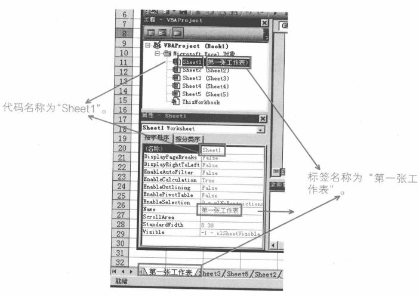
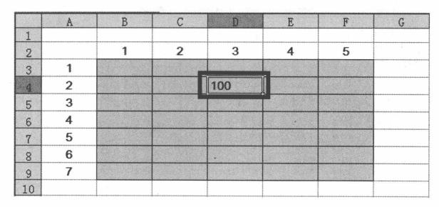

# 过程

* MagBox "hello world"
* ​

# 语法

## 定义变量

```vc
Dim str As String

'定义不可变长String，下面定义只能存储十个字符
Dim str As String*10

Dim str As String,int As Integer

'不声明则默认表示Variant类型
Dim str

Public str As String
Private str As String
Static str As String
```

## 赋值

```
Let str = "hello"
str = "hello"
'如果给对象变量（Object，如单元格）赋值
Set rng = Worksheets("Sheet1").Range("A1")
```

## 常量

```
Const PI As Single = 3.14
```

# 数组

```
Dim arr(1 To 50) As String
arr(1) = "a"

Dim arr(49) As String
'相当于Dim arr(0 To 49) As String

Dim arr(3,3)

'动态数组
Dim arr() As String

Dim arr As Variant
arr = Array(1,2,3,4,5)

arr = Split("a,b,c,d,e",",")

arr = Range("A1:C3")..Value
Range("E1:G3").Value = arr

'Ubound：最大索引号；LBound：最小
arr_len = UBound(arr) - LBound(arr) + 1
UBound(arr,1) '第一维

Join(arr,"@")

```

## 运算符

| 运算符  | 作用   |
| ---- | ---- |
| +    | 加    |
|      | 减    |
| *    | 乘    |
| /    | 除    |
| \    | 整除   |
| &    | 指数   |
| Mod  | 求模   |

## 比较运算符

| 运算符  | 作用          |
| ---- | ----------- |
| <>   | 不等于         |
| Is   | 比较两个对象的引用对象 |
| Like | 比较两个字符串是否匹配 |

## 通配符

| 通配符    | 作用              |
| ------ | --------------- |
| *      | 匹配任意多个字符        |
| ?      | 匹配任意一个字符        |
| #      | 匹配任意一个数字        |
| [abc]  | 匹配abc里面任意一个字符   |
| [^abc] | 匹配不在abc里面任意一个字符 |

## 逻辑运算符

| 运算符  | 作用   |
| ---- | ---- |
| And  | 与    |
| Or   | 或    |
| Not  | 非    |
| Xor  | 异或   |
| Eqv  | 等价   |
| Imp  | 蕴含   |

## 运算符顺序

略

## 逻辑语句

### 判断语句

```
If a < 1 Then Msgbox "xxxx" Else MsgBox "oooo"

If a < 1 Then 
	Msgbox "xxxx" 
ElseIF a > 2 Then
	MsgBox "oooo"
Else
	MsgBox "yyy"
End If
```

### 选择语句

```
Select Case a
	Case Is < 1
		MsgBox "xxxx"
	Case 1 To 2
    	MsgBox "yyy"
    Case Is > 2
    	MsgBox "oooo"
```

### 循环语句

####For

```
For i = 2 To 19 Step 1
'Step默认为1
	MsgBox i
	[Exit For]
Next i
'Next i的i可以忽略
```

#### Do While

```
Do [While 逻辑表达式]
	....
	[Exit Do]
Loop

Do
	....
	[Exit Do]
Loop [While 逻辑表达式]
```

#### Do Until

```
Do [Until 逻辑表达式]
	....
	[Exit Do]
Loop

Do
	....
	[Exit Do]
Loop [Until 逻辑表达式]
```

#### For Each...Next

```
For Each item In array
	...
	[Exit For]
Next
```

### With

```
Worksheets("Sheet1").xxxx
Worksheets("Sheet1").yyyy
Worksheets("Sheet1").oooo

With Worksheets("Sheet1")
	.xxxx
	.yyyy
End With
```

## 过程

```
[Private|Public] [Static] Sub 过程名 ([参数列表])
	...
Exit Sub

过程调用
过程名
Call 过程名[(参数列表)]
Application.Run "过程名"
```

```
' 变换单元格颜色
Sub func()
    Dim rng As Range
    Dim i As Integer
    For i = 1 To 20
        delay (1)
        For Each rng In Range("A1:A10")
            rng.Interior.Color = RGB(Rnd() * 255, Rnd() * 255, Rnd() * 255)
        Next
    Next
End Sub


Sub delay(T As Single)
    Dim time1 As Single
    time1 = Timer
    Do
        DoEvents
    Loop While Timer - time1 < T
End Sub

```

## 函数

```
Public Function Fun()
	Fun = Rnd()
End Function
```

不同于过程的是，函数可以直接在excel里面使用。

函数也可以在过程里面使用。

# 内置过程

略


## 作用域

| 作用域  | 说明                          |
| ---- | --------------------------- |
| 单个过程 | 在一个过程中使用Dim或者Static语句定义     |
| 单个模块 | 在模块第一个过程之前使用Dim或Private语句定义 |
| 所有模块 | 在一个模块的第一个过程之前使用Public语句定义   |


# 数据类型

* Byte
* Boolean
* Integer
* Long
* Single（小范围浮点数）
* Doubal
* Currency
* Decimal
* Date
* String
* Object
* Variant
* 用户自订体


# 常用对象

| 对象          | 对象说明         |
| ----------- | ------------ |
| Application | 代表Excel应用程序  |
| Workbook    | 代表Excel中的工作簿 |
| Worksheet   | 代表Excel中的工作表 |
| Range       | 代表Excel中的单元格 |

```
Application.ScreenUpdating = False	'关闭屏幕更新
Application.DisplayAlerts = False	'不显示警告信息。之后要设置回True
```

## 事件

```
'选中单元格的时候，自动将该单元格的地址写入
'选中sheet1，右键“查看代码”
Private Sub Worksheet_SelectionChange(ByVal Target As Range)
	Target.Value = Target.Address
End Sub
```

禁用事件

```
Application.EnableEvents = False
```

## WorksheetFunction

VBA中没有COUNTIF，SUMIF等函数。虽然VBA中没有，但可以调用。

```
'统计A1:B50单元格中数值大于1000的单元格有多少个
Sub CountTest()
	Dim mycount As Interger, rng As Range
	For Each rng In Range("A1:B50")
		If rng.Value > 1000 Then mycount = mycount + 1
	Next
	MsgBox "count:" & mycount
End Sub


Sub CountTest()
	Dim mycount As Interger
	mycount = Application.WorksheetFunction.CountIf(Range("A1:B50"), ">1000")
	MsgBox "count:" & mycount
End Sub
```

## Application

| 属性             | 说明                     |
| -------------- | ---------------------- |
| ActiveCell     | 当前活动单元格                |
| ActiveChart    | 当前活动工作簿中的活动图表          |
| ActiveSheet    | 当前活动工作薄中的活动工作表         |
| ActiveWindow   | 当前活动窗口                 |
| ActiveWorkbook | 当前活动工作薄                |
| Charts         | 当前活动工作薄中所有的图表工作表       |
| Selection      | 当前活动工作薄中所有选中的对象        |
| Sheets         | 当前活动工作薄中所有Sheet对象      |
| Worksheets     | 当前活动工作薄中的所有Worksheet对象 |
| Workbooks      | 当前所有打开的工作薄             |

## Workbook

```
Workbooks.Item(3)
'可以简写
Workbooks(3)

Workbooks("Book1")

Range("B2") = ThisWorkbook.Name
Range("B3") = ThisWorkbook.Path
Range("B4") = ThisWorkbook.FullName

'代码所在工作薄
ThisWorkbook
'当前活动工作薄
ActiveWorkbook
```

### 创建一个工作薄文件

```
Workbooks.Add "C:\xxx.xls"

Workbooks.Add XlWBATemplate
'XlWBATemplate 常數： xlWBATChart 、 xlWBATExcel4IntlMacroSheet 、 xlWBATExcel4MacroSheet 或 xlWBATWorksheet 。
```

### 打开一个工作薄

```
Workbooks.Open Filename:="C:\xx.xls"
```

### 激活工作薄

同一时间只能有一个窗口是活动的

```
Workbooks("Book1").Activate
```

### 保存工作簿

```
ThisWorkbook.Save

ThisWorkbook.SaveAs Filename:='C:\xx.xls'
'另存为之后，将自动关闭源文件，打开新文件，如不希望
ThisWorkbook.SaveCopyAs Filename:='C:\x.xls'
```

### 关闭工作薄

```
Workbooks.Close
Workbooks("Book1").Close
Workbooks("Book1").Close savechanges:=True
'或者
Workbooks("Book1").Close True
```

## Worksheet

一个Worksheet对象代表一张普通工作表，Worksheets是多个Worksheet对象的集合，包含指定工作薄中所有的Worksheet对象。

```
Worksheets.Item(1)
Worksheets(1)
Worksheets("Sheet1")
```



也可以用代码名称来引用

```
Sheet1.Range("A1")=100
```

直接读取代码名称

```
ActiveSheet.CodeName
```

### 新建工作表

```
'如果不带参数，默认在活动工作表前新建一张工作表
Worksheets.Add
'在第一张工作表前插入一张新工作表
Worksheets.Add before:=Worksheets(1)
'在第一张工作表后插入一张新工作表
Worksheets.Add after:=Worksheets(1)
'同时插入多张
Worksheets.Add Count:=3

Worksheets.Add after:=Worksheets(1), Count:=3
```

### 更改工作表标签名

```
Worksheets(2).Name = "工资表"
ActiveSheet.Name = "工资表"
Worksheets.Add (before:=Worksheets(1)) = "工资表"
```

### 删除工作表

```
Worksheets("Sheet1").Delete
```

### 激活工作表

```
Worksheets(1).Activate
Worksheet(1).Select

Worksheets.Activate
Worksheet.Select
```

### 复制工作表

```
Worksheets("sheet1").Copy before:=Worksheets("sheet1")
```

若没有参数，则默认将工作表复制到新工作薄中。

### 移动工作表

```
.Move
```

若没有参数，则默认将工作表移动到新工作薄中。

### 隐藏或显示工作表

```
'等同于在“格式”惨淡里银从工作表
.Visible = False
.Visible = xlSheetHidden
.Visible = 0

'不能再“格式”菜单取消
.Visible = xlSheetVeryHidden
.Visible = 2

'显示
.Visible = True
.Visible = 1
.Visible = -1
.Visible = xkSheetVisble
```

### 获取工作表的数目

```
.Count
```

### UsedRange

获取工作表中已使用的单元格区域

```
.UsedRange
```


## Sheets与Worksheets

Sheets表示工作薄里所有类型的工作表的集合

Worksheets值表示普通工作表的集合

## Range

```
Worksheets("Sheet1").Range("A1").Value = 50
Worksheets("Sheet1").Range("A1:A10").Value = 50
'若单元格已经被定义为名称
Worksheets("Sheet1").Range("date").Value = 50
'并
Worksheets("Sheet1").Range("A1:A10,A4:E6").Value = 50
'交
Worksheets("Sheet1").Range("A1:A10 A4:E6").Value = 50
'两个区域围成的矩形区域(直到E6)
Worksheets("Sheet1").Range("A1:A10","A4:E6").Value = 50
```
### Offser
```
'下移2，右移3
Range("A1").Offset(2,3)
```

### Resize

```
'将B2单元格扩大为B2:E6
Range("B2").Resize(5,4).Select
'将B2:E6单元格缩小为B2:B3（缩小为一个2行1列的区域）
Range("B2:E6").Resize(2,1).Select
```

### CurrentRegion

返回当前区域，即以空行和空列的组合为边界的区域。相当于在单元格按F5。

```
.CurrentRegion
```

### End

返回当前区域结尾处的单元格，等同于在原单元格按End+方向键得到的单元格。

```
'xlToLeft,xlToRight,xlUp,xlDown
.End(xlUp).Select

ActiveSheet.Range("A65536").End(xlUp).Offset(1,0).Select
```

### Value

Value是Range对象的默认属性。

```
Range("B1")=5
```

### Count

```
.Count
```

### 清除

```
.Clear
.ClearComments
.ClearCOntents
.ClearFormats
```

### 复制/剪切

```
'A1 copy to C1
Range("A1").Copy Range("C1")

'G1为最左上角
Range("A1").CurrentRegion.Copy Range("G1")

Range("A1").Cut Range("G1")
```

### 删除

```
.Delete Shift:=xlToLeft
.Delete Shift:=xlUp    '默认
.EntireRow.Delete
.EntireColumn.Delete
```

##Cells

我们也可以用`Cells`来引用`Range`对象

```
ActiveSheet.Cells(3,4).Value = 20
ActiveSheet.Cells(3,"D").Value = 20
```

B3:F9单元格区域的第2行与第3列相交

```
Range("B3:F9").Cells(2,3)
```



```
'下面三句是等效的
Range(Cells(1,1),Cells(10,5)).Select
Range("A1","E10").Select
Range(Range("A1"),Range("E10")).Select
```

选中所有单元格

```
ActiveSheet.Cells.Select
```

## 更快捷的方式

```
[B2]
[A1:D10]
[A1:A10,C1:C10]
[B1:B10 A5:D5]
```

## Rows

```
'选中第3到第5行
ActiveSheet.Rows("3:5").Select
'选中第3行
ActiveSheet.Rows("3").Select
'选中所有行
ActiveSheet.Rows.Select

'选中第3行到第10行区域中的第1行到第3行
Rows("3:10").Rows("1:3").Select
```

## Columns

```
'第六列
ActiveSheet.Columns(6)
'所有列
ActiveSheet.Columns

```

## Union

并起来

```
Application.Union(Range("A1:A10"),Range("D1:D5"))
```
## Address

```
Selection.Address
```

## Font

```
With Range("A1").Font
	.Name="宋体"
	.Size=12
	.Color=RBG(255,0,0)
	.Bold=True
	.Italic=True
```

