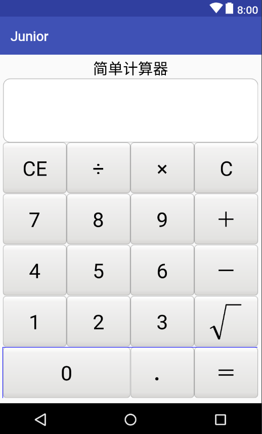

## ScrollView

ScrollView和HorizontalScrollView两个容器。它们分别代表了垂直滚动以及水平滚动，滚动的内容是它其中包含的View。

ScrollView，通过官方文档的继承关系可以看出，它继承自FrameLayout，所以它是一种特殊类型的FrameLayout，因为它可以使用用户滚动显示一个占据的空间大于物理显示的视图列表。值得注意的是，ScrollView只能包含一个子视图或视图组，在实际项目中，通常包含的是一个垂直的LinearLayout。

值得注意的是，ScrollView不能和ListView一起使用，因为ListView已经对垂直方向的滚动做了处理，它会迫使如果ListView的内容大于物理视图的内容的时候，强制垂直滚动的效果，所以这里使用ScrollView和ListView混合使用是没有意义的。

```xml
<LinearLayout xmlns:android="http://schemas.android.com/apk/res/android"
    android:layout_width="match_parent"
    android:layout_height="match_parent"
    android:padding="5dp"
    android:gravity="top|center"
    android:orientation="vertical">

    <ScrollView
        android:layout_width="match_parent"
        android:layout_height="wrap_content">

        <LinearLayout
            android:layout_width="match_parent"
            android:layout_height="wrap_content"
            android:orientation="vertical">

            <TextView
                android:layout_width="match_parent"
                android:layout_height="wrap_content"
                android:gravity="center"
                android:text="简单计算器"
                android:textColor="#000000"
                android:textSize="22sp" />

            <LinearLayout
                android:layout_width="match_parent"
                android:layout_height="wrap_content"
                android:background="@drawable/shape_white_with_stroke"
                android:orientation="vertical">

                <!--
                android:gravity="right|bottom"：里面的文字向右下对齐
                -->
                <TextView
                    android:id="@+id/tv_result"
                    android:layout_width="match_parent"
                    android:layout_height="wrap_content"
                    android:gravity="right|bottom"
                    android:lines="3"
                    android:maxLines="3"
                    android:scrollbars="vertical"
                    android:textColor="#000000"
                    android:textSize="25sp" />
            </LinearLayout>

            <LinearLayout
                android:layout_width="match_parent"
                android:layout_height="wrap_content"
                android:orientation="vertical">

                <LinearLayout
                    android:layout_width="match_parent"
                    android:layout_height="75dp"
                    android:orientation="horizontal">

                    <Button
                        android:id="@+id/btn_cancel"
                        style="@style/btn_cal"
                        android:text="CE" />

                    <Button
                        android:id="@+id/btn_divide"
                        style="@style/btn_cal"
                        android:text="÷" />

                    <Button
                        android:id="@+id/btn_multiply"
                        style="@style/btn_cal"
                        android:text="×" />

                    <Button
                        android:id="@+id/btn_clear"
                        style="@style/btn_cal"
                        android:text="C" />
                </LinearLayout>

                <LinearLayout
                    android:layout_width="match_parent"
                    android:layout_height="75dp"
                    android:orientation="horizontal">

                    <Button
                        android:id="@+id/btn_seven"
                        style="@style/btn_cal"
                        android:text="7" />

                    <Button
                        android:id="@+id/btn_eight"
                        style="@style/btn_cal"
                        android:text="8" />

                    <Button
                        android:id="@+id/btn_nine"
                        style="@style/btn_cal"
                        android:text="9" />

                    <Button
                        android:id="@+id/btn_plus"
                        style="@style/btn_cal"
                        android:text="＋" />
                </LinearLayout>

                <LinearLayout
                    android:layout_width="match_parent"
                    android:layout_height="75dp"
                    android:orientation="horizontal">

                    <Button
                        android:id="@+id/btn_four"
                        style="@style/btn_cal"
                        android:text="4" />

                    <Button
                        android:id="@+id/btn_five"
                        style="@style/btn_cal"
                        android:text="5" />

                    <Button
                        android:id="@+id/btn_six"
                        style="@style/btn_cal"
                        android:text="6" />

                    <Button
                        android:id="@+id/btn_minus"
                        style="@style/btn_cal"
                        android:text="－" />
                </LinearLayout>

                <LinearLayout
                    android:layout_width="match_parent"
                    android:layout_height="75dp"
                    android:orientation="horizontal">

                    <Button
                        android:id="@+id/btn_one"
                        style="@style/btn_cal"
                        android:text="1" />

                    <Button
                        android:id="@+id/btn_two"
                        style="@style/btn_cal"
                        android:text="2" />

                    <Button
                        android:id="@+id/btn_three"
                        style="@style/btn_cal"
                        android:text="3" />

                    <!--
                    android:scaleType="centerInside"：把图片缩小放在中间
                    为什么其他兄弟按钮不用
                    android:layout_width="0dp"
                    android:layout_height="match_parent"
                    android:layout_weight="1"
                    发现其他兄弟按钮加上跟不加上一样
                    -->
                    <ImageButton
                        android:id="@+id/ib_sqrt"
                        android:layout_width="0dp"
                        android:layout_height="match_parent"
                        android:layout_weight="1"
                        android:scaleType="centerInside"
                        android:src="@drawable/sqrt"
                        android:background="@drawable/btn_nine_selector"/>
                </LinearLayout>

                <LinearLayout
                    android:layout_width="match_parent"
                    android:layout_height="75dp"
                    android:orientation="horizontal">
                    
                    <!--
                    这里又不用layout_width？？？
                    -->
                    <Button
                        android:id="@+id/btn_zero"
                        style="@style/btn_cal"
                        android:layout_weight="2"
                        android:text="0" />

                    <Button
                        android:id="@+id/btn_dot"
                        style="@style/btn_cal"
                        android:text="．" />

                    <Button
                        android:id="@+id/btn_equal"
                        style="@style/btn_cal"
                        android:text="＝" />
                </LinearLayout>
            </LinearLayout>
        </LinearLayout>
    </ScrollView>

</LinearLayout>
```



## ImageButton

```xml
<ImageButton
android:id="@+id/ib_sqrt"
android:layout_width="0dp"
android:layout_height="match_parent"
android:layout_weight="1"
android:scaleType="centerInside"
android:src="@drawable/sqrt"
android:background="@drawable/btn_nine_selector"/>
```

## TextView的textIsSelectable属性和setMovementMethod()

TextView的textIsSelectable属性可以支持长按文字可以复制，搜索等，而且支持对TextView的内容滑动。

TextView的setMovementMethod()方法，也可以支持对TextView的内容滑动，但对Textview内容不支持长按文字可以复制，搜索等。

```java
public class MainActivity extends AppCompatActivity {

    @Override
    protected void onCreate(Bundle savedInstanceState) {
        super.onCreate(savedInstanceState);
        setContentView(R.layout.activity_main);
        TextView view = (TextView) findViewById(R.id.textview);
        view.setMovementMethod(ScrollingMovementMethod.getInstance());
    }
}
```

## 定时器

```java
	private Handler mHandler = new Handler();
	private Runnable mResetCache = new Runnable() {
		@Override
		public void run() {
			tv_capture.setDrawingCacheEnabled(false);
			tv_capture.setDrawingCacheEnabled(true);
		}
	};
    mHandler.postDelayed(mResetCache, 200);
```

## layout_gravity和gravity

lauout_gravity用于当前控件，另一个用于其子控件

## drawableLeft

可以设置`android:drawableLeft="@mipmap/ic_launcher"`来设置按键图标。同样的有`drawableBottom`等。

可以使用控件的方法设置。位置从左开始顺时针。

```
btn_icon.setCompoundDrawables(null, drawable, null, null);
```

## 跑马灯

使用聚焦来设置跑马灯

```
tv_marquee.setFocusable(false);
tv_marquee.setFocusableInTouchMode(false);
```

