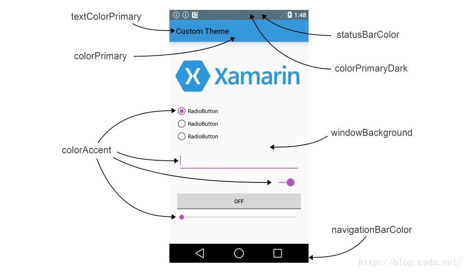
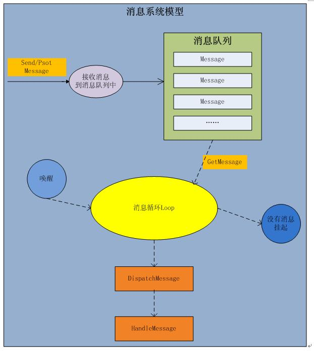

# 安卓系统架构

* Linux内核层
* 系统运行库层
* 应用框架层
* 应用层

# 工程目录


## res文件夹

`drawable`开头的文件夹用来存放图片；`mipmap`开头的文件夹用来存放图标；`layout`用来存放布局文件。

## 全局build.gradle文件

```
// Top-level build file where you can add configuration options common to all sub-projects/modules.

buildscript {
    
    repositories {
        google()
        jcenter()	//jcenter是一个代码托管仓库
    }
    dependencies {
    	// 依赖
        classpath 'com.android.tools.build:gradle:3.0.0'
        

        // NOTE: Do not place your application dependencies here; they belong
        // in the individual module build.gradle files
    }
}

allprojects {
    repositories {
        google()
        jcenter()
    }
}

task clean(type: Delete) {
    delete rootProject.buildDir
}
```

## app build.gradle文件

```
// com.android.library表示库模块
apply plugin: 'com.android.application'

android {
	// 制定项目的编译版本
    compileSdkVersion 26
    defaultConfig {
    	// 项目包名
        applicationId "com.example.vincent.activitytest"
        // 兼容最低的安卓版本
        minSdkVersion 15
        // 在该目标版本上经过充分测试
        targetSdkVersion 26
        // 版本号
        versionCode 1
        // 版本名
        versionName "1.0"
        testInstrumentationRunner "android.support.test.runner.AndroidJUnitRunner"
    }
    buildTypes {
        release {
        	// 是否进行混淆
            minifyEnabled false
            // 制定混淆的规则文件
            proguardFiles getDefaultProguardFile('proguard-android.txt'), 'proguard-rules.pro'
        }
    }
}

// 本地依赖，库依赖，远程依赖
dependencies {
	// 本地依赖
    implementation fileTree(dir: 'libs', include: ['*.jar'])
    // 远程依赖。appcompat-v7是组名，26.1.0是版本号
    implementation 'com.android.support:appcompat-v7:26.1.0'
    implementation 'com.android.support.constraint:constraint-layout:1.0.2'
    testImplementation 'junit:junit:4.12'
    androidTestImplementation 'com.android.support.test:runner:1.0.1'
    androidTestImplementation 'com.android.support.test.espresso:espresso-core:3.0.1'
    // implement project(':helper')
}
```

# Manifest文件

```xml
<?xml version="1.0" encoding="utf-8"?>
<manifest xmlns:android="http://schemas.android.com/apk/res/android"
    package="com.example.vincent.activitytest">
  
    <application
        android:allowBackup="true"
        android:icon="@mipmap/ic_launcher"
        android:label="@string/app_name"
        android:roundIcon="@mipmap/ic_launcher_round"
        android:supportsRtl="true"
        android:theme="@style/AppTheme">
      
    </application>
</manifest>
```

# 测试

## 单元测试

首先，创建一个非常简单的被测类：Calculator类。

```
package com.example.testing.testingexample;

public class Calculator {

    public double sum(double a, double b){
        return 0;
    }

    public double substract(double a, double b){
        return 0;
    }

    public double divide(double a, double b){
        return 0;
    }

    public double multiply(double a, double b){
        return 0;
    }
}
```

Android Studio提供了一个快速创建测试类的方法。只需在编辑器内右键点击Calculator类的声明，选择**Go to > Test**，然后**"Create a new test…"**

这样，就会在正确的文件夹内`(app/src/test/java/com/example/testing/testingexample)`生成测试类框架，在框架内填入测试方法即可。下面是一个示例：

**Calculator.java**

```
package com.example.testing.testingexample;

import org.junit.Before;
import org.junit.Test;

import static org.junit.Assert.*;

public class CalculatorTest {

    private Calculator mCalculator;

    @Before
    public void setUp() throws Exception {
        mCalculator = new Calculator();
    }

    @Test
    public void testSum() throws Exception {
        //expected: 6, sum of 1 and 5
        assertEquals(6d, mCalculator.sum(1d, 5d), 0);
    }

    @Test
    public void testSubstract() throws Exception {
        assertEquals(1d, mCalculator.substract(5d, 4d), 0);
    }

    @Test
    public void testDivide() throws Exception {
        assertEquals(4d, mCalculator.divide(20d, 5d), 0);
    }

    @Test
    public void testMultiply() throws Exception {
        assertEquals(10d, mCalculator.multiply(2d, 5d), 0);
    }
}
```

# 活动

## 活动基本用法

### 创建活动

一个活动如下所示

```java
public class FirstActivity extends AppCompatActivity {

    private static final String TAG = "FirstActivity";
    @Override
    protected void onCreate(Bundle savedInstanceState) {
        super.onCreate(savedInstanceState);   //制定一个布局文件
        setContentView(R.layout.first_layout);   //绑定一个按键

        //你也可以隐藏标题栏
        if (getSupportActionBar() != null){
            getSupportActionBar().hide();
        }
}
```

### 布局文件

与活动同时创在有一个布局文件，其放在res/layout下

```xml
<?xml version="1.0" encoding="utf-8"?>
<LinearLayout xmlns:android="http://schemas.android.com/apk/res/android"
    android:orientation="vertical" android:layout_width="match_parent"
    android:layout_height="match_parent">
    
    <Button
        android:layout_width="match_parent"
        android:layout_height="wrap_content"
        android:id="@+id/button_1"
        android:text="Button 1"
        />

    <!--在xml中定义id用@+id，引用的话用@id-->

</LinearLayout>
```

### 修改Manifest文件

```xml
<?xml version="1.0" encoding="utf-8"?>
<manifest xmlns:android="http://schemas.android.com/apk/res/android"
    package="com.example.vincent.activitytest">

    <application
        android:allowBackup="true"
        android:icon="@mipmap/ic_launcher"
        android:label="@string/app_name"
        android:roundIcon="@mipmap/ic_launcher_round"
        android:supportsRtl="true"
        android:theme="@style/AppTheme">
        <activity android:name=".FirstActivity">
            <intent-filter>
                <action android:name="android.intent.action.MAIN" />
                <category android:name="android.intent.category.LAUNCHER" />
            </intent-filter>
        </activity>
    </application>
  
</manifest>
```

### 显示Toast

试试显示一个Toast。在`onCreate`函数里面

```java
...
        Button button1 = (Button) findViewById(R.id.button_1);
        button1.setOnClickListener(new View.OnClickListener() {
            @Override
            public void onClick(View v) {
//                创造出一个Toast对象
//                context：上下文对象
//                text：文本内容
//                Toast显示时长


                Toast.makeText(FirstActivity.this, "You clicked", Toast.LENGTH_SHORT).show();
            }
        });
...
```

### 销毁活动

使用`finish()`销毁一个活动

```java
    protected void onCreate(Bundle savedInstanceState) {
        finish();
    }
```

## Intent

### 显式Intent

我们新建一个新的布局文件，新建一个新的活动，类名为`SecoendActivity`在其`onCreate()`函数里面初始化。

在第一个活动的`onCreate()`函数里面。

```java
        button1.setOnClickListener(new View.OnClickListener() {
            @Override
            public void onClick(View v) {
                Intent intent=new Intent(FirstActivity.this,SecondActivity.class);
                startActivity(intent);
            }
        });
```

通过`FirstActivity.this`传入一个`Context`。

### 隐式Intent

我们需要更改下manifest文件。增加一个activity标签。

```xml
        <activity android:name=".SecondActivity">
            <intent-filter>
                <!-- 当前活动可以响应com.example.activitytest.ACTION_START这个action -->
                <action android:name="com.example.activitytest.ACTION_START" />
                <!-- 指明了当前的活动能够响应的Intent中还可能带有的category -->
                <category android:name="android.intent.category.DEFAULT" />
            </intent-filter>
        </activity>
```

我们新建一个新的布局文件，新建一个新的活动，类名为`SecoendActivity`在其`onCreate()`函数里面初始化。

在第一个活动的`onCreate()`函数里面。

```java
        button1.setOnClickListener(new View.OnClickListener() {
            @Override
            public void onClick(View v) {
                Intent intent=new Intent("com.example.activitytest.ACTION_START");
//                会将默认的category添加到Intent中
//                你也可以制定多个category
//                intent.addCategory("com.example.activitytest.MY_CATEGORY");
                startActivity(intent);
            }
        });
```

关于category：提供将要执行的action的额外信息，一般在隐式地启动activity时需要用到。

### 使用隐式Intent打开其他程序

```java
        button1.setOnClickListener(new View.OnClickListener() {
            @Override
            public void onClick(View v) {
                Intent intent=new Intent(Intent.ACTION_VIEW);
//                打电话
//                Intent intent=new Intent(Intent.ACTION_DIAL);
//                intent.setData(Uri.parse("tel:10086"));

                intent.setData(Uri.parse("http://www.baidu.com"));
                startActivity(intent);
            }
        });
```

我们也可以在`<intent-filter>`标签里面添加一个`<data>`来制定当前活动能够响应什么类型的数据。

### 向下一个活动传递数据

在第一个活动中传递

```java
//        利用intent传递数据到下一个activity
        button1.setOnClickListener(new View.OnClickListener() {
            @Override
            public void onClick(View v) {
                String data = "Hello";
                Intent intent =new Intent(FirstActivity.this,SecondActivity.class);
                intent.putExtra("extra_data",data);
                startActivity(intent);
            }
        });
```

在第二个活动中接受

```java
        Intent intent=getIntent();
        String data=intent.getStringExtra("extra_data");
```

若我们需要向第二个活动发送数据之后等待其的回答。我们可以在一个活动中，将`startActivity(intent);`换成`startActivityForResult(intent,1);`

然后重载`AppCompatActivity`类的一个方法。

```java
//    接收从Activity中返回的数据
    @Override
    protected void onActivityResult(int requestCode, int resultCode, Intent data) {
        switch (requestCode){
            case 1:
                if(resultCode==RESULT_OK){
                    String returnedData=data.getStringExtra("data_return");
                    Log.d(TAG, returnedData);
                }
                break;
            default:
        }
    }
```

我们在第二个活动里面

```java
//        返回数据给上一个Activity
        Button button2=(Button)findViewById(R.id.button_2);
        button2.setOnClickListener(new View.OnClickListener() {
            @Override
            public void onClick(View v) {
                Intent intent=new Intent();
                intent.putExtra("data_return","Hello");
                setResult(RESULT_OK,intent);
                finish();
            }
        });
```

## 活动的生命周期

### 返回栈

我们每启动一个新的活动，就会覆盖在原来的活动上面。就像数据结构里面的栈，我们称其为“返回栈”。

### 活动状态

* 活动状态：当一个活动位于返回栈的栈顶时，这时活动就在于运行状态。
* 暂停状态：当一个活动不再处于栈顶位置，但仍可见，此时活动就进入了暂停状态。
* 停止状态：当一个活动不再处于栈顶位置，并且完全不可见的时候。
* 销毁状态：当一个活动从返回栈中移除后 。

### 活动的生存期

* onCreate()：在活动第一次被创建的时候调用。
* onStart()：在活动有不可见变为可见的时候调用。
* onResume()：在活动准备好和用户进行交互的时候调用。
* onPause()：在系统准备去启动或者恢复另一个活动的时候调用。这个方法一定要快。
* onStop()：在活动完全不可见的时候调用。和onPause()的区别在于。如果启动的新活动是一个对话框的活动，那么onPause()会执行，而onStop()不会执行。
* onDestory()：在活动被销毁之前调用。
* onRestart()：在活动头停止状态变为运行状态之前调用。


## 活动的启动模式

我们在manifest文件下面修改启动模式。

```xml
        <activity 
            android:name=".FirstActivity"
            android:launchMode="standard"
            >
            <intent-filter>
                <action android:name="android.intent.action.MAIN" />
                <category android:name="android.intent.category.LAUNCHER" />
            </intent-filter>
        </activity>
```

### standard

在不指定的情况下，默认。

每当启动一个新的活动，他就会在返回栈中入栈，并处于栈顶的位置。对于使用standard模式启动的活动，系统不会在乎这个活动是否已经在返回栈中存在，每次启动都会创建该活动的一个新的实例。

### singleTop

当活动的启动模式指定为singleTop时，在启动活动时候如果发现返回栈已经是该活动，则认为可以直接使用它。不过如果活动并未处于栈顶的位置，还是会启动新的实例的。

### singleTask

每次启动该活动时系统首先会在返回栈中检查是否存在该活动的实例，如果发现已经存在就直接使用，并且把这个活动之上的所有活动统统出栈，如果没有发现就会创建一个新的活动实例。

### singleInstance

活动会启用一个新的返回栈来管理这个活动。

## 关于活动的PS

### 知晓当前是在哪一个活动

```
getClass().getSimpleName()
```

### 随时退出程序

```java
public class ActivityCollector {
    public static List<Activity> activities = new ArrayList<Activity>();

    public static void addActivity(Activity activity) {
        activities.add(activity);
    }

    public static void removeActivity(Activity activity) {
        activities.remove(activity);
    }
    
    public static void finishAll() {
        for (Activity activity : activities) {
            if (!activity.isFinishing()) {
                activity.finish();
            }
        }
    }
}
```

使用一个管理器，重写每个活动的onCreate和onDestory方法。

## Android按钮单击事件的四种常用写法总结

### 匿名内部类

```java
public class TestButtonActivity extends Activity {
 
  Button btn1, btn2;
  Toast tst;
 
  @Override
  protected void onCreate(Bundle savedInstanceState) {
    super.onCreate(savedInstanceState);
    setContentView(R.layout.activity_test_button);
 
    btn1 = (Button) findViewById(R.id.button1);
    btn2 = (Button) findViewById(R.id.button2);
 
    btn1.setOnClickListener(new OnClickListener() {
 
      @Override
      public void onClick(View v) {
        // TODO Auto-generated method stub
        Toast tst = Toast.makeText(TestButtonActivity.this, "111111111", Toast.LENGTH_SHORT);
        tst.show();
 
      }
    });
 
    btn2.setOnClickListener(new OnClickListener() {
 
      @Override
      public void onClick(View v) {
        // TODO Auto-generated method stub
        Toast tst = Toast.makeText(TestButtonActivity.this, "222222222", Toast.LENGTH_SHORT);
        tst.show();
      }
    });
  }
}
```

### 自定义单击事件监听类

```java
public class TestButtonActivity extends Activity {
 
  Button btn1, btn2;
  Toast tst;
 
  class MyClickListener implements OnClickListener {
 
    @Override
    public void onClick(View v) {
      // TODO Auto-generated method stub
      switch (v.getId()) {
      case R.id.button1:
        tst = Toast.makeText(TestButtonActivity.this, "111111111", Toast.LENGTH_SHORT);
        tst.show();
        break;
      case R.id.button2:
        tst = Toast.makeText(TestButtonActivity.this, "222222222", Toast.LENGTH_SHORT);
        tst.show();
        break;
      default:
        break;
      }
    }
  }
 
  @Override
  protected void onCreate(Bundle savedInstanceState) {
    super.onCreate(savedInstanceState);
    setContentView(R.layout.activity_test_button);
 
    btn1 = (Button) findViewById(R.id.button1);
    btn2 = (Button) findViewById(R.id.button2);
 
    btn1.setOnClickListener(new MyClickListener());
    btn2.setOnClickListener(new MyClickListener());
  }
}
```

### Activity继承View.OnClickListener

```java
public class TestButtonActivity extends Activity implements OnClickListener {
 
  Button btn1, btn2;
  Toast tst;
 
  @Override
  protected void onCreate(Bundle savedInstanceState) {
    super.onCreate(savedInstanceState);
    setContentView(R.layout.activity_test_button);
 
    btn1 = (Button) findViewById(R.id.button1);
    btn2 = (Button) findViewById(R.id.button2);
 
    btn1.setOnClickListener(this);
    btn2.setOnClickListener(this);
  }
 
  @Override
  public void onClick(View v) {
    // TODO Auto-generated method stub
    switch (v.getId()) {
    case R.id.button1:
      tst = Toast.makeText(this, "111111111", Toast.LENGTH_SHORT);
      tst.show();
      break;
    case R.id.button2:
      tst = Toast.makeText(this, "222222222", Toast.LENGTH_SHORT);
      tst.show();
      break;
    default:
      break;
    }
  }
}
```

### XML

```xml
<Button
    android:id="@+id/button1"
    android:layout_width="wrap_content"
    android:layout_height="wrap_content"
    android:onClick="onClick"
    android:text="Button1" />
 
  <Button
    android:id="@+id/button2"
    android:layout_width="wrap_content"
    android:layout_height="wrap_content"
    android:onClick="onClick"
    android:text="Button2" />
```

# UI

##常见控件
### TextView

```xml
<TextView
    android:layout_width="match_parent"
    android:layout_height="match_parent"
    android:text="this is text"
    android:gravity="center"
    />
```

* match_parent：当前空间的大小和父布局大小一样
* wrap_content：当前空间的大小刚好包含住里面的内容

可以同时用`|`来制定多个对齐方式

### Button

### EditText

```xml
    <EditText
        android:layout_width="match_parent"
        android:layout_height="wrap_content"
        android:hint="input somethings"
        android:maxLines="2"/>
```

### ImageView

```xml
    <ImageView
        android:layout_width="wrap_content"
        android:layout_height="wrap_content"
        android:src="@drawable/ic_launcher_background"/>
```

### ProgressBar

```xml
    <ProgressBar
        android:layout_width="wrap_content"
        android:layout_height="wrap_content" />
```

### AlertDialog

```java
AlertDialog.Builder dialog = new AlertDialog.Builder(FirstActivity.this);
dialog.setTitle("Title");
dialog.setMessage("Message");
dialog.setCancelable(false);
dialog.setPositiveButton("OK", new DialogInterface.OnClickListener() {
    @Override
    public void onClick(DialogInterface dialog, int which) {
        
    }
});

dialog.setNegativeButton("Cancel", new DialogInterface.OnClickListener() {
    @Override
    public void onClick(DialogInterface dialog, int which) {
        
    }
});
dialog.show();
```

### ProgressDialog

```java
ProgressDialog progressDialog=new ProgressDialog(FirstActivity.this);
progressDialog.setTitle("Title");
progressDialog.setMessage("Loading...");
progressDialog.setCancelable(true);
progressDialog.show();
```

## 可见与不可见

任何空间都可以用`android:visibility`设定。

* visible：可见
* invisible：不可见
* gone：不仅不可见，而且不占用屏幕空间

我们也可以在代码中

```java
Button button1 = (Button) findViewById(R.id.button_1);
button1.setVisibility(View.VISIBLE);
```

## ~~四~~五种布局

### LinearLayout

```xml
<LinearLayout xmlns:android="http://schemas.android.com/apk/res/android"
    android:orientation="vertical" android:layout_width="match_parent"
    android:layout_height="match_parent">
    
    <Button
        android:layout_width="match_parent"
        android:layout_height="wrap_content"
        android:layout_gravity="center"
        android:text="Button"/>

</LinearLayout>
```

我们可以设置`android:orientation="horizontal"`来将布局设置为水平布局。

我们可以设置`android:layout_gravity="center"`来控制控件的位置。有`top`，`bottom`，`center_horizontal`，`center_vertical`，`center`可选。

我们还可以按照比例设置，如下button与textview的比例为一比一。

```xml
    <Button
        android:layout_width="0dp"
        android:layout_height="wrap_content"
        android:layout_weight="1"/>

    <TextView
        android:layout_width="0dp"
        android:layout_height="wrap_content"
        android:text="this is text"
        android:layout_weight="1"/>
```

```
orientation:方向；vertical，垂直；horizontal,水平
gravity:对齐方式，子控件相对于当前控件的对齐方式
layout_gravity：当前控件相对于父控件的对齐方式
margin:当前控件相对于四周的间距。
padding：当前控件中的子控件相对于当前控件四周的间距。
```

### RelativeLayout

```xml
    <RelativeLayout
        android:layout_width="match_parent"
        android:layout_height="match_parent">
        <Button
            android:layout_width="wrap_content"
            android:layout_height="wrap_content"
            android:text="Hello World!"
            android:layout_alignParentLeft="true"
            android:layout_alignParentBottom="true"
            />

        <Button
            android:layout_width="wrap_content"
            android:layout_height="wrap_content"
            android:text="Hello World2!"
            android:layout_alignParentTop="true"
            android:layout_alignParentRight="true"
            />
    </RelativeLayout>
```


上面的参数设置是相对于父布局的。若果你想相对于某一控件。

```xml
<RelativeLayout
                android:layout_width="match_parent"
                android:layout_height="match_parent">
  <Button
          android:layout_width="wrap_content"
          android:layout_height="wrap_content"
          android:text="Hello World!"
          android:id="@+id/Hello1"
          android:layout_centerInParent="true"
          />

  <Button
          android:layout_width="wrap_content"
          android:layout_height="wrap_content"
          android:id="@+id/Hello2"
          android:layout_above="@id/Hello1"
          android:layout_toLeftOf="@id/Hello1"
          android:text="Hello World2!"
          />

  <Button
          android:layout_width="wrap_content"
          android:layout_height="wrap_content"
          android:id="@+id/Hello3"
          android:layout_below="@id/Hello1"
          android:layout_toRightOf="@id/Hello1"
          android:text="Hello World3!"
          />
</RelativeLayout>
```


此外，还有`android:layout_alignTop`，`android:layout_alignBottom`等，对齐某一控件的边缘。

```xml
<RelativeLayout
    android:layout_width="match_parent"
    android:layout_height="match_parent">
    <Button
        android:layout_width="wrap_content"
        android:layout_height="wrap_content"
        android:text="Hello World!!!!!!!!!!!!!!!!!!!!!!!!!!!!!!!!!!"
        android:id="@+id/Hello1"
        android:layout_centerInParent="true"
        />
    <Button
        android:layout_width="wrap_content"
        android:layout_height="wrap_content"
        android:id="@+id/Hello2"
        android:layout_alignRight="@id/Hello1"
        android:text="Hello World"
        />
</RelativeLayout>
```


```
	layout_below:位于哪个控件的下方
	layout_above:位于哪个控件的上方
	layout_toLeftOf:指定当前控件位于哪个控件的左边
	layout_toRightOf：指定当前控件位于哪个控件的右边
	layout_alignParentRight:当前控件基于父窗体的对其方式
	layout_centerHorizontal:水平居中
	layout_centerVertical：垂直居中
	layout_centerInParent:位于父窗体的中间
```

### FrameLayout

帧布局中的子控件都是一层一层向上叠加的，全部放在左上角

```xml
<FrameLayout
    android:layout_width="match_parent"
    android:layout_height="match_parent">
    <ImageView
        android:layout_width="wrap_content"
        android:layout_height="wrap_content" 
        android:src="@drawable/ic_launcher_background"/>
    <Button
        android:layout_width="wrap_content"
        android:layout_height="wrap_content"
        android:id="@+id/Hello2"
        android:text="Hello World" />
</FrameLayout>
```


### TableLayout

```xml
<TableLayout
    android:layout_width="match_parent"
    android:layout_height="match_parent">
    <TableRow>
        <TextView 
            android:layout_height="wrap_content"
            android:text="Account:"/>
        
        <EditText 
            android:layout_height="wrap_content"
            android:hint="Input your account"/>
    </TableRow>
    <TableRow>
        <TextView
            android:layout_height="wrap_content"
            android:text="Password:"/>

        <EditText
            android:layout_height="wrap_content"
            android:hint="Input your passowrd"/>
    </TableRow>
    
    <TableRow>
        <Button 
            android:layout_height="wrap_content"
            android:layout_span="2"
            android:text="Login"/>
    </TableRow>
</TableLayout>
```

`android:layout_span="2"`让登陆按钮占据两列的空间。


在TableLayout标签里加上`android:stretchColumns="1"`可以将不能占据满屏幕的控件的第二列进行拉伸。若0则第一列拉伸。

### PercentFrameLayout

build.gradle添加：

```
compile 'com.android.support:percent:25.2.0'
```

```xml
<?xml version="1.0" encoding="utf-8"?>
<android.support.percent.PercentFrameLayout
    xmlns:android="http://schemas.android.com/apk/res/android"
    xmlns:app="http://schemas.android.com/apk/res-auto"
    android:layout_width="match_parent"
    android:layout_height="match_parent">
    
    <ImageView
        android:layout_width="0dp"
        android:layout_height="0dp"
        app:layout_heightPercent="20%"
        app:layout_widthPercent="50%"
        android:layout_gravity="center"
        android:background="@mipmap/picture"/>
    
    <TextView
        android:layout_width="wrap_content"
        android:layout_height="wrap_content"
        android:textSize="16sp"
        android:layout_gravity="center"
        android:text="孩子"
        android:gravity="center"/>
    
</android.support.percent.PercentFrameLayout>
```

还有一个`PercentRelativeLayout`库。这里略。

## 引入布局

若我们需要引入一个布局文件，只需要在xml文件中`<include layout="@layout/xml_files_name" />`即可，。

### 引入布局的绑定

若引用的布局里面需要绑定按钮等，那么每次引入布局都需要重新绑定，这不行。

假若我们需要引入的布局文件为`hello.xml`我们新建一个类，在类中绑定好所有按钮。

```java
public class HelloLayout extends LinearLayout {
    public HelloLayout(Context context, AttributeSet attrs){
        super(context, attrs);
        // 动态加载一个布局文件，第一个参数是需要加载的布局文件的id，第二个参数是给加载好的布局在添加一个父布局。
        LayoutInflater.from(context).inflate(R.layout.hello,this);
        Button hello=(Button) findViewById(R.id.hello);
        hello.setOnClickListener(new OnClickListener() {
            @Override
            public void onClick(View view) {
                Toast.makeText(getContext(),"Hello",Toast.LENGTH_SHORT).show();
            }
        });
    }
}
```


hello.xml

```xml
<?xml version="1.0" encoding="utf-8"?>
<LinearLayout
    android:layout_width="match_parent"
    xmlns:android="http://schemas.android.com/apk/res/android"
    android:layout_height="wrap_content">
    <Button
        android:layout_width="wrap_content"
        android:layout_height="wrap_content"
        android:text="Hello"
        android:id="@+id/hello"
        />
</LinearLayout>
```

在需要引入的地方

```xml
<com.example.vincent8280.myapplication.HelloLayout
    android:layout_width="wrap_content"
    android:layout_height="wrap_content"></com.example.vincent8280.myapplication.HelloLayout>
```

## ListView

```java
public class MainActivity extends AppCompatActivity {
      private String[] data={"item1","item2","item1","item2","item1","item2","item1","item2",
              "item1","item2","item1","item2","item1","item2","item1","item2","item1","item2",
              "item1","item2","item1","item2"};
      @Override
      protected void onCreate(Bundle savedInstanceState) {
            super.onCreate(savedInstanceState);
            setContentView(R.layout.activity_main);

            ArrayAdapter<String> adapter=new ArrayAdapter<String>(
                    MainActivity.this,android.R.layout.simple_list_item_1,data
            );
            ListView listview =(ListView)findViewById(R.id.list_view);
            listview.setAdapter(adapter);
      }
}
```
`android.R.layout.simple_list_item_1`是一个内置的布局文件，里面有一个TextView，可以简单地显示一段文本。
```xml
<?xml version="1.0" encoding="utf-8"?>
<android.support.constraint.ConstraintLayout
    xmlns:android="http://schemas.android.com/apk/res/android"
    xmlns:tools="http://schemas.android.com/tools"
    xmlns:app="http://schemas.android.com/apk/res-auto"
    android:layout_width="match_parent"
    android:layout_height="match_parent"
    tools:context="com.example.vincent8280.myapplication.MainActivity">

    <ListView
        android:id="@+id/list_view"
        android:layout_width="match_parent"
        android:layout_height="match_parent"></ListView>

</android.support.constraint.ConstraintLayout>
```

### 自定义Adapter

如果我们需要设置一个带图标的ListView，我们就需要自定义一个Adapter了。

活动的xml

```xml
<?xml version="1.0" encoding="utf-8"?>
<android.support.constraint.ConstraintLayout
    xmlns:android="http://schemas.android.com/apk/res/android"
    xmlns:tools="http://schemas.android.com/tools"
    xmlns:app="http://schemas.android.com/apk/res-auto"
    android:layout_width="match_parent"
    android:layout_height="match_parent"
    tools:context="com.example.vincent8280.myapplication.MainActivity">
    <ListView
        android:id="@+id/list_view"
        android:layout_width="match_parent"
        android:layout_height="match_parent">
    </ListView>
</android.support.constraint.ConstraintLayout>
```

我们再新建一个名为`image_list.xml`的layout。

```xml
<?xml version="1.0" encoding="utf-8"?>
    <LinearLayout
        xmlns:android="http://schemas.android.com/apk/res/android"
        android:layout_width="match_parent"
        android:layout_height="match_parent">

        <ImageView
            android:layout_width="wrap_content"
            android:layout_height="wrap_content"
            android:id="@+id/list_image"/>
        <TextView
            android:id="@+id/list_text"
            android:layout_width="match_parent"
            android:layout_height="match_parent"></TextView>

    </LinearLayout>
```

我们新建一个类，专门负责每一个listitem。在安卓中，资源都是以int形式出现的。

```java
public class ImageListItem {
    private String name;
    private int image_id;
    public ImageListItem(String name,int image_id){
        this.name=name;
        this.image_id =image_id;
    }

    public String get_name(){
        return this.name;
    }

    public int get_image_id(){
        return this.image_id;
    }
}
```

然后我们自定义一个Adapter

```java
public class ImageListAdapter extends ArrayAdapter<ImageListItem> {
    private int textViewResourceId;

    public ImageListAdapter(Context context, int textViewResourceId, List<ImageListItem> objects){
        super(context,textViewResourceId,objects);
        this.textViewResourceId=textViewResourceId;
    }

    @Override
    public View getView(int position, View convertView, ViewGroup parent) {
        ImageListItem image_list_item=getItem(position); //从this.objects里面获取当前项的Fruit实例。position代表第几个list，从0开始。
        View view= LayoutInflater.from(getContext()).inflate(this.textViewResourceId,null);
        ImageView image=(ImageView) view.findViewById(R.id.list_image);
        TextView name=(TextView) view.findViewById(R.id.list_text);
        image.setImageResource(image_list_item.get_image_id());
        name.setText(image_list_item.get_name());
        return view;
    }
}
```

`textViewResourceId`代表`image_list.xml`这个layout。`objects`代表每一个listitem项的实例的列表。

活动类

```java
public class MainActivity extends AppCompatActivity {
      private List<ImageListItem> data=new ArrayList<ImageListItem>();

      @Override
      protected void onCreate(Bundle savedInstanceState) {
            super.onCreate(savedInstanceState);
            setContentView(R.layout.activity_main);
            init();
            ImageListAdapter adapter=new ImageListAdapter(
                    MainActivity.this,R.layout.image_list,data
            );
            ListView listview =(ListView)findViewById(R.id.list_view);
            listview.setAdapter(adapter);
      }

      private void init(){
            data.add(new ImageListItem("item1",R.drawable.ic_launcher_background));
            data.add(new ImageListItem("item2",R.drawable.ic_launcher_background));
            data.add(new ImageListItem("item3",R.drawable.ic_launcher_background));
            data.add(new ImageListItem("item4",R.drawable.ic_launcher_background));
      }
}
```

我们注意到，`getView()`每次都将布局重新加载一遍，这会导致性能低下。我们可以使用`convertView`参数，用于将之前加载好的布局进行缓存。

```java
if (convertView==null){
    view= LayoutInflater.from(getContext()).inflate(this.textViewResourceId,null);
}else{
    view=convertView;
}
```

我们还可以使用`ViewHolder`来缓存控件的实例。`ViewHolder`使我们自己编写的类，之后调用`view.setTag()`方法将这个类保存在`view`中。

```java
class ViewHolder{
    ImageView image_view;
    TextView text_view;
}

@Override
public View getView(int position, View convertView, ViewGroup parent) {
    ImageListItem image_list_item=getItem(position); //从this.objects里面获取当前项的Fruit实例。position代表第几个list，从0开始。
    View view;
    ViewHolder view_holder;
    if (convertView==null){
        view= LayoutInflater.from(getContext()).inflate(this.textViewResourceId,null);
        view_holder=new ViewHolder();
        view_holder.image_view=(ImageView) view.findViewById(R.id.list_image);
        view_holder.text_view=(TextView) view.findViewById(R.id.list_text);
        view.setTag(view_holder);   //将ViewHolder存储在View中
    }else{
        view=convertView;
        view_holder=(ViewHolder) view.getTag();
    }
    view_holder.image_view.setImageResource(image_list_item.get_image_id());
    view_holder.text_view.setText(image_list_item.get_name());
    return view;
}
```

## RecyclerView


## 单位与尺寸

不同于px与pt安卓使用dp和sp，使得在不同密度的屏幕中显示比例保持一致。sp用于文字大小。

# Material Design

## 主题

```xml
    <application
        android:allowBackup="true"
        android:icon="@mipmap/ic_launcher"
        android:label="@string/app_name"
        android:roundIcon="@mipmap/ic_launcher_round"
        android:supportsRtl="true"
        android:theme="@style/AppTheme">
      ...
     </application>
```

其指定的`AppTheme`在`style.xml`文件中

```xml
<resources>

    <!-- Base application theme. -->
    <style name="AppTheme" parent="Theme.AppCompat.Light.DarkActionBar">
        <!-- Customize your theme here. -->
        <item name="colorPrimary">@color/colorPrimary</item>
        <item name="colorPrimaryDark">@color/colorPrimaryDark</item>
        <item name="colorAccent">@color/colorAccent</item>
    </style>

</resources>
```

其中`Theme.AppCompat.Light.DarkActionBar`表示使用带`ActionBar`的浅色主题。`Theme.AppCompat.NoActionBar`表示不带`ActionBar`的深色主题。

除了设置主题之外，我们还可以单独设置不同位置的颜色。



## Toolbar

每个活动最顶部的那个标题栏其实就是`ActionBar`。不过`ActionBar`由于其设计的原因，被限定只能位于活动的顶部，从而不能实现一些`Material Design`的效果，现在官方已经不推荐使用了。

如要使用`Toolbar`

```xml
<?xml version="1.0" encoding="utf-8"?>
<FrameLayout
    xmlns:android="http://schemas.android.com/apk/res/android"
    xmlns:app="http://schemas.android.com/apk/res-auto"
    android:layout_width="match_parent"
    android:layout_height="match_parent">

    <android.support.v7.widget.Toolbar
        android:layout_width="match_parent"
        android:layout_height="?attr/actionBarSize"
        android:id="@+id/toolbar"
        android:background="?attr/colorPrimary"
        android:theme="@style/Base.ThemeOverlay.AppCompat.Dark.ActionBar"
        app:popupTheme="@style/Base.ThemeOverlay.AppCompat.Light"/>

</FrameLayout>
```

`app:popupTheme`单独将弹出的菜单项制定成淡色主题。

```java
public class MainActivity extends AppCompatActivity {

    @Override
    protected void onCreate(Bundle savedInstanceState) {
        super.onCreate(savedInstanceState);
        setContentView(R.layout.activity_main);

        android.support.v7.widget.Toolbar toolbar = (android.support.v7.widget.Toolbar) findViewById(R.id.toolbar);
        setSupportActionBar(toolbar);
    }
}
```


我们在`res`目录下新建一个`menu`文件夹，再在其目录下新建一个`xml`文件。

```xml
<?xml version="1.0" encoding="utf-8"?>
<menu xmlns:android="http://schemas.android.com/apk/res/android"
    xmlns:app="http://schemas.android.com/apk/res-auto">
    <item
        android:id="@+id/backup"
        android:title="Backup"
        android:icon="@mipmap/ic_keyboard_return_white_24dp"
        app:showAsAction="always"/>

    <item
        android:id="@+id/delete"
        android:title="Delete"
        android:icon="@mipmap/ic_delete_white_24dp"
        app:showAsAction="ifRoom"/>

    <item
        android:id="@+id/settings"
        android:title="Settings"
        app:showAsAction="never"/>

</menu>
```


always`表示永远显示在`Toolbar`中，`ifRoom`表示有空间就显示，`never`表示不显示。

```java
public class MainActivity extends AppCompatActivity {

    @Override
    protected void onCreate(Bundle savedInstanceState) {
        super.onCreate(savedInstanceState);
        setContentView(R.layout.activity_main);

        android.support.v7.widget.Toolbar toolbar = (android.support.v7.widget.Toolbar) findViewById(R.id.toolbar);
        setSupportActionBar(toolbar);
    }

    public boolean onCreateOptionsMenu(Menu menu){
        getMenuInflater().inflate(R.menu.toolbar_menu,menu);
        return true;
    }

    @Override
    public boolean onOptionsItemSelected(MenuItem item) {
        switch (item.getItemId()){
            case R.id.backup:
                Toast.makeText(this,"...",Toast.LENGTH_SHORT).show();
                break;
            case R.id.delete:
                Toast.makeText(this,"...",Toast.LENGTH_SHORT).show();
                break;
            case R.id.settings:
                Toast.makeText(this,"...",Toast.LENGTH_SHORT).show();
                break;
        }
        return true;
    }
}
```

## 滑动菜单

### DrawerLayout

```xml
<?xml version="1.0" encoding="utf-8"?>

<android.support.v4.widget.DrawerLayout
    xmlns:android="http://schemas.android.com/apk/res/android"
    xmlns:app="http://schemas.android.com/apk/res-auto"
    android:layout_width="match_parent"
    android:layout_height="match_parent"
    android:id="@+id/drawer_layout">
    <FrameLayout
        android:layout_width="match_parent"
        android:layout_height="match_parent">

        <android.support.v7.widget.Toolbar
            android:id="@+id/toolbar"
            android:layout_width="match_parent"
            android:layout_height="?attr/actionBarSize"
            android:background="?attr/colorPrimary"
            android:theme="@style/Base.ThemeOverlay.AppCompat.Dark.ActionBar"
            app:popupTheme="@style/Base.ThemeOverlay.AppCompat.Light" />

    </FrameLayout>
      <TextView
        android:layout_width="match_parent"
        android:layout_height="match_parent"
        android:layout_gravity="start"
        android:text="The menu"
        android:textSize="30sp"/>
</android.support.v4.widget.DrawerLayout>
```

`DrawerLayout`中防止了两个直接子空间，第一个子空间是FrameLayout，用作与作为主屏幕中显示的内容。第二个子空间这里使用一个`TextView`用作滑动菜单中显示的内容，其实用什么都可以。

`layout_gravity`这个属性是必选的，`left`表示滑动菜单在左边，`start`表示根据系统语言决定。


`Material Design`建议的做法是在`Toolbar`的最左边加入一个导航按钮，点击了按钮也会将滑动菜单展示出来。

```java
package com.example.vincent.myapplication;

import android.support.v4.view.Gravityrt 
import android.support.v4.widget.DrawerLayout;
import android.support.v7.app.ActionBar;
import android.support.v7.app.AppCompatActivity;
import android.os.Bundle;
import android.util.Log;
import android.view.Menu;
import android.view.MenuItem;
import android.widget.Toast;

public class MainActivity extends AppCompatActivity {
    private static final String TAG = "MainActivity";
    private DrawerLayout mDrawerLayout;

    @Override
    protected void onCreate(Bundle savedInstanceState) {
        super.onCreate(savedInstanceState);
        setContentView(R.layout.activity_main);

        android.support.v7.widget.Toolbar toolbar = (android.support.v7.widget.Toolbar) findViewById(R.id.toolbar);
        setSupportActionBar(toolbar);


//        Start DrawerLayout_1
        mDrawerLayout = (DrawerLayout) findViewById(R.id.drawer_layout);
        ActionBar supportActionBar = getSupportActionBar();
        if (supportActionBar != null) {
            supportActionBar.setDisplayHomeAsUpEnabled(true);
            supportActionBar.setHomeAsUpIndicator(R.drawable.ic_menu_white_24dp);
        }
//        End DrawerLayout_1
    }

    public boolean onCreateOptionsMenu(Menu menu){
        getMenuInflater().inflate(R.menu.toolbar_menu,menu);
        return true;
    }

    @Override
    public boolean onOptionsItemSelected(MenuItem item) {
        switch (item.getItemId()){
//            Start DrawerLayout_1
            case android.R.id.home:
                mDrawerLayout.openDrawer(GravityCompat.START);
                break;
//            End DrawerLayout_1
            case R.id.backup:
                Toast.makeText(this,"...",Toast.LENGTH_SHORT).show();
                break;
            case R.id.delete:
                Toast.makeText(this,"...",Toast.LENGTH_SHORT).show();
                break;
            case R.id.settings:
                Toast.makeText(this,"...",Toast.LENGTH_SHORT).show();
                break;
        }
        return true;
    }
}
```


`setDisplayHomeAsUpEnabled`方法其实设置了一个返回箭头，含义是返回上一个活动。这里重写了它。

### NavigationView

添加如下依赖

```
implementation 'com.android.support:design:26.0.0-beta1'
// circleimageview用来实现图片圆形化功能
implementation 'de.hdodenhof:circleimageview:2.1.0'
```

我们在`res`目录下新建一个`menu`文件夹，再在其目录下新建一个`xml`文件。

```xml
//nav_menu.xml
<?xml version="1.0" encoding="utf-8"?>
<menu xmlns:android="http://schemas.android.com/apk/res/android">
<group android:checkableBehavior="single">
    <item
        android:id="@+id/nav_call"
        android:title="@string/call"/>
    <item
        android:id="@+id/nav_friends"
        android:title="@string/friends"/>
    <item
        android:id="@+id/nav_location"
        android:title="@string/location"/>
    <item
        android:id="@+id/nav_mail"
        android:title="@string/mail"/>
    <item
        android:id="@+id/nav_task"
        android:title="@string/tasks"/>
</group>

</menu>
```

`checkableBehavior`指定为`single`表示组中所有菜单项只能单选。

我们在`layout`文件夹下新建一个`xml`

```xml
//nav_header
<?xml version="1.0" encoding="utf-8"?>
<RelativeLayout
    xmlns:android="http://schemas.android.com/apk/res/android"
    android:layout_width="match_parent"
    android:layout_height="180dp"
    android:padding="10dp"
    android:background="?attr/colorPrimary">

    <de.hdodenhof.circleimageview.CircleImageView
        android:id="@+id/icon_image"
        android:layout_width="70dp"
        android:layout_height="70dp"
        android:src="@drawable/icon"
        android:layout_centerInParent="true"
        />

    <TextView
        android:layout_width="wrap_content"
        android:layout_height="wrap_content"
        android:id="@+id/username"
        android:layout_alignParentBottom="true"
        android:layout_centerInParent="true"
        android:text="wax8280@163.com"
        android:textSize="14sp"/>

    <TextView
        android:layout_width="wrap_content"
        android:layout_height="wrap_content"
        android:text="Vincent Zhong"
        android:layout_above="@+id/username"
        android:layout_centerInParent="true"
        android:textSize="14sp"/>

</RelativeLayout>
```

修改`activity_main.xml`文件

```xml
<?xml version="1.0" encoding="utf-8"?>

<android.support.v4.widget.DrawerLayout xmlns:android="http://schemas.android.com/apk/res/android"
    xmlns:app="http://schemas.android.com/apk/res-auto"
    android:id="@+id/drawer_layout"
    android:layout_width="match_parent"
    android:layout_height="match_parent">

    <FrameLayout
        android:layout_width="match_parent"
        android:layout_height="match_parent">

        <android.support.v7.widget.Toolbar
            android:id="@+id/toolbar"
            android:layout_width="match_parent"
            android:layout_height="?attr/actionBarSize"
            android:background="?attr/colorPrimary"
            android:theme="@style/Base.ThemeOverlay.AppCompat.Dark.ActionBar"
            app:popupTheme="@style/Base.ThemeOverlay.AppCompat.Light" />

    </FrameLayout>

    <!--Start NavigationView_1-->
    <android.support.design.widget.NavigationView
        android:id="@+id/nav_view"
        android:layout_width="match_parent"
        android:layout_height="match_parent"
        android:layout_gravity="start"
        app:headerLayout="@layout/nav_header"
        app:menu="@menu/nav_menu" />
    <!--End NavigationView_1-->
</android.support.v4.widget.DrawerLayout>
```

我们将`TextView`换成`NavigationView`了。通过`headerLayout`和`menu`将之前编写的布局加载进去。

```java
NavigationView navigationView = (NavigationView) findViewById(R.id.nav_view);
navigationView.setCheckedItem(R.id.nav_call);   //默认勾选
navigationView.setNavigationItemSelectedListener(new NavigationView.OnNavigationItemSelectedListener() {
    @Override
    public boolean onNavigationItemSelected(@NonNull MenuItem item) {
        mDrawerLayout.closeDrawer(GravityCompat.START);
        return true;
    }
});
```


## 悬浮按钮和可交互提示

### FloatingActionButton

```xml
//activity_main.xml
<?xml version="1.0" encoding="utf-8"?>

<android.support.v4.widget.DrawerLayout xmlns:android="http://schemas.android.com/apk/res/android"
    xmlns:app="http://schemas.android.com/apk/res-auto"
    android:id="@+id/drawer_layout"
    android:layout_width="match_parent"
    android:layout_height="match_parent">

    <FrameLayout
        android:layout_width="match_parent"
        android:layout_height="match_parent">

        <android.support.v7.widget.Toolbar
            android:id="@+id/toolbar"
            android:layout_width="match_parent"
            android:layout_height="?attr/actionBarSize"
            android:background="?attr/colorPrimary"
            android:theme="@style/Base.ThemeOverlay.AppCompat.Dark.ActionBar"
            app:popupTheme="@style/Base.ThemeOverlay.AppCompat.Light" />

        <!--Start FloatingActionButton_1-->
        <android.support.design.widget.FloatingActionButton
            android:layout_width="wrap_content"
            android:layout_height="wrap_content"
            android:id="@+id/fab"
            android:layout_gravity="end|bottom"
            android:layout_margin="16dp"
            android:src="@drawable/ic_playlist_add_white_18pt_3x" />
        <!--End FloatingActionButton_1-->


    </FrameLayout>

    <android.support.design.widget.NavigationView
        android:id="@+id/nav_view"
        android:layout_width="match_parent"
        android:layout_height="match_parent"
        android:layout_gravity="start"
        app:headerLayout="@layout/nav_header"
        app:menu="@menu/nav_menu" />
</android.support.v4.widget.DrawerLayout>
```

`end`和`start`一样，根据系统的设置来决定左右。

绑定事件

```java
FloatingActionButton floatingActionButton = (FloatingActionButton) findViewById(R.id.fab);
floatingActionButton.setOnClickListener(new View.OnClickListener() {
    @Override
    public void onClick(View v) {
        Toast.makeText(MainActivity.this, "...", Toast.LENGTH_SHORT).show();
    }
});
```

### Snackbar

类似`Toast`的作用。但是在提示当中加入一个可交互按钮，当用户点击按钮的时候可以执行一些额外的逻辑操作。

```
FloatingActionButton floatingActionButton = (FloatingActionButton) findViewById(R.id.fab);
floatingActionButton.setOnClickListener(new View.OnClickListener() {
    @Override
    public void onClick(View v) {
        Snackbar.make(v,"Data deleted",Snackbar.LENGTH_SHORT).setAction("Undo", new View.OnClickListener() {
            @Override
            public void onClick(View v) {
                Toast.makeText(MainActivity.this, "...", Toast.LENGTH_SHORT).show();
            }
        }).show();
    }
});
```


但是这个把我们悬浮按钮遮住了。

### CoordinatorLayout

`CoordinatorLayout`可以监听其所有子空间的各种事件，然后自动帮助我们做出最为合理的响应。

我们仅仅只用把`FrameLayout`换成`android.support.design.widget.CoordinatorLayout`即可。


虽然这里的`Snackbar`不是`CoordinatorLayout`的子空间，但是它是基于`FloatingActionButton`来触发的。

## 卡片式布局

### CardView

添加如下依赖

```
implementation 'com.android.support:cardview-v7:26.0.0-beta1'
implementation 'com.android.support:cardview-v7:26.0.0-beta1'
implementation 'com.github.bumptech.glide:glide:4.5.0'
```

在`activity_main.xml`里面添加如下

```xml
<android.support.v7.widget.RecyclerView
android:layout_width="match_parent"
android:layout_height="match_parent"
android:id="@+id/recycler_view"/>
```

我们新建一个`fruit_item.xml`

```xml
<?xml version="1.0" encoding="utf-8"?>
<android.support.v7.widget.CardView xmlns:android="http://schemas.android.com/apk/res/android"
    android:layout_width="match_parent"
    android:layout_height="wrap_content"
    xmlns:app="http://schemas.android.com/apk/res-auto"
    android:layout_margin="5dp"
    app:cardCornerRadius="4dp">

    <LinearLayout
        android:layout_width="match_parent"
        android:layout_height="wrap_content"
        android:orientation="vertical">

        <ImageView
            android:layout_width="match_parent"
            android:layout_height="100dp"
            android:id="@+id/fruit_image"
            android:scaleType="center"/>

        <TextView
            android:layout_width="wrap_content"
            android:layout_height="wrap_content"
            android:id="@+id/fruit_name"
            android:layout_gravity="center_horizontal"
            android:textSize="16sp"
            android:layout_margin="5dp"/>

    </LinearLayout>

</android.support.v7.widget.CardView>
```

`CardView`是一个`FrameLayout`。

我们再新建一个`FruitAdapter`类

```java
public class FruitAdapter extends RecyclerView.Adapter<FruitAdapter.ViewHolder>{

    private static final String TAG = "FruitAdapter";

    private Context mContext;

    private List<Fruit> mFruitList;

    static class ViewHolder extends RecyclerView.ViewHolder {
        CardView cardView;
        ImageView fruitImage;
        TextView fruitName;

        public ViewHolder(View view) {
            super(view);
            cardView = (CardView) view;
            fruitImage = (ImageView) view.findViewById(R.id.fruit_image);
            fruitName = (TextView) view.findViewById(R.id.fruit_name);
        }
    }

    public FruitAdapter(List<Fruit> fruitList) {
        mFruitList = fruitList;
    }

    @Override
    public ViewHolder onCreateViewHolder(ViewGroup parent, int viewType) {
        if (mContext == null) {
            mContext = parent.getContext();
        }
//        动态加载fruit_item布局
        View view = LayoutInflater.from(mContext).inflate(R.layout.fruit_item, parent, false);
        return new ViewHolder(view);
    }

    @Override
    public void onBindViewHolder(ViewHolder holder, int position) {
        Fruit fruit = mFruitList.get(position);
        holder.fruitName.setText(fruit.getName());
//        使用Glide加载图片
        Glide.with(mContext).load(fruit.getImageId()).into(holder.fruitImage);
    }

    @Override
    public int getItemCount() {
        return mFruitList.size();
    }

}
```

修改`MainActivity`类

```java
...
    private Fruit[] fruits = {new Fruit("Apple", R.drawable.apple), new Fruit("Banana", R.drawable.banana),
            new Fruit("Orange", R.drawable.orange), new Fruit("Watermelon", R.drawable.watermelon),
            new Fruit("Pear", R.drawable.pear), new Fruit("Grape", R.drawable.grape),
            new Fruit("Pineapple", R.drawable.pineapple), new Fruit("Strawberry", R.drawable.strawberry),
            new Fruit("Cherry", R.drawable.cherry), new Fruit("Mango", R.drawable.mango)};
    private List<Fruit> fruitList = new ArrayList<>();

    private FruitAdapter adapter;
...
    private void initFruits() {
        fruitList.clear();
        for (int i = 0; i < 50; i++) {
            Random random = new Random();
            int index = random.nextInt(fruits.length);
            fruitList.add(fruits[index]);
        }
    }
    ....
    @Override
    protected void onCreate(Bundle savedInstanceState) {
    	....
        initFruits();
        RecyclerView recyclerView = (RecyclerView) findViewById(R.id.recycler_view);
      //2是列数
        GridLayoutManager layoutManager = new GridLayoutManager(this, 2);
        recyclerView.setLayoutManager(layoutManager);
        adapter = new FruitAdapter(fruitList);
        recyclerView.setAdapter(adapter);
    }
```


但是我们的`Toolbar`被挡住了！

### AppBarLayout

我们的`RecyclerView`和`Toolbar`都是放置在`CoordinatorLayout`中的，而`CoordinatorLayout`只是一个加强版的`FrameLayout`。

在传统的方式下，我们可以给`RecyclerView`向下偏移一个`Toolbar`的高度。

在这里我们使用`AppBarLayout`。`AppBarLayout`实际上是一个垂直方向的`LinearLayout`。

我们用一个`AppBarLayout`将`Toolbar`包裹起来，再在`RecyclerView`添加一个`layout_behavior`属性。

```xml
<android.support.design.widget.AppBarLayout
    android:layout_width="match_parent"
    android:layout_height="wrap_content">
    <android.support.v7.widget.Toolbar
        android:id="@+id/toolbar"
        android:layout_width="match_parent"
        android:layout_height="?attr/actionBarSize"
        android:background="?attr/colorPrimary"
        android:theme="@style/Base.ThemeOverlay.AppCompat.Dark.ActionBar"
        app:popupTheme="@style/Base.ThemeOverlay.AppCompat.Light" />
</android.support.design.widget.AppBarLayout>
...
        <android.support.v7.widget.RecyclerView
            android:layout_width="match_parent"
            android:layout_height="match_parent"
            android:id="@+id/recycler_view"
            app:layout_behavior="@string/appbar_scrolling_view_behavior"/>
...
```


当`RecyclerView`滚动的时候就已经将滚动事件都通知给`AppBarLayout`了，只是我们还没进行处理而已。

我们可以在`Toolbar`标签里面添加`app:layout_scrollFlags="enterAlways|scroll|snap"`。其中`scrool`表示当`RecyclerView`向上滚动的时候，`Toolbar`会隐藏；`enterAlways`表示向下滚动的时候会显示；`snap`表示`Toolbar`还没有完全隐藏或显示的时候，会根据当前滚动的距离，自动选择是隐藏还是显示。

## 下拉刷新

我们把需要下拉更新的用`SwipeRefreshLayout`包裹起来。

```xml
<android.support.v4.widget.SwipeRefreshLayout
    android:id="@+id/swipe_refresh"
    android:layout_width="match_parent"
    android:layout_height="match_parent"
    app:layout_behavior="@string/appbar_scrolling_view_behavior">
<android.support.v7.widget.RecyclerView
    android:layout_width="match_parent"
    android:layout_height="match_parent"
    android:id="@+id/recycler_view"/>
</android.support.v4.widget.SwipeRefreshLayout>
```

注意，`layout_behavior`从`RecyclerView`转移到`SwipeRefreshLayout`了。

在`onCreate`方法里面

```java
//        SwipeRefreshLayout
    swipeRefreshLayout = (SwipeRefreshLayout) findViewById(R.id.swipe_refresh);
    swipeRefreshLayout.setColorSchemeColors(getResources().getColor(R.color.colorPrimary));
    swipeRefreshLayout.setOnRefreshListener(new SwipeRefreshLayout.OnRefreshListener() {
        @Override
        public void onRefresh() {
            refreshsomethings();
        }
    });


}

private void refreshsomethings() {
    new Thread(new Runnable() {
        @Override
        public void run() {
            try {
//                    进行耗时操作
                Thread.sleep(2000);
            } catch (InterruptedException e) {
                e.printStackTrace();
            }
            runOnUiThread(new Runnable() {
                @Override
                public void run() {
                    initFruits();
                    adapter.notifyDataSetChanged();
//                        取消刷新标志
                    swipeRefreshLayout.setRefreshing(false);
                }
            });
        }
    }).start();
}
```

## 可折叠标题栏

### CollapsingToolbarLayout

`CollapsingToolbarLayout`不能单独存在，只能作为`AppbarLayout`的直接子布局来使用。`AppbarLayout`有必须是`CoordinatorLayout`的子布局。

一个水果标题栏，一个水果内容详情。


我们新建一个layout，作为每一个水果的具体页面

```xml
<android.support.design.widget.CoordinatorLayout
    xmlns:android="http://schemas.android.com/apk/res/android"
    xmlns:app="http://schemas.android.com/apk/res-auto"
    android:layout_width="match_parent"
    android:layout_height="match_parent">

        <android.support.design.widget.AppBarLayout
            android:layout_width="match_parent"
            android:layout_height="250dp"
            android:id="@+id/appBar">
            <android.support.design.widget.CollapsingToolbarLayout
                android:layout_width="match_parent"
                android:layout_height="match_parent"
                android:id="@+id/collapsing_toolbar"
                android:theme="@style/Base.ThemeOverlay.AppCompat.Dark.ActionBar"
                app:contentScrim="@color/colorPrimary"
                app:layout_scrollFlags="scroll|exitUntilCollapsed">

                <ImageView
                    android:layout_width="match_parent"
                    android:layout_height="match_parent"
                    android:id="@+id/fruit_image_view"
                    android:scaleType="centerCrop"
                    app:layout_collapseMode="parallax"/>
                <android.support.v7.widget.Toolbar
                    android:layout_width="match_parent"
                    android:layout_height="?attr/actionBarSize"
                    android:id="@+id/toolbar"
                    app:layout_collapseMode="pin"/>

            </android.support.design.widget.CollapsingToolbarLayout>
        </android.support.design.widget.AppBarLayout>

        <android.support.v4.widget.NestedScrollView
            android:layout_width="match_parent"
            android:layout_height="match_parent"
            app:layout_behavior="@string/appbar_scrolling_view_behavior">
            <LinearLayout
                android:layout_width="match_parent"
                android:layout_height="wrap_content"
                android:orientation="vertical">
                <android.support.v7.widget.CardView
                    android:layout_width="match_parent"
                    android:layout_height="wrap_content"
                    android:layout_marginRight="15dp"
                    android:layout_marginLeft="15dp"
                    android:layout_marginBottom="15dp"
                    android:layout_marginTop="35dp" />

                <TextView
                    android:layout_width="wrap_content"
                    android:layout_height="wrap_content"
                    android:id="@+id/fruit_content_text"
                    android:layout_margin="10dp"/>
            </LinearLayout>
        </android.support.v4.widget.NestedScrollView>


        <android.support.design.widget.FloatingActionButton
            android:layout_width="wrap_content"
            android:layout_height="wrap_content"
            app:layout_anchor="@id/appBar"
            app:layout_anchorGravity="bottom|end"
            android:layout_margin="16dp" />

</android.support.design.widget.CoordinatorLayout>
```

`contentScrim`指定`CollapsingToolbarLayout`在趋于折叠之后的背景色。`scroll`表示`CollapsingToolbarLayout`会随着水果内容详情的滚动一起滚动，`exitUntilCopllapsed`表示当`CollapsingToolbarLayout`随着滚动完成折叠之后就保留在界面上，不再移出屏幕。

`layout_collapseMode`用于制定当前控件在`CollapsingToolbarLayout`折叠过程中的折叠模式，`pin`表示在折叠过程中位置始终保持不变，`parallax`表示在折叠过程中产生一定的错位偏移。

我们在这里还要用到`NestedScrollView`，此控件在`ScrollView`基础之上增加了嵌套响应滚动事件的功能。我们还在它里面放入东西——`LinearLayout`。

我们下面写新页面具体的代码

```java
package com.example.vincent.myapplication;

/**
 * Created by vincent on 18-1-25.
 */

import android.content.Intent;
import android.graphics.Color;
import android.support.design.widget.CollapsingToolbarLayout;
import android.support.v7.app.ActionBar;
import android.support.v7.app.AppCompatActivity;
import android.os.Bundle;
import android.support.v7.widget.Toolbar;
import android.util.Log;
import android.view.MenuItem;
import android.widget.ImageView;
import android.widget.TextView;

import com.bumptech.glide.Glide;

public class FruitActivity extends AppCompatActivity {
    private static final String TAG = "FruitActivity";

    public static final String FRUIT_NAME = "fruit_name";

    public static final String FRUIT_IMAGE_ID = "fruit_image_id";

    @Override
    protected void onCreate(Bundle savedInstanceState) {
        super.onCreate(savedInstanceState);
        setContentView(R.layout.activity_fruit);

//        获取水果名字和图片
        Intent intent = getIntent();
        String fruitName = intent.getStringExtra(FRUIT_NAME);
        int fruitImageId = intent.getIntExtra(FRUIT_IMAGE_ID, 0);

        Toolbar toolbar = (Toolbar) findViewById(R.id.toolbar);
        CollapsingToolbarLayout collapsingToolbar = (CollapsingToolbarLayout) findViewById(R.id.collapsing_toolbar);
        ImageView fruitImageView = (ImageView) findViewById(R.id.fruit_image_view);
        TextView fruitContentText = (TextView) findViewById(R.id.fruit_content_text);

//        设置ActionBar
        setSupportActionBar(toolbar);
        ActionBar actionBar = getSupportActionBar();
        if (actionBar != null) {
            actionBar.setDisplayHomeAsUpEnabled(true);
        }

        collapsingToolbar.setTitle(fruitName);
        Glide.with(this).load(fruitImageId).into(fruitImageView);
        String fruitContent = generateFruitContent(fruitName);
        fruitContentText.setText(fruitContent);
    }

    private String generateFruitContent(String fruitName) {
        StringBuilder fruitContent = new StringBuilder();
        for (int i = 0; i < 500; i++) {
            fruitContent.append(fruitName);
        }
        return fruitContent.toString();
    }

    @Override
    public boolean onOptionsItemSelected(MenuItem item) {
        switch (item.getItemId()) {
//            HomeAsUp按钮处理
            case android.R.id.home:
                finish();
                return true;
        }
        return super.onOptionsItemSelected(item);
    }
}
```

然后我们设置在点击一个item之后，跳转到具体的页面。

修改`FruitAdapter`的`onCreateViewHolder`

```java
    @Override
    public ViewHolder onCreateViewHolder(ViewGroup parent, int viewType) {
        if (mContext == null) {
            mContext = parent.getContext();
        }
//        动态加载fruit_item布局
        View view = LayoutInflater.from(mContext).inflate(R.layout.fruit_item, parent, false);
        final ViewHolder holder = new ViewHolder(view);
        holder.cardView.setOnClickListener(new View.OnClickListener() {
            @Override
            public void onClick(View v) {
                int position = holder.getAdapterPosition();
                Fruit fruit = mFruitList.get(position);
                Intent intent = new Intent(mContext, FruitActivity.class);
                intent.putExtra(FruitActivity.FRUIT_NAME, fruit.getName());
                intent.putExtra(FruitActivity.FRUIT_IMAGE_ID, fruit.getImageId());
                mContext.startActivity(intent);
            }
        });
        return holder;
    }
```

### 充分利用系统状态栏空间

我们会发现水果的背景图片和系统的状态栏不搭。在安卓5.0之后，我们可以借助`android:fitsSystemWindows`这个属性来实现背景图和系统状态栏的融合。

我们先要在程序的主题中将状态栏的颜色设置成透明。在安卓5.0之后我们可以直接设置`android:statusBarColor`这个属性为`@android:color/transparent`即可。但是我们为了向下兼容，我们在`res`文件夹下新建一个`values-v21`文件夹，在里面新建一个`styles.xml`文件。

```xml
<?xml version="1.0" encoding="utf-8"?>
<resources>
    <style name="FruitActivityTheme" parent="AppTheme">
        <item name="android:statusBarColor">@android:color/transparent</item>
        <item name="android:windowTranslucentStatus">true</item>    <!--状态栏为透明,如果设置为false，则没有黑色条盖住，见下图对比-->
        <item name="android:windowTranslucentNavigation">true</item> <!--导航栏为透明-->
    </style>
</resources>
```

我们在`values`文件夹下的`styles.xml`

```xml
<resources>

    <!-- Base application theme. -->
    <style name="AppTheme" parent="Theme.AppCompat.NoActionBar">
        <!-- Customize your theme here. -->
        <item name="colorPrimary">@color/colorPrimary</item>
        <item name="colorPrimaryDark">@color/colorPrimaryDark</item>
        <item name="colorAccent">@color/colorAccent</item>
    </style>
    
    <style name="FruitActivityTheme" parent="AppTheme"></style>

</resources>
```

然后在`AndroidMainfest`文件里面指定下主题即可。

我们在`CollapsingToolbarLayout`，`AppBarLayout`，`CoordinatorLayout`和`ImageView`标签里面加上这样一个属性即可。

# 碎片

我们先新建`left_fragment.xml`和`right_fragment.xml`文件。

```xml
<?xml version="1.0" encoding="utf-8"?>
<LinearLayout
    xmlns:android="http://schemas.android.com/apk/res/android"
    android:layout_width="match_parent"
    android:layout_height="match_parent">

    <TextView
        android:id="@+id/list_text"
        android:layout_width="match_parent"
        android:layout_height="match_parent"
        android:text="Hello World!left"></TextView>

</LinearLayout>
```

然后依次新建两个类。

```java
public class LeftFragment extends Fragment{
//      继承android.app.Fragment。另一个包的那个是为了兼容4.0以下系统的。
      @Nullable
      @Override
      public View onCreateView(LayoutInflater inflater, @Nullable ViewGroup container, Bundle savedInstanceState) {
            View view=inflater.inflate(R.layout.left_fragment,container,false);
            return view;
      }
}
```

接着改变下活动xml的代码。

```xml
<?xml version="1.0" encoding="utf-8"?>
<android.support.constraint.ConstraintLayout
    xmlns:android="http://schemas.android.com/apk/res/android"
    xmlns:tools="http://schemas.android.com/tools"
    xmlns:app="http://schemas.android.com/apk/res-auto"
    android:layout_width="match_parent"
    android:layout_height="match_parent"
    tools:context="com.example.vincent8280.myapplication.MainActivity">

    <LinearLayout
        android:layout_width="match_parent"
        android:layout_height="match_parent">
        <fragment
            android:layout_width="0dp"
            android:layout_weight="1"
            android:layout_height="match_parent"
            android:id="@+id/left_fragment"
            android:name="com.example.vincent8280.myapplication.LeftFragment"/>

        <fragment
            android:layout_width="0dp"
            android:layout_weight="1"
            android:layout_height="match_parent"
            android:id="@+id/right_fragment"
            android:name="com.example.vincent8280.myapplication.RightFragment"/>

    </LinearLayout>

</android.support.constraint.ConstraintLayout>
```

## 动态添加碎片

我们像上面那样，再新建一个layout，名为another_right_fragment.xml。然后也类似的新建一个类。

修改活动xml文件

```xml
<?xml version="1.0" encoding="utf-8"?>
<android.support.constraint.ConstraintLayout
    xmlns:android="http://schemas.android.com/apk/res/android"
    xmlns:tools="http://schemas.android.com/tools"
    xmlns:app="http://schemas.android.com/apk/res-auto"
    android:layout_width="match_parent"
    android:layout_height="match_parent"
    tools:context="com.example.vincent8280.myapplication.MainActivity">

    <LinearLayout
        android:layout_width="match_parent"
        android:layout_height="match_parent">
        <fragment
            android:layout_width="0dp"
            android:layout_weight="1"
            android:layout_height="match_parent"
            android:id="@+id/left_fragment"
            android:name="com.example.vincent8280.myapplication.LeftFragment"/>
        
        <FrameLayout
            android:layout_width="0dp"
            android:layout_weight="1"
            android:id="@+id/right_layout"
            android:layout_height="match_parent">
            <fragment
                android:layout_width="0dp"
                android:layout_height="match_parent"
                android:id="@+id/right_fragment"
                android:name="com.example.vincent8280.myapplication.RightFragment"/>
        </FrameLayout>

    </LinearLayout>

</android.support.constraint.ConstraintLayout>
```

FrameLayout布局没有布局可言，只把所有元素放在左上角。

我们可以动态加载碎片了

```java
public class MainActivity extends AppCompatActivity {
      @Override
      protected void onCreate(Bundle savedInstanceState) {
            super.onCreate(savedInstanceState);
            setContentView(R.layout.activity_main);
            AnotherRightFragment fragment=new AnotherRightFragment();
            FragmentManager fragmentManager=getFragmentManager();
            FragmentTransaction fragmentTransaction=fragmentManager.beginTransaction();
            fragmentTransaction.replace(R.id.right_layout,fragment);
            fragmentTransaction.commit();
      }
}
```

## 在碎片中模拟返回栈

上面的例子，如果按下Back键会直接退出。怎么样才能按下Back回到上一个碎片呢？

在`fragmentTransaction.commit();`之前加上一行代码`fragmentTransaction.addToBackStack(null);`即可。

## 碎片与活动之间进行通信

FragmentManager提供了一个类似于findViewById的方法，专门用于从布局文件中获取碎片的实例。

```java
RightFragment rightFragment=(RightFragment) getFragmentManager().findFragmentById(R.id.right_fragment); 
```

我们还可以动态获取活动

```
MainActivity activity=(MainActivity) getActivity();   //获取来的是一个context
```

## 碎片的生命周期

### 碎片的状态

* 运行状态：可见，并且它所关联的活动正处于运行状态时。

* 暂停状态：由于一个未占满屏幕的活动被添加到了栈顶。

* 停止状态：当一个活动进入停止状态时，与它相关联的碎片就会进入到停止状态。或者通过调用 FragmentTransaction 的 remove()、replace()方法将碎片从活动中移除，但有在事务提交之前调用addToBackStack()方法，这时的碎片也会进入到停止状态。总的来说，进入停止状态的碎片对用户来说是完全不可见的，有可能会被系统回收。

* 销毁状态：碎片总是依附于活动而存在的，因此当活动被销毁时，与它相关联的碎片就会进入到销毁状态。或者通过调用FragmentTransaction 的 remove()、replace()方法将碎片从活动中移除，但在事务提交之前并没有调用 addToBackStack()方法，这时的碎片也会进入到销毁状态。 

### 碎片的回调方法 

Fragment类提供了一系列的回调方法，以覆盖碎片的每个环节，主要的回调方法有：  

* onAttach()：当碎片和活动建立关联的时候调用。 
* onCreateView()：为碎片创建视图（加载布局）时调用。 
* onActivityCreated()：确保与碎片相关联的活动一定已经创建完毕的时候调用。
* onDestroyView()：当与碎片关联的视图被移除的时候调用。 
* onDetach()：当碎片和活动解除关联的时候调用。


## 使用限定符

很多平板应用采用都是双页模式(程序在左侧的面板上显示一个包含子项的列表，在右侧的面板上显示内容)，因为平板电脑放的屏幕足够大，完全可以同时显示下两页的内容，但手机屏幕一次就只能显示一页的内容，因此两个页面需要分开显示    我们需要借助“限定符(Qualifiers)”来在运行时判断程序是应该使用双页模式还是单页模式。

我们可以在res目录下新建一个“限定符-layout”的文件夹。例如我们的活动文件为activity_main.xml，我们需要在平板上使用另一个碎片，我们即可创建一个`large-layout`文件夹，然后在里面重新新建一个activity_main.xml。

| **限定符** | **描述**        |
| ------- | ------------- |
| small   | 小             |
| normal  | 中             |
| large   | 大             |
| xlarge  | 超大            |
| ldpi    | <120dpi       |
| mdpi    | 120dpi~160dpi |
| hdpi    | 160dpi~240dpi |
| xhdpi   | 240dpi~320dpi |
| land    | 横屏设备          |
| port    | 竖屏设备          |

除了上面的限定符之外，我们可以使用诸如`layout-sw600dp`之类的文件夹，在程序运行在宽度大于600dp的设备上，会加载里面的文件。

# 广播机制

广播发送者和广播接收者，通常情况下，BroadcastReceiver指的就是广播接收者（广播接收器）。广播作为Android组件间的通信方式，可以使用的场景如下：
1.同一app内部的同一组件内的消息通信（单个或多个线程之间）；

2.同一app内部的不同组件之间的消息通信（单个进程）；

3.同一app具有多个进程的不同组件之间的消息通信；

4.不同app之间的组件之间消息通信；

5.Android系统在特定情况下与App之间的消息通信。


普通广播 (Normal broadcast)

* 所有监听该广播接受者都可以监听到该广播

* 同级别接收先后顺序是随机的(无序)

* 级别低的后收到广播

* 接收器不能截断广播的继续传播，也不能处理广播

* 同级别动态注册高于静态注册

有序广播 (Oredered broadcast)

* 按照接收者的优先顺序来接收广播，优先级别在intent-filter中的priority中声明，-1000到1000之间，值越大优先级越高，可以终止广播的继续传播，接受者可以修改intent的内容。
* 同级别接收顺序是随机的
* 级别低的后收到
* 能截断广播的继续传播，高级别的广播接收器接收广播后能决定时候截断。
* 能处理广播同级别动态注册高于静态注册

## 动态注册与静态注册

在代码中注册为动态注册，在AndroidManifest.xml中注册为动态注册。

### 动态注册

```java
public class MainActivity extends AppCompatActivity {
      private IntentFilter intentFilter;
      private MyBroadcastReceiver myBroadcastReceiver;

      @Override
      protected void onCreate(Bundle savedInstanceState) {
            super.onCreate(savedInstanceState);
            setContentView(R.layout.activity_main);
            intentFilter=new IntentFilter();
            //当网络发生变化时，系统发出这样一条广播
            intentFilter.addAction("android.net.conn.CONNECTIVITY_CHANGE");
            myBroadcastReceiver=new MyBroadcastReceiver();
            registerReceiver(myBroadcastReceiver,intentFilter);
      }

      @Override
      protected void onDestroy() {
            super.onDestroy();
            unregisterReceiver(myBroadcastReceiver);
      }

      class MyBroadcastReceiver extends BroadcastReceiver {
            @Override
            public void onReceive(Context context, Intent intent) {
                  ConnectivityManager connectivityManager=(ConnectivityManager) getSystemService(Context.CONNECTIVITY_SERVICE);
                  NetworkInfo networkInfo=connectivityManager.getActiveNetworkInfo();
                  String Text;
                  if (networkInfo!=null && networkInfo.isAvailable()){
                        Text="network is available";
                  }else{
                        Text="network is unavailable";
                  }

                  Toast.makeText(context,Text,Toast.LENGTH_SHORT).show();
            }
      }
}
```

最后我们还要声明权限

```xml
<?xml version="1.0" encoding="utf-8"?>
<manifest xmlns:android="http://schemas.android.com/apk/res/android"
    package="com.example.vincent8280.myapplication" >
    <uses-permission android:name="android.permission.ACCESS_NETWORK_STATE"/>

    <application
        android:allowBackup="true"
        android:icon="@mipmap/ic_launcher"
        android:label="@string/app_name"
        android:roundIcon="@mipmap/ic_launcher_round"
        android:supportsRtl="true"
        android:theme="@style/AppTheme" >
        <activity android:name=".MainActivity" >
            <intent-filter>
                <action android:name="android.intent.action.MAIN" />

                <category android:name="android.intent.category.LAUNCHER" />
            </intent-filter>
        </activity>
    </application>

</manifest>
```

### 静态注册

希望程序在未启动的情况下接受到广播

```xml
<?xml version="1.0" encoding="utf-8"?>
<manifest xmlns:android="http://schemas.android.com/apk/res/android"
    package="com.example.vincent8280.myapplication" >
    <uses-permission android:name="android.permission.ACCESS_NETWORK_STATE"/>
    <!--监听系统开机权限的广播-->
    <uses-permission android:name="android.permission.RECEIVE_BOOT_COMPLETED"/>

    <application
        android:allowBackup="true"
        android:icon="@mipmap/ic_launcher"
        android:label="@string/app_name"
        android:roundIcon="@mipmap/ic_launcher_round"
        android:supportsRtl="true"
        android:theme="@style/AppTheme" >
        <activity android:name=".MainActivity" >
            <intent-filter>
                <action android:name="android.intent.action.MAIN" />
                <category android:name="android.intent.category.LAUNCHER" />
            </intent-filter>
        </activity>
        <receiver android:name=".BootCompleteRecevier">
            <intent-filter>
                <!--需要接受的广播-->
                <!--BOOT_COMPLETED是系统启动后发出的一条广播-->
                <action android:name="android.intent.action.BOOT_COMPLETED"/>
            </intent-filter>
        </receiver>
    </application>

</manifest>
```

BroadReceiver生命周期只有十秒左右，不能直接执行耗时操作，不然会出现ANR(应用程序无响应)，也不能用子线程来做，因为每次广播来的时候都会创建一个Reveiver对象，并且调用onReceiver，执行完之后 ，对象会立刻被销毁，子线程也没了要做耗时操作的话，应该通过发送Intent给Service，由Service来完成。 

动态注册广播接受者的话要在Destory回调事件进行unregister。

## 发送自定义广播

### 发送标准广播

```java
Intent intent=new Intent("com.example.vincent8280.myapplication.MY_BROADCAST");
sendBroadcast(intent);
```

### 发送有序广播

```java
Intent intent=new Intent("com.example.vincent8280.myapplication.MY_BROADCAST");
sendOrderedBroadcast(intent,null);
```

第二个参数是与权限有关的参数。

在`BroadcastReceiver`里面可以使用`abortBroadcast()`将广播截断。

```xml
<receiver android:name=".BootCompleteRecevier">
    <!--有序广播的优先级越高，越先接收到-->
    <intent-filter android:priority="100">
        <action android:name="android.intent.action.BOOT_COMPLETED"/>
    </intent-filter>
</receiver>
```

## 本地广播

只在应用程序内部进行传递。本地广播是无法通过静态注册的方法接收的。

```java
private LocalReceiver localReceiver;
private LocalBroadcastManager localBroadcastManager;

class LocalReceiver extends BroadcastReceiver{
      @Override
      public void onReceive(Context context, Intent intent) {
            // do somethings
      }
}
...
localBroadcastManager=LocalBroadcastManager.getInstance(this);    //获取实例

...
//发送
Intent intent=new Intent("com.example.vincent8280.myapplication.LOCAL_BROADCAST");
localBroadcastManager.sendBroadcast(intent);    //发送本地广播
...

//注册本地广播监听
intentFilter=new IntentFilter();
intentFilter.addAction("android.net.conn.CONNECTIVITY_CHANGE");
localReceiver=new LocalReceiver();
localBroadcastManager.registerReceiver(localReceiver,intentFilter);
```

记得在`onDestory`方法里面注销注册的广播。

# 持久化

## 文件存储

`openFileOutput`，第一个参数指定文件名，目录默认存储在`/data/data/<package_name>/files/`目录下。第二个参数是操作模式，`MODE_PRIVATE`是默认的操作模式，相当于python的w模式，而`MODE_APPEDN`相当于python的a模式。

```java
String data = "Hello";
FileOutputStream fileOutputStream = null;
BufferedWriter bufferedWriter = null;
try {
      fileOutputStream = openFileOutput("data", Context.MODE_PRIVATE);
      bufferedWriter = new BufferedWriter(new OutputStreamWriter(fileOutputStream));
      bufferedWriter.write(data);
} catch (IOException e) {
      e.printStackTrace();
} finally {
      try {
            if (bufferedWriter != null) {
                  bufferedWriter.close();
            }
      } catch (IOException e) {
            e.printStackTrace();
      }
}
```

	//通过context对象获取私有目录，/data/data/packagename/filse
	context.getFileDir().getPath()
## 存储到SD卡

```
1.权限问题：	
	<uses-permission android:name="android.permission.WRITE_EXTERNAL_STORAGE"/>
2.硬性编码问题：通过 Environment可以获取sdcard的路径
	 Environment.getExternalStorageDirectory().getPath();
3.使用前需要判断sdcard状态
	if(!Environment.getExternalStorageState().equals( Environment.MEDIA_MOUNTED)){
    //sdcard状态是没有挂载的情况
    Toast.makeText(mContext, "sdcard不存在或未挂载", Toast.LENGTH_SHORT).show();
    return ;
}
4.需要判断sdcard剩余空间
//得到sdcard的目录作为一个文件对象
File sdcard_filedir = Environment.getExternalStorageDirectory();
//获取文件目录对象剩余空间
long usableSpace = sdcard_filedir.getUsableSpace();
long totalSpace = sdcard_filedir.getTotalSpace();
//将一个long类型的文件大小格式化成用户可以看懂的M，G字符串
String usableSpace_str = Formatter.formatFileSize(mContext, usableSpace);
String totalSpace_str = Formatter.formatFileSize(mContext, totalSpace);
if(usableSpace < 1024 * 1024 * 200){//判断剩余空间是否小于200M
    Toast.makeText(mContext, "sdcard剩余空间不足,无法满足下载；剩余空间为："+usableSpace_str, Toast.LENGTH_SHORT).show();
    return ;
}
```

	/data/data: context.getFileDir().getPath();
	是一个应用程序的私有目录，只有当前应用程序有权限访问读写，其他应用无权限访问。一些安全性要求比较高的数据存放在该目录，一般用来存放size比较小的数据。
	
	/sdcard:  Enviroment.getExternalStorageDirectory().getPath();
	是一个外部存储目录，只用应用声明了<uses-permission android:name="android.permission.WRITE_EXTERNAL_STORAGE"/>的一个权限，就可以访问读写sdcard目录；所以一般用来存放一些安全性不高的数据，文件size比较大的数据。
## SharedPreferences存储

SharedPreferences存储是利用键值对的方式来存储的，感觉有点类似map集合

要使用该方法来存储数据就要先**获得一个SharedPreferences对象**，有三种获取方法

* Context上下文类中的getSharedPreferences
  两个参数，第一个是指定文件的名称，不在就创建。目录也是在data/data/包名/shared_prefs目录下
  第二个参数是操作模式。MODE_PRIVATE是默认的，只允许当前的应用程序对其进行操作,MODE_MULTI_PROCESS是一般用于有多个进程中对同一个SharedPreferences文件进行读写的情况,同样有MODE_WORLD_WRITEABLE MODE_WORLD_READABLE两个被废弃的模式
* Activity类中的getPreferences
  只有一个参数，也是操作模式，文件的名称是默认的当前活动的类名
* PreferenceManager管理类中的getDefaultSharedPreferences()
  管理类中的一个静态方法，接收一个context参数,自动把当前的包名作为文件命名的前缀

   SharedPreferences  pref=getSharedPreferences( "data", MODE_PRIVATE);
  ​           

```java
//写
SharedPreferences.Editor editor=getSharedPreferences( "data", MODE_PRIVATE).edit();
editor.putString( "name", "hl174");
editor.putInt( "age", 18);
editor.putBoolean( "吃饭没", false );
editor.commit();

editor.clear();		//将文件中的所有数据清除掉

//读
String name= pref.getString( "name", "");
int age= pref.getInt( "age", 0);
boolean lunch= pref.getBoolean( "吃饭没", false );
```
## SQLite

为方便管理数据库有一个专门的抽象类`SQLiteOpenHelper`,它有两个抽象的方法`onCreate()`和`onUpdate()`。此外还有两个实例方法，`getReadableDatabase()`和`getWritableDatabase()`,都可以创建或者是打开一个现有的数据库（存在就打开，不在就创建），返回一个可对数据库进行操作的对象。当数据库不可写入的时候，前者返回的是一个只能读的方式打开数据库，后者则会出现异常数据库文件同样还是会放在`data/data/包名/databases`下面。

### 创建

一般步骤：
* 构建SQLiteOpenHelper的实例，也就是完成其构造函数(参数一是context，第二个是要创建的数据库的名字，第三个是cursor,一般是null,第四个是数据库的版本号)
* 再调用getReadableDatabase()或者getWritableDatabase()方法创建数据库
* 同时重写onCreate()方法，该方法也会得到执行

```java
public class MyDatabaseHelper extends SQLiteOpenHelper {
      /*
      补充一下建表的一些类型
      integer ---整型
      real-----浮点类型
      text---文本类型
      blob---二进制类型
      
      */
      public static final String CREATE_BOOK = "create table book(id integer primary key autoincrement,"
              + "author text"
              + "price real"
              + "pages integer"
              + "name text)";
      private Context mContext;

      public MyDatabaseHelper(Context context, String name,
                              CursorFactory factory, int version) {
            super(context, name, factory, version);
            mContext = context;
      }

      @Override
      public void onCreate(SQLiteDatabase db) {
            //执行建表语句
            db.execSQL(CREATE_BOOK);
            Toast.makeText(mContext, "数据库创建成功", Toast.LENGTH_SHORT).show();
      }

      @Override
      public void onUpgrade(SQLiteDatabase db, int oldVersion, int newVersion) {
      }
}
```

在主活动里面

```java
dbHelper= new MyDatabaseHelper( this, "BookStore.db", null, 1)
dbHelper. getWritableDatabase();  
```

当传入的版本号大于上一次的版本号的时候，会执行`onUpgrade`方法。

### 插入

关于CRUD操作，由于之前用到了getWritableDatabase或者是getReadableDatabase方法，这两个方法可以返回一个SQLiteDatabase对象，通过这个对象就可以操作数据库该对象有一个Insert()方法，接收三个参数：第一个是表名，第二个是给未指定添加数据的情况下某些可为空的列赋null，第三个是ContentValue对象，该对象里面有一系列的get put方法，有点类似于SharedPreferences里面的的构造参数的方法。

```java
SQLiteDatabase dbOperate= dbHelper.getWritableDatabase();
ContentValues values= new ContentValues();
//下面没有给表中的id赋值，因为在建表的时候，id是默认自动增长的
//添加第一条记录到Book
values.put( "name", "安卓入门之路" );
values.put( "author", "hl174");
values.put( "pages", 800);
values.put( "price", 50);               
dbOperate.insert( "book", null, values);

values.clear();

//插入第二条记录到book
values.put( "name", "安卓精通" );
values.put( "author", "hl174");
values.put( "pages", 700);
values.put( "price", 45);     
dbOperate.insert( "book", null, values);
```

### 更新数据

//更新数据

```java
 Button updateData=(Button) findViewById(R.id. update_data);
  updateData.setOnClickListener( new OnClickListener() {
        @Override
        public void onClick(View v) {
             // TODO Auto-generated method stub
            SQLiteDatabase db= dbHelper.getWritableDatabase();
            ContentValues values= new ContentValues();
             values.put( "price", 10000);
            
    db.update( "book", values, "name=?", new String[]{"安卓入门之路" });
       }
 });
```
### 删除

```java
 Button deleteData=(Button) findViewById(R.id. delete_data);
  deleteData.setOnClickListener( new OnClickListener() {      
        @Override
        public void onClick(View v) {
             // TODO Auto-generated method stub
            SQLiteDatabase db= dbHelper.getWritableDatabase();
             //删除页数大于500的记录
             db.delete( "book", "pages>?", new String[]{"500" });
       }
 });
```
### 查询

`public Cursor query (String table, String[] columns, String selection, String[]selectionArgs, String groupBy, String having, String orderBy)`

| table         | The table name to compile the query against. |
| ------------- | ---------------------------------------- |
| columns       | 查询的列名                                    |
| selection     | WHERE的约束                                 |
| selectionArgs | WHERE中占位符提供具体的值                          |
| groupBy       | 指定需要GROUP BY的列                           |
| having        | 对GROUP BY后的结果进一步约束                       |
| orderBy       | 排序                                       |

```java
public void onClick(View v) {
      SQLiteDatabase db = dbHelper.getWritableDatabase();
      //查询book表中的所有数据
      Cursor cursor = db.query("book", null, null, null, null, null, null);
      if (cursor.moveToFirst()) {
            do {
                  //遍历cursor对象，取出数据并打印
                  String name = cursor.getString(cursor.getColumnIndex("name"));
                  String author = cursor.getString(cursor.getColumnIndex("author"));
                  int pages = cursor.getInt(cursor.getColumnIndex("pages"));
                  double price = cursor.getDouble(cursor.getColumnIndex("price"));

            } while (cursor.moveToNext());
      }
      cursor.close();
}
```

首先是通过db.query得到cursor对象，在cursor类中我们发现了下面的一些方法，getString,getDouble,getInt等但是都需要传一个参数进去，也就是所在列的下标，从0开始计数。
要得到相应列所在的下标同样有方法getColumnIndex(String columnName),这样的话先得到列所在的下标，然后通过该下标得到相应的记录值

### 事务

```java
db.beginTransaction(); //循环之前开启事务
db.setTransactionSuccessful(); //循环结束后调用
db.endTransaction();//最后释放事务
```

# 内容提供器

内容提供器（Content Provider）主要用于在不同的应用程序之间实现数据共享的功能， 它提供了一套完整的机制，允许一个程序访问另一个程序中的数据，同时还能保证被访数据 的安全性。目前，使用内容提供器是 Android 实现跨程序共享数据的标准方式。

## 访问其他程序中的数据

### ContentResolver 的基本用法
ContentResolver 中提供了一系列的方法用于对数据进行 CRUD 操作，其中 insert()方法用于 添加数据，update()方法用于更新数据，delete()方法用于删除数据，query()方法用于查询数据。

不同于 SQLiteDatabase，ContentResolver 中的增删改查方法都是不接收表名参数的，而是使用一个 Uri 参数代替，这个参数被称为内容 URI。

内容 URI 给内容提供器中的数据建立

 了唯一标识符，它主要由两部分组成，权限（authority）和路径（path）。权限是用于对不同 的应用程序做区分的，一般为了避免冲突，都会采用程序包名的方式来进行命名。比如某个 程序的包名是 com.example.app ，那么该程序对应的权限就可以命名为 com.example.app. provider。路径则是用于对同一应用程序中不同的表做区分的，通常都会添加到权限的后面。比如某个程序的数据库里存在两张表，table1 和 table2，这时就可以将路径分别命名为/table1 和/table2，然后把权限和路径进行组合，内容 URI 就变成了 com.example.app.provider/table1 和 com.example.app.provider/table2。

内容 URI 最标准的格式写法如下：

`content://com.example.app.provider/table1`
`content://com.example.app.provider/table2`

```java
Uri uri = Uri.parse("content://com.example.app.provider/table1")
Cursor cursor = getContentResolver().query(
        uri,
        projection, 
        selection, 
        selectionArgs, 
        sortOrder);
```
| query()方法参数   | 对应 SQL部分                  | 描述                  |
| ------------- | ------------------------- | ------------------- |
| uri           | from table_name           | 指定查询某个应用程序下的某一张表    |
| projection    | select column1, column2   | 指定查询的列名             |
| selection     | where column = value      | 指定 where 的约束条件      |
| selectionArgs | -                         | 为 where 中的占位符提供具体的值 |
| orderBy       | order by column1, column2 | 指定查询结果的排序方式         |

查询完成后返回的仍然是一个 Cursor 对象。

```java
if(cursor!=null){
      while(cursor.moveToNext()){
            String column1=cursor.getString(cursor.getColumnIndex("column1"));
            int column2=cursor.getInt(cursor.getColumnIndex("column2"));
      }
      cursor.close();
}
```

插入

```java
ContentValues values = new ContentValues();
values.put("column1","text");
values.put("column2",1);
getContentResolver().insert(uri,values);
```

更新

```java
ContentValues values = new ContentValues();
values.put("column1","");
getContentResolver().update(uri,values,"column1 = ? and column2 = ?",new String[]{"text","1"});
```

删除

```java
getContentResolver().delete(uri, "column2 = ?", new String[] { "1" });
```
## 创建自己的内容提供器

```java
public class MyProvider extends ContentProvider {
      @Override
      public boolean onCreate() {
            return false;
      }

      @Nullable
      @Override
      public Cursor query(@NonNull Uri uri, @Nullable String[] projection, @Nullable String selection, @Nullable String[] selectionArgs, @Nullable String sortOrder) {
            return null;
      }

      @Nullable
      @Override
      public String getType(@NonNull Uri uri) {
            return null;
      }

      @Nullable
      @Override
      public Uri insert(@NonNull Uri uri, @Nullable ContentValues values) {
            return null;
      }

      @Override
      public int delete(@NonNull Uri uri, @Nullable String selection, @Nullable String[] selectionArgs) {
            return 0;
      }

      @Override
      public int update(@NonNull Uri uri, @Nullable ContentValues values, @Nullable String selection, @Nullable String[] selectionArgs) {
            return 0;
      }
}
```

`onCreate()`方法
在初始化内容提供器的时候调用。通常在这里完成对数据库的创建和升级等操作，返回true表示内容提供器初始化成功，返回false则表示失败。注意，只有当存在ContentResolver尝试访问当前程序的数据时，内容提供器才会被初始化。

`getType()`方法

`content://com.example.demo.provider/table1/1`表示调用者想要访问table1表中id为1的数据
内容Uri的格式主要分为上面两种，以路径结尾的Uri表示想要访问该表中所有的数据，以id结尾就表示想要访问该表中相应id的数据。我们可以使用通配符的方式来分别匹配这两种格式的Uri
* *:表示匹配任意长的任意字符
* \#:表示匹配任意长度的数字

`content://com.example.demo.provider/*`匹配任意表的内容Uri格式
` content://com.example.demo.provider/table1/#`表中任意一行数据的

```java
private static final int TABLE1_DIR = 0;
    private static final int TABLE1_ITEM = 1;
    private static final int TABLE2_DIR = 3;
    private static final int TABLE2_ITEM = 4;
    private static UriMatcher matcher = null;

    static {
        matcher = new UriMatcher(UriMatcher.NO_MATCH);
        matcher.addURI("com.example.pby.demo.provider", "table1", TABLE1_DIR);
        matcher.addURI("com.example.pby.demo.provider", "table1/#", TABLE1_ITEM);
        matcher.addURI("com.example.pby.demo.provider", "table2", TABLE2_DIR);
        matcher.addURI("com.example.pby.demo.provider", "table2/#", TABLE1_ITEM);
    }


    @Nullable
    @Override
    public Cursor query(@NonNull Uri uri, @Nullable String[] projection, @Nullable String selection, @Nullable String[] selectionArgs, @Nullable String sortOrder) {
        switch (matcher.match(uri)) {
            //查询table1表中的所有数据
            case TABLE1_DIR: {
                break;
            }
            //查询table1表中的某一条数据
            case TABLE1_ITEM: {
                break;
            }
            //查询table2表中的所有数据
            case TABLE2_DIR: {
                break;
            }
            //查询table2表中的某一条数据
            case TABLE2_ITEM: {
                break;
            }
        }
        return null;
    }
```

getType()方法。它是所有的内容提供器都必须提供的方法，用于获取Uri对象对应的MIME类型。
一个内容URI所对应的MIME字符串主要由3部分组成，Android对这3个部分做了如下格式规定：
* 必须以vnd开头。
* 如果URI以路径结尾，则后接android.cursor.dir/；如果是以id结尾，则后接android.cursor.item/
* 最后接上vnd.<authority>.<path>

`content://com.example.pby.demo.provider/table1`这个内容Uri对应的MIME类型`vnd.android.cursor.dir/vnd.com.example.pby.demo.provider.table1`
`content://com.example.pby.demo.provider/table1/1`对应`vnd.android.cursor.item/vnd.com.example.pby.demo.provider.table1`

```java
@Nullable
    @Override
    public String getType(@NonNull Uri uri) {
        switch(matcher.match(uri))
        {
            case TABLE1_DIR:
            {
                return "vnd.android.cursor.dir/vnd.com.example.pby.demo.provider.table1";
            }
            case TABLE1_ITEM:
            {
                return "vnd.android.cursor.item/vnd.com.example.pby.demo.provider.table1";
            }
            case TABLE2_DIR:
            {
                return "vnd.android.cursor.dir/vnd.com.example.pby.demo.provider.table2";
            }
            case TABLE2_ITEM:
            {
                return "vnd.android.cursor.item/vnd.com.example.pby.demo.provider.table2";
            }
        }
        return null;
    }
```

## 实现跨程序数据共享

我们把上面的`MyProvider`类编写完成。无非是在`update`或`query`等方法查询数据库并返回。

```java
public class MyProvider extends ContentProvider {
    private static final int PHONETABLE_DIR = 0;
    private static final int PHONETABLE_ITEM = 1;
    private static final String AUTHORITY = "com.example.android_demo.provider";
    private static UriMatcher matcher = null;
    private MySQLiteHelper sqliteHelper = null;

    static {
        matcher = new UriMatcher(UriMatcher.NO_MATCH);
        matcher.addURI("com.example.android_demo.provider", "phoneTable", PHONETABLE_DIR);
        matcher.addURI("com.example.android_demo.provider", "phoneTable/#", PHONETABLE_ITEM);
    }

    @Override
    public boolean onCreate() {
        sqliteHelper = new MySQLiteHelper(getContext(), "dataBase", null, 1);
        return true;
    }

    @Nullable
    @Override
    public Cursor query(@NonNull Uri uri, @Nullable String[] projection, @Nullable String selection, @Nullable String[] selectionArgs, @Nullable String sortOrder) {
        Cursor cursor = null;
        SQLiteDatabase dataBase = sqliteHelper.getReadableDatabase();
        try {
            switch (matcher.match(uri)) {
                case PHONETABLE_DIR: {
                    cursor = dataBase.query("phoneTable", projection, selection, selectionArgs, null,null,sortOrder);
                    break;
                }
                case PHONETABLE_ITEM: {
                    //getPathSegments()方法，它会将内容URI权限之后的部分(也就是authority之后)进行分割，并把分割后
                    //的结果放入到一个字符创列表中去，0表示存放的路径--path,1表示的path之后的id
                    String id = uri.getPathSegments().get(1);
                    cursor = dataBase.query("phoneTable", projection, "id = ?", new String[]{id}, null, null, sortOrder);
                    break;
                }
            }
        } catch (Exception e) {

        } finally {
        }
        return cursor;
    }

    @Nullable
    @Override
    public String getType(@NonNull Uri uri) {
        switch(matcher.match(uri))
        {
            case PHONETABLE_DIR:
            {
                return "vnd.android.cursor.dir/vnd.com.example.android_demo.provider.phoneTable";
            }
            case PHONETABLE_ITEM:
            {
                return "vnd.android.cursor.item/vnd.example.android_demo.provider.phoneTable";
            }
        }
        return null;
    }

    @Nullable
    @Override
    public Uri insert(@NonNull Uri uri, @Nullable ContentValues values) {
        SQLiteDatabase dataBase = sqliteHelper.getWritableDatabase();
        long newId = dataBase.insert("phoneTable", null, values);
        Uri returnUri = Uri.parse("content://" + AUTHORITY + "/phoneTable/" + newId);
        return returnUri;
    }

    @Override
    public int delete(@NonNull Uri uri, @Nullable String selection, @Nullable String[] selectionArgs) {
        int deleteRowsNumber = 0;
        SQLiteDatabase dataBase = sqliteHelper.getWritableDatabase();
        deleteRowsNumber = dataBase.delete("phoneTable", selection, selectionArgs);
        return deleteRowsNumber;
    }

    @Override
    public int update(@NonNull Uri uri, @Nullable ContentValues values, @Nullable String selection, @Nullable String[] selectionArgs) {
        int updateRowNumber = 0;
        SQLiteDatabase dataBase = sqliteHelper.getWritableDatabase();
        updateRowNumber = dataBase.update("phoneTable", values, selection, selectionArgs);
        return updateRowNumber;
    }
}
```

我们的主活动代码就不写了，跟前面的差不多。

最后要记得在`AndroidManifest.xml`文件里面的`<application>`里面加上

```
<provider
android:name=".provider.MyProvider"
        android:authorities="com.example.android_demo.provider"
        android:enabled="true"
        android:exported="true">
</provider>
```

# 线程

## 线程的基本用法

```java
class MyThread extends Thread {

      @Override
      public void run() {
            // 处理具体的逻辑 
      }

}
//启动
new MyThread().start();
```

```java
class MyThread implements Runnable {
      @Override
      public void run() {
            // 处理具体的逻辑 
      }
}
//启动
MyThread myThread = new MyThread();
new Thread(myThread).start();
```

```java
new Thread(new Runnable() {
      @Override 
      public void run() {
            // 处理具体的逻辑 
        }
        
}).start();
```

## 在子线程中更新UI

安卓更新UI元素必须在主线程中，否则就会出现异常。一种常用的处理方法就是，在子线程中进行耗时操作，完成之后发送消息，通知主线程更新UI。

我们在主活动里面新增一个`Handler`对象并且重写了父类`handleMessage`方法，对具体的`Message`进行处理。

```java
private Handler mHandler = new Handler() {  
        @Override  
        public void handleMessage(Message msg) {  
            super.handleMessage(msg);  
            switch (msg.what) {  
            case 0:  
                //完成主界面更新,拿到数据 
                String data = (String)msg.obj;  
                // 更新UI
                textView.setText(data);  
                break;  
            default:  
                break;  
            }  
        }
};
```
然后我们在子进程里面向我们定义的`handle`发送一个`message`。
```java
 new Thread(new Runnable(){
      @Override 
      public void run(){
            //耗时操作，完成之后发送消息给Handler，完成UI更新
            //需要数据传递，用下面方法
            Message msg = new Message();
            msg.obj = "数据";    //可以是基本类型，可以是对象，可以是List、map等
            msg.what = 0
            mHandler.sendMessage(msg);
      }
}).start();  
```

## 解析异步消息处理机制

安卓中的异步消息处理主要有四个部分组成：Message、Handler、MessageQueue、Looper
* Message：Message是在线程之间传递的消息，它可以携带少量的信息，用于在不同线程之间交换数据。可以携带what字段、使用arg1和arg2字段来携带一些整形数据、使用obj字段携带一个Object对象。
* Handler：主要用于发送和处理消息。发送消息使用Handler的sendMessage()方法；发出的消息经过处理后，最终会传递到Handler的handleMessage()方法中。
* MessageQueue：主要用于存放所有通过Handler发送的消息。这部分消息会一直存在于消息对列中，等待被处理。每个线程中只会有一个MessageQueue对象。
* Looper：Looper是每个线程中的MessageQueue的管家，调用Looper的loop()方法后，就会进入到一个无限循环当中，然后每当发现MessageQueue中存在一条消息，就会将它取出，并传递到Handler的handleMessage()方法中。每个线程中也只有一个Looper对象。



* 首先在主线程中创建一个`Handle`对象，重写`handleMessage()`方法。
* 然后当子线程中需要进行UI操作时就创建一个`Handler`对象，并通过`Handle`将这条消息发送出去。
* 之后这条消息会被添加到`MessageQueue`队列中等待处理。而`Looper`则会一直尝试从`MessageQueue`队列中取出待处理消息。
* 最后分发回`Handle`的`handleMessage()`方法中。由于`Handle`是在主线程中创建的，所以此时`handleMessage()`方法中的代码也会在主线程中运行。

# AsyncTask

AsyncTask,是android提供的轻量级的异步类,可以直接继承AsyncTask,在类中实现异步操作,并提供接口反馈当前异步执行的程度(可以通过接口实现UI进度更新),最后反馈执行的结果给UI主线程。

AsyncTask定义了三种泛型类型 Params，Progress和Result。
* Params 启动任务执行的输入参数，比如HTTP请求的URL。
* Progress 后台任务执行的百分比。
* Result 后台执行任务最终返回的结果，比如String。

一个异步加载数据最少要重写以下这两个方法：
* doInBackground(Params…)：后台执行，比较耗时的操作都可以放在这里。注意这里不能直接操作UI。此方法在后台线程执行，完成任务的主要工作，通常需要较长的时间。在执行过程中可以调用publicProgress(Progress…)来更新任务的进度。
* onPostExecute(Result) ：相当于Handler 处理UI的方式，在这里面可以使用在doInBackground 得到的结果处理操作UI。 此方法在主线程执行，任务执行的结果作为此方法的参数返回

有必要的话你还得重写以下这三个方法，但不是必须的：
* onProgressUpdate(Progress…)：可以使用进度条增加用户体验度。 此方法在主线程执行，用于显示任务执行的进度。
* onPreExecute()：这里是最终用户调用Excute时的接口，当任务执行之前开始调用此方法，可以在这里显示进度对话框。
* onCancelled()：用户调用取消时，要做的操作

使用AsyncTask类，以下是几条必须遵守的准则：
* Task的实例必须在UI thread中创建；
* execute方法必须在UI thread中调用；
* 不要手动的调用onPreExecute(), onPostExecute(Result)，doInBackground(Params...), onProgressUpdate(Progress...)这几个方法；
* 该task只能被执行一次，否则多次调用时将会出现异常；

`main.xml`

```xml
<?xml version="1.0" encoding="utf-8"?>  
<LinearLayout xmlns:android="http://schemas.android.com/apk/res/android"  
    android:orientation="vertical"  
    android:layout_width="fill_parent"  
    android:layout_height="fill_parent"  
    >  
    <TextView    
    android:id="@+id/textView01"  
    android:layout_width="fill_parent"   
    android:layout_height="wrap_content"   
    />  
   <ProgressBar   
   android:id="@+id/progressBar02"  
    android:layout_width="fill_parent"   
    android:layout_height="wrap_content"   
    style="?android:attr/progressBarStyleHorizontal"   
    />  
    <Button  
    android:id="@+id/button03"  
    android:layout_width="fill_parent"   
    android:layout_height="wrap_content"   
    android:text="更新progressbar"  
    />  
</LinearLayout>  
```

`MainActivity`

```java
public class MainActivity extends Activity {  
    private Button button;  
    private ProgressBar progressBar;  
    private TextView textView;  
      
    @Override  
    public void onCreate(Bundle savedInstanceState) {  
        super.onCreate(savedInstanceState);  
        setContentView(R.layout.main);  
          
        button = (Button)findViewById(R.id.button03);  
        progressBar = (ProgressBar)findViewById(R.id.progressBar02);  
        textView = (TextView)findViewById(R.id.textView01);  
          
        button.setOnClickListener(new OnClickListener() {  
              
            @Override  
            public void onClick(View v) {  
                ProgressBarAsyncTask asyncTask = new ProgressBarAsyncTask(textView, progressBar);  
                asyncTask.execute(1000);  
            }  
        });  
    }  
}  
```

`ProgressBarAsyncTask`
```java
public class ProgressBarAsyncTask extends AsyncTask<Integer, Integer, String> {  
  
    private TextView textView;  
    private ProgressBar progressBar;  
      
      
    public ProgressBarAsyncTask(TextView textView, ProgressBar progressBar) {  
        super();  
        this.textView = textView;  
        this.progressBar = progressBar;  
    }  
  
  
    /**  
     * 这里的Integer参数对应AsyncTask中的第一个参数   
     * 这里的String返回值对应AsyncTask的第三个参数  
     * 该方法并不运行在UI线程当中，主要用于异步操作，所有在该方法中不能对UI当中的空间进行设置和修改  
     * 但是可以调用publishProgress方法触发onProgressUpdate对UI进行操作  
     */  
    @Override  
    protected String doInBackground(Integer... params) {  
        NetOperator netOperator = new NetOperator();  
        int i = 0;  
        for (i = 10; i <= 100; i+=10) {  
			// 模拟网络请求
            netOperator.operator();  
            publishProgress(i);  
        }  
        return i + params[0].intValue() + "";  
    }  
  
  
    /**  
     * 这里的String参数对应AsyncTask中的第三个参数（也就是接收doInBackground的返回值）  
     * 在doInBackground方法执行结束之后在运行，并且运行在UI线程当中 可以对UI空间进行设置  
     */  
    @Override  
    protected void onPostExecute(String result) {  
        textView.setText("异步操作执行结束" + result);  
    }  
  
  
    //该方法运行在UI线程当中,并且运行在UI线程当中 可以对UI空间进行设置  
    @Override  
    protected void onPreExecute() {  
        textView.setText("开始执行异步线程");  
    }  
  
  
    /**  
     * 这里的Intege参数对应AsyncTask中的第二个参数  
     * 在doInBackground方法当中，，每次调用publishProgress方法都会触发onProgressUpdate执行  
     * onProgressUpdate是在UI线程中执行，所有可以对UI空间进行操作  
     */  
    @Override  
    protected void onProgressUpdate(Integer... values) {  
        int vlaue = values[0];  
        progressBar.setProgress(vlaue);  
    }   
}  
```


# 服务

它主要用于在后台处理一些耗时的逻辑，或者去执行某些需要长期运行的任务。必要的时候我们甚至可以在程序退出的情况下，让Service在后台继续保持运行状态。

实际上服务并不会自动开启线程，所有的代码都是默认运行在主线程中。

服务可以被手动关闭，不会重启，但是如果被自动关闭，内存充足就会重启

startService启动服务的生命周期 ：onCreate-onStartCommand-onDestroy。`onStartCommand`方法在每次启动服务的时候都会调用，而`onCreate`方法只会在第一次创建服务的时候调用。
## 服务的创建

```java
public class MyService extends Service {

	@Override//必须实现的方法
	public IBinder onBind(Intent arg0) {
		return null;
	}
	
	@Override//被创建时的调用
	public void onCreate() {
		super.onCreate();
		Log.i("MyService", "onCreate------------");
	}

	@Override//启动时会调用
	public int onStartCommand(Intent intent, int flags, int startId) {
		Log.i("MyService", "onStartCommand------------");
		return super.onStartCommand(intent, flags, startId);
	}
}

```

`AndroidManifest.xml`

```xml
<application>
...
<service android:name="com.example.servicetest.MyService" ></service> 
</application>
```

我们使用`Intent`启动服务。

```java
//启动
Intent startIntent = new Intent(this, MyService.class);  
startService(startIntent);  
//停止
Intent startIntent = new Intent(this, MyService.class);  
stopService(startIntent); 
```

## 活动和服务进行通信
`Myservice`
```java

public class MyService extends Service {

	public static final String TAG = "MyService";

	private MyBinder mBinder = new MyBinder();

	@Override
	public void onCreate() {
		super.onCreate();
		Log.d(TAG, "onCreate() executed");
	}

	@Override
	public int onStartCommand(Intent intent, int flags, int startId) {
		Log.d(TAG, "onStartCommand() executed");
		return super.onStartCommand(intent, flags, startId);
	}

	@Override
	public void onDestroy() {
		super.onDestroy();
		Log.d(TAG, "onDestroy() executed");
	}

	@Override
	public IBinder onBind(Intent intent) {
		return mBinder;
	}

	class MyBinder extends Binder {

		public void startDownload() {
			Log.d("TAG", "startDownload() executed");
			// 执行具体的下载任务
		}
	}
}
```

`MainActivity`
```java
public class MainActivity extends Activity implements OnClickListener {

	private Button startService;

	private Button stopService;

	private Button bindService;

	private Button unbindService;

	private MyService.MyBinder myBinder;

	private ServiceConnection connection = new ServiceConnection() {

		@Override
		public void onServiceDisconnected(ComponentName name) {
		}

		@Override
		public void onServiceConnected(ComponentName name, IBinder service) {
			myBinder = (MyService.MyBinder) service;
			myBinder.startDownload();
		}
	};

	@Override
	protected void onCreate(Bundle savedInstanceState) {
		super.onCreate(savedInstanceState);
		setContentView(R.layout.activity_main);
		startService = (Button) findViewById(R.id.start_service);
		stopService = (Button) findViewById(R.id.stop_service);
		bindService = (Button) findViewById(R.id.bind_service);
		unbindService = (Button) findViewById(R.id.unbind_service);
		startService.setOnClickListener(this);
		stopService.setOnClickListener(this);
		bindService.setOnClickListener(this);
		unbindService.setOnClickListener(this);
	}

	@Override
	public void onClick(View v) {
		switch (v.getId()) {
		case R.id.start_service:
			Intent startIntent = new Intent(this, MyService.class);
			startService(startIntent);
			break;
		case R.id.stop_service:
			Intent stopIntent = new Intent(this, MyService.class);
			stopService(stopIntent);
			break;
		case R.id.bind_service:
			Intent bindIntent = new Intent(this, MyService.class);
			//绑定后自动创建服务执行onBind方法，会执行onCreate但不会执行onStartCommand
			bindService(bindIntent, connection, BIND_AUTO_CREATE);
			break;
		case R.id.unbind_service:
			unbindService(connection);
			break;
		default:
			break;
		}
	}
}
```
## 服务的生命周期

每调用一次`startService()`方法，`onStartCommand()`就会执行一次，但实际上只存在一个实例，所以只需要调用一次`stopService()`或`stopSelf()`方法即可。此时服务中的`onDestroy()`方法就会执行。类似的，当调用了`bindService()`之后，又去调用`unbindService()`方法，`onDestroy()`方法也会执行。

如果一个服务即`startService()`又`bindService()`的话，只有调用`unbindService()`和`stopService`方法，`onDestroy()`方法才会执行。

## 服务与线程的关系

之所以有不少人会把它们联系起来，主要就是因为Service的后台概念。Thread我们大家都知道，是用于开启一个子线程，在这里去执行一些耗时操作就不会阻塞主线程的运行。而Service我们最初理解的时候，总会觉得它是用来处理一些后台任务的，一些比较耗时的操作也可以放在这里运行。

但是！Service确实是运行在主线程里的，也就是说如果你在Service里编写了非常耗时的代码，程序必定会出现ANR的。

Android的后台就是指，它的运行是完全不依赖UI的。即使Activity被销毁，或者程序被关闭，只要进程还在，Service就可以继续运行。比如说一些应用程序，始终需要与服务器之间始终保持着心跳连接，就可以使用Service来实现。你可能又会问，前面不是刚刚验证过Service是运行在主线程里的么？在这里一直执行着心跳连接，难道就不会阻塞主线程的运行吗？当然会，但是我们可以在Service中再创建一个子线程，然后在这里去处理耗时逻辑就没问题了。

额，既然在Service里也要创建一个子线程，那为什么不直接在Activity里创建呢？这是因为Activity很难对Thread进行控制，当Activity被销毁之后，就没有任何其它的办法可以再重新获取到之前创建的子线程的实例。而且在一个Activity中创建的子线程，另一个Activity无法对其进行操作。但是Service就不同了，所有的Activity都可以与Service进行关联，然后可以很方便地操作其中的方法，即使Activity被销毁了，之后只要重新与Service建立关联，就又能够获取到原有的Service中Binder的实例。因此，使用Service来处理后台任务，Activity就可以放心地finish，完全不需要担心无法对后台任务进行控制的情况。

一个比较标准的Service就可以写成：

```java
@Override
public int onStartCommand(Intent intent, int flags, int startId) {
	new Thread(new Runnable() {
		@Override
		public void run() {
			// 开始执行后台任务
			stopSelf();
		}
	}).start();
	return super.onStartCommand(intent, flags, startId);
}

class MyBinder extends Binder {

	public void startDownload() {
		new Thread(new Runnable() {
			@Override
			public void run() {
				// 执行具体的下载任务
				stopSelf();
			}
		}).start();
	}

}
```

## 使用前台服务

前台Service和普通Service最大的区别就在于，它会一直有一个正在运行的图标在系统的状态栏显示，下拉状态栏后可以看到更加详细的信息，非常类似于通知的效果。当然有时候你也可能不仅仅是为了防止Service被回收才使用前台Service，有些项目由于特殊的需求会要求必须使用前台Service，比如说墨迹天气，它的Service在后台更新天气数据的同时，还会在系统状态栏一直显示当前天气的信息。

```java

public class MyService extends Service {

	public static final String TAG = "MyService";

	private MyBinder mBinder = new MyBinder();

	@Override
	public void onCreate() {
		super.onCreate();
		Notification notification = new Notification(R.drawable.ic_launcher,
				"有通知到来", System.currentTimeMillis());
		Intent notificationIntent = new Intent(this, MainActivity.class);
		PendingIntent pendingIntent = PendingIntent.getActivity(this, 0,
				notificationIntent, 0);
		notification.setLatestEventInfo(this, "这是通知的标题", "这是通知的内容",
				pendingIntent);
		startForeground(1, notification);
		Log.d(TAG, "onCreate() executed");
	}

	.........

}
```

首先创建了一个Notification对象，然后调用了它的setLatestEventInfo()方法来为通知初始化布局和数据，并在这里设置了点击通知后就打开MainActivity。然后调用startForeground()方法就可以让MyService变成一个前台Service，并会将通知的图片显示出来。

## 使用IntentService

IntentService:异步处理服务，新开一个线程：handlerThread在线程中发消息，然后接受处理完成后，会清理线程，并且关掉服务。

IntentService有以下特点：
* 它创建了一个独立的工作线程来处理所有的通过onStartCommand()传递给服务的intents。
* 创建了一个工作队列，来逐个发送intent给onHandleIntent()。
* 不需要主动调用stopSelft()来结束服务。因为，在所有的intent被处理完后，系统会自动关闭服务。
* 默认实现的onBind()返回null
* 默认实现的onStartCommand()的目的是将intent插入到工作队列中

继承IntentService的类至少要实现两个函数：构造函数和onHandleIntent()函数。在`onHandleIntent()`方法里面处理一些具体的逻辑而不用担心ANR。要覆盖IntentService的其它函数时，注意要通过super调用父类的对应的函数。

```java
public class IntentServiceSub extends IntentService {

    private static final String TAG = "IntentServiceSub";

    public IntentServiceSub() {
        super("IntentServiceSub");
        Log.i(TAG, "=>IntentServiceSub");
    }

    @Override
    public void onCreate() {
        Log.i(TAG, "=>onCreate");
        super.onCreate();
    }

    @Override
    public void onDestroy() {
        Log.i(TAG, "=>onDestroy");
        super.onDestroy();
    }
    
    @Override
    protected void onHandleIntent(Intent arg0) {
        Log.i(TAG, "IntentService 线程："+Thread.currentThread.getId());
        Thread.sleep(2000); 
}
```

`MainActivity`
```java
mServiceIntent = new Intent(MainActivity.this,IntentServiceSub.class);
startService(mServiceIntent);
```

# 网络技术

## WebView

在AndroidManifest.xml设置访问网络权限：
```xml
<uses-permission android:name="android.permission.INTERNET"/>
```

控件：
```xml
<WebView 
    android:layout_width="match_parent"
    android:layout_height="match_parent"
    android:id="@+id/webView"
    />
```

加载本地资源
```java
webView = (WebView) findViewById(R.id.webView);
webView.loadUrl("file:///android_asset/example.html");
```

加载web资源：
```java
webView = (WebView) findViewById(R.id.webView);
webView.loadUrl("http://baidu.com");
```

```java
package com.example.testopen;

import android.app.Activity;
import android.os.Bundle;
import android.webkit.WebView;
import android.webkit.WebViewClient;

public class MainActivity extends Activity {
private WebView webView;
    @Override
    protected void onCreate(Bundle savedInstanceState) {
        super.onCreate(savedInstanceState);
        setContentView(R.layout.test);             
        init();

    }
    

    private void init(){
        webView = (WebView) findViewById(R.id.webView);
        //WebView加载web资源
       webView.loadUrl("http://baidu.com");
        //覆盖WebView默认使用第三方或系统默认浏览器打开网页的行为，使网页用WebView打开
       webView.setWebViewClient(new WebViewClient(){
           @Override
        public boolean shouldOverrideUrlLoading(WebView view, String url) {
            // TODO Auto-generated method stub
               //返回值是true的时候控制去WebView打开，为false调用系统浏览器或第三方浏览器
             view.loadUrl(url);
            return true;
        }
       });
    }
    
}
```

```java
//启用支持javascript
WebSettings settings = webView.getSettings();
settings.setJavaScriptEnabled(true);
```

如果希望浏览的网页后退而不是退出浏览器，需要WebView覆盖URL加载，让它自动生成历史访问记录，那样就可以通过前进或后退访问已访问过的站点。

```java
//改写物理按键——返回的逻辑
    @Override
    public boolean onKeyDown(int keyCode, KeyEvent event) {
        // TODO Auto-generated method stub
        if(keyCode==KeyEvent.KEYCODE_BACK)
        {
            if(webView.canGoBack())
            {
                webView.goBack();//返回上一页面
                return true;
            }
            else
            {
                System.exit(0);//退出程序
            }
        }
        return super.onKeyDown(keyCode, event);
    }
```

优先使用缓存
```java
webView.getSettings().setCacheMode(WebSettings.LOAD_CACHE_ELSE_NETWORK);
```

不使用缓存：
```java
webView.getSettings().setCacheMode(WebSettings.LOAD_NO_CACHE);
```

## HttpURLConnection

```java
//url 是String类型
URL url1 = new URL(url);  
HttpURLConnection urlConn = (HttpURLConnection) url1.openConnection();  
urlConn.setRequestMethod("GET");  
InputStream in = urlConn.getInputStream()l;

//最后关闭连接
urlConn.disconnect();
```

```java
//在实际中，通常用子线程进行请求，但是子线程不能进行UI操作。
	private Handler handler=new Handler(){
		@Override
		public void handleMessage(Message msg) {
//			接收消息并且去更新UI线程上的控件内容
			switch (msg.what) {
			case SHOW_RESPONSE:
				String response=(String) msg.obj;
				reponseText.setText(response);
				break;
			default:
				Toast.makeText(MainActivity.this, "show fail!!", Toast.LENGTH_SHORT).show();
				break;
			}
		}
	};
....	
// 当子线程请求完成后
Message message=handler.obtainMessage();
message.what=SHOW_RESPONSE;
message.obj=response.toString();
handler.sendMessage(message);
```

对于POST请求

```java
urlConn.setRequestMethod("POST");
DataOutputStram out = new DataOutStream(urlConn.getOutputStream());
out.writeBytes("username=admin&pw=123");
```

## HttpClient
略

# 附录

## android.support.v4.app.Fragment和android.app.Fragment区别

**1.最低支持版本不同**

android.app.Fragment 兼容的最低版本是android:minSdkVersion="11" 即3.0版

android.support.v4.app.Fragment 兼容的最低版本是android:minSdkVersion="4" 即1.6版

**2.需要导jar包**

fragment android.support.v4.app.Fragment 需要引入包android-support-v4.jar

**3.在Activity中取的方法不同**

android.app.Fragment使用 (ListFragment)getFragmentManager().findFragmentById(R.id.userList)  获得  ，继承Activity

android.support.v4.app.Fragment使用 (ListFragment)getSupportFragmentManager().findFragmentById(R.id.userList) 获得 ，需要继承android.support.v4.app.FragmentActivity

