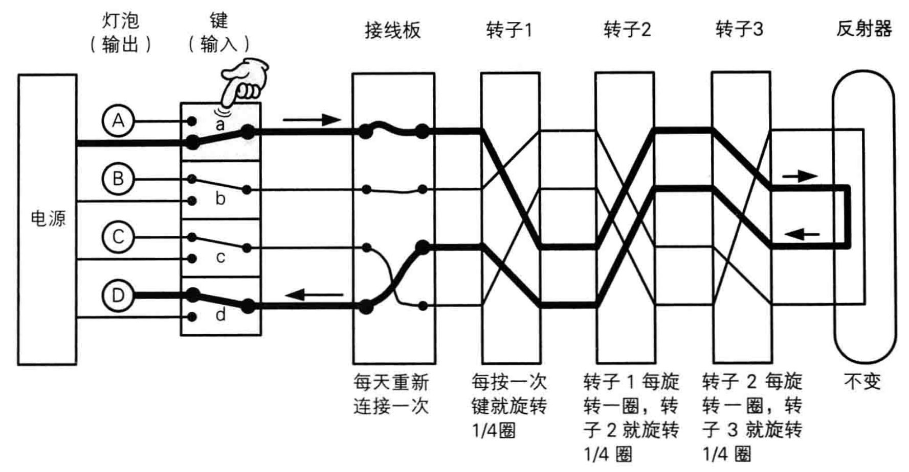
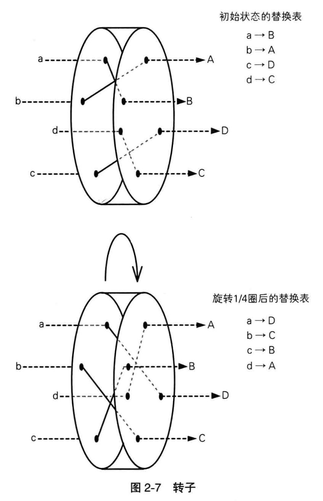
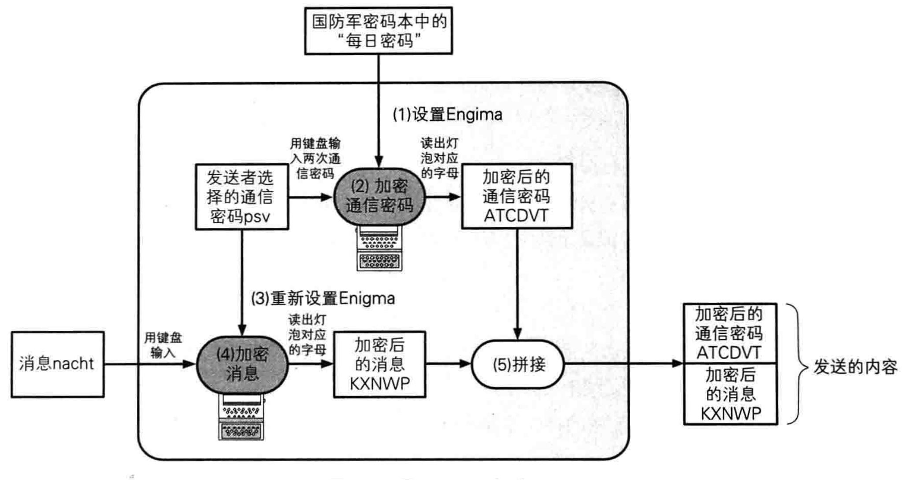
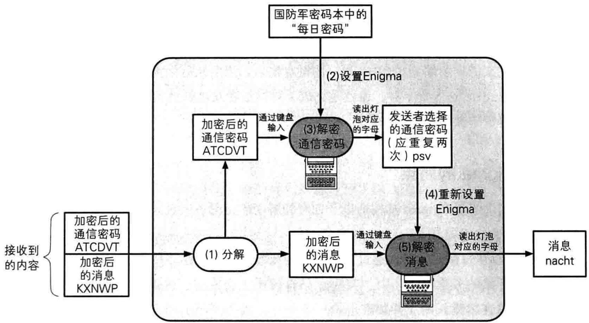

### 对称加密与非对称加密

* 对称加密：加密解密使用同一密钥
* 非对称加密：加密解密使用不同的密钥

| 信息安全所面临的威胁 | 受威胁的特性 | 用来应对的密码技术         |
| ---------- | ------ | ----------------- |
| 窃听         | 机密性    | 对称、非对称加密          |
| 篡改         | 完整性    | 单向散列函数、数字签名、消息认证码 |
| 伪装         | 认证     | 消息认证码、数字签名        |
| 否认         | 不可否认性  | 数字签名              |

# 历史上的密码

## 凯撒密码

将字母表中的字母平移的这个操作就是这个密码的算法。

### 对应方法

暴力破解

## 简单替换密码

### 对应方法

频率分析法：英文字母中“e”出现的频率最高

## Enigma

### 使用Enigma加密

通信密码中三个字母实际上代表了三个转子的初位置。通信密码“psv”表示分别将1、2和3转子转到p、s、v对应的位置。

### 每日密码和通信密码

每日密码用来加密通信密码。这样的密钥，一般称为KEK。

### 避免通信错误

输入两次通信密码

### 使用Enigma进行解密

