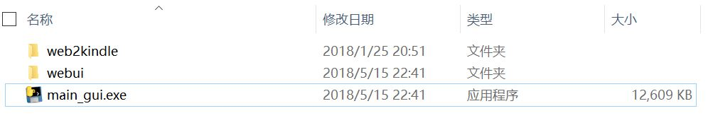
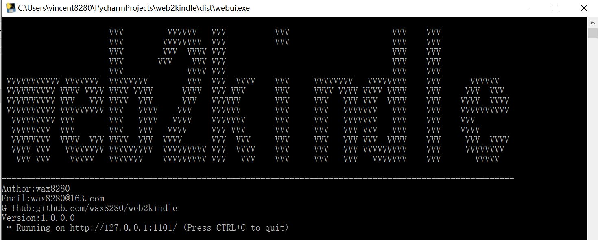
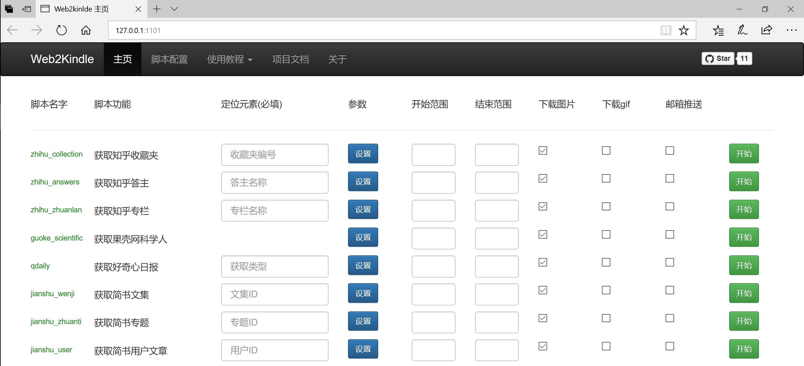
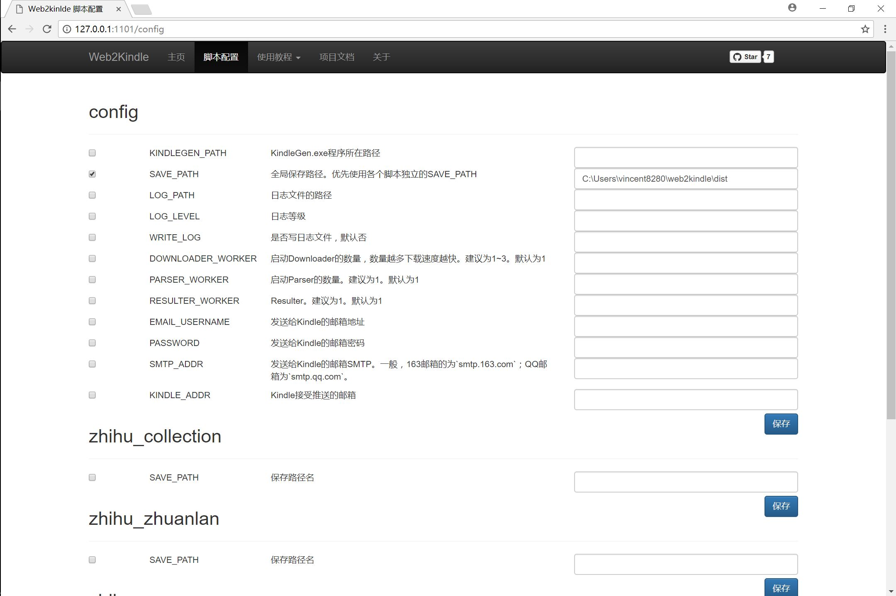
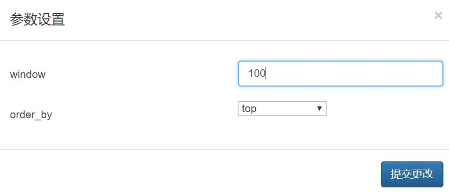

# Web2kindle GUI简介

`Web2kindle`项目提供一系列脚本，将知乎、知乎日报、好奇心日报、果壳、简书等网站的内容批量获取并解析打包成`mobi`格式供Kindle阅读。

# 快速开始

## 下载

访问[web2kindle百度云地址](http://pan.baidu.com/s/1kV8Bqpp)下载最新版`Web2kindle GUI`与`Kindlegen`，并解压。

进入`Web2kindle`程序的目录，如图所示。这个目录称为程序的`根目录`。

### 放置Kindlegen程序

进入`根目录/web2kindle/bin`文件夹。将下载好的`Kindlegen`程序放入该文件夹内（**不要修改文件名**）

## 运行

双击`main_gui.exe`程序运行。如图所示。

运行后，打开浏览器访问[127.0.0.1:1101](127.0.0.1:1101)。如图所示。（至于为什么要默认用1101端口，因为那是我女朋友的生日。如果在你的电脑上该端口有冲突，你可手动修改`根目录\web2kindle\config\config.yml`文件，新增一个`WEBUI_PORT`配置项，值为你所希望的端口号。）

### 配置

进入`脚本配置`，**将`Config`下的`SAVE_PATH`设置为你想保存结果的路径**。确保**文件夹存在且路径不含中文名**，也可以单独对每个脚本设置`SAVE_PATH`参数。如图所示。

**配置完成之后，请重启`web2kindle`**

### 主页

#### 定位元素

我们需要用一个唯一的元素来定位我们要获取的内容。

如对于知乎收藏夹`https://www.zhihu.com/collection/199993533`，其定位元素为`199993533`

详见`附录`里面各个脚本的`i`参数。

#### 参数

每个脚本都有一些个性化的参数可供设置。如获取简书某一用户所有的文章的脚本`jianshu_user`。其在`附录`下的`参数`是这样的。

- --i：简书用户的定位元素ID。如`https://www.jianshu.com/u/74307f7c1d61?utm_source=desktop&utm_medium=index-users`的定位元素ID为“74307f7c1d61”

- --window：每本电子书所含最大文章数，默认50
- --order_by：
  - top：按热门排序
  - commented_at：按评论时间排序
  - added_at：按添加时间排序（默认）

除了`i`参数之外，其他的参数我们都可以设置。如下我们设置每本电子书有100篇文章，并且按照热门排序获取文章。

#### 开始范围、结束范围

可选参数，在获取一个很大的栏目的时候，**建议你分点来获取**。对于不同的脚本，因为源的不同，所以这个参数也会有所不同。具体可以到`附录`里面查看。

#### 下载图片、gif

默认不下载gif，因其占用体积太大

#### 邮箱推送

`Web2kindle`支持邮箱推送，免除了Kindle连接电脑的烦恼。具体请看`更进一步-推送到Kindle`

# 更进一步

## 推送到Kindle

如果需要推送到Kindle，需要在配置文件里面新增如下配置项。

- EMAIL_USERNAME(可选)：发送给Kindle的邮箱地址。
- PASSWORD(可选)：发送给Kindle的邮箱密码。
- SMTP_ADDR(可选)：发送给Kindle的邮箱SMTP。一般，163邮箱的为`smtp.163.com`；QQ邮箱为`smtp.qq.com`。
- KINDLE_ADDR(可选)：kindle的邮箱地址。

注意，该推送将会推送目标文件夹下面所有mobi文件。**所以每次推送完你应该手动清除目录下的mobi文件，避免下次出现重复推送的情况。**

## 增量更新

在运行过一次`Web2kindle`之后，目标文件夹下面出现一个名为`article.db`的数据库文件。`Web2kindle`每次下载的时候都会检查这个数据库，避免重复下载。

举个例子，比如我知乎专门有一个收藏夹收藏要推送到Kindle的文章。每天我在知乎上收藏十篇文章，希望使用`Web2kinlde`每天仅下载新增的十篇文章，而不是把全部文章都获取下来。那么在第一次获取该收藏夹所有内容之后。第二天再往这个收藏夹新增十篇文章，再次运行`Web2kindle`会仅仅下载新增的那十篇文章而不会把收藏夹里全部文章重新下载一遍。

这个功能称之为`增量更新`。如果你不需要这种功能，你可以**手动删除目标文件夹下面的`article.db`文件。**

## 目录结构

在运行过一次`Web2kindle`之后，我们发现目录文件夹下面多出了几个文件。分别是：

- `article.db`：存放已下载文章的数据库
- `kindlegen.log`：kindlegen程序运行日志
- `static`：存放下载的图片的文件夹

# 附录

## 脚本

### zhihu_collection

批量获取知乎收藏夹。

#### 参数

- --i：知乎收藏夹的编号。如`https://www.zhihu.com/collection/191640375`的编号为“191640375”

- --window：每本电子书所含最大文章数，默认50

#### 开始范围、结束范围

取页数。

### zhihu_zhuanlan

批量获取知乎专栏。

#### 参数

- --i：知乎专栏的编号。如`https://zhuanlan.zhihu.com/vinca520`的编号为“vinca520”

- --window：每本电子书所含最大文章数，默认50

#### 开始范围、结束范围

取文章篇数，最少一页即~~20~~（我也不知道多少）篇。如结束范围是`30`的话。则会下载40篇文章。

### zhihu_answers

批量获取知乎某人的全部回答。

#### 参数

- --i：知乎答主的ID。如`https://www.zhihu.com/people/zhong-wen-sen/answers`的ID为“zhong-wen-sen”

- --window：每本电子书所含最大文章数，默认50

#### 开始范围、结束范围

取文章篇数，最少一页即~~20~~（我也不知道多少）篇。如结束范围是`30`的话。则会下载40篇文章。

### zhihu_daily

批量获取知乎日报

#### 开始范围、结束范围

取日期。开始默认今天，结束默认今天。也就是**默认获取今天的所有文章**。日期格式如下`20180212`。**开始日期必须小于或等于结束日期**。

### guoke_scientific

批量获取果壳网科学人下的所有文章。

#### 参数

- -window：每本电子书所含最大文章数，默认50

#### 开始范围、结束范围

取文章篇数，最少一页即~~20~~（我也不知道多少）篇。如结束范围是`30`的话。则会下载40篇文章。

### qdaily

批量获取好奇心下的所有文章。

#### 参数

可选参数：

- --i：制定类型，默认为`home`
  - home：首页
  - business：商业
  - intelligent：智能
  - design：设计
  - fashion：时尚
  - entertainment：娱乐
  - city：城市
  - game：游戏
  - long：长文章
- --window：每本电子书所含最大文章数，默认50

#### 开始范围、结束范围

取日期。开始默认今天，结束默认今天。**也就是默认获取今天的所有文章。**日期格式如下`2018-12-12`。因为是倒叙获取，**开始日期必须大于或等于结束日期。**

### jianshu_wenji

批量获取某一简书文集下的所有文章。

#### 参数

- --i：简书文集的ID。如`https://www.jianshu.com/nb/4431345`的ID为“4431345”
- --window：每本电子书所含最大文章数，默认50
- --order_by：
  - seq：按目录排序（默认）
  - commented_at：按评论时间排序
  - added_at：按添加时间排序

#### 开始范围、结束范围

取页数。

### jianshu_zhuanti

批量获取某一简书专题下的所有文章。

#### 参数

- --i：简书专题的定位元素ID。如`https://www.jianshu.com/c/1a54c5910458`的定位元素ID为“1a54c5910458”

- --window：每本电子书所含最大文章数，默认50
- --order_by：
  - top：按热门排序
  - commented_at：按评论时间排序
  - added_at：按添加时间排序（默认）

### jianshu_user

批量获取某一简书专题下的所有文章。

#### 参数

- --i：简书用户的定位元素ID。如`https://www.jianshu.com/u/74307f7c1d61?utm_source=desktop&utm_medium=index-users`的定位元素ID为“74307f7c1d61”

- --window：每本电子书所含最大文章数，默认50
- --order_by：
  - top：按热门排序
  - commented_at：按评论时间排序
  - added_at：按添加时间排序（默认）

#### 开始范围、结束范围

取页数。