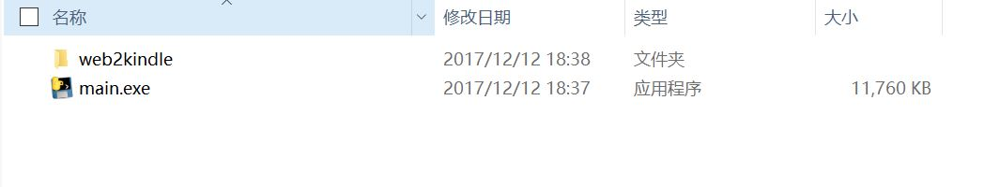
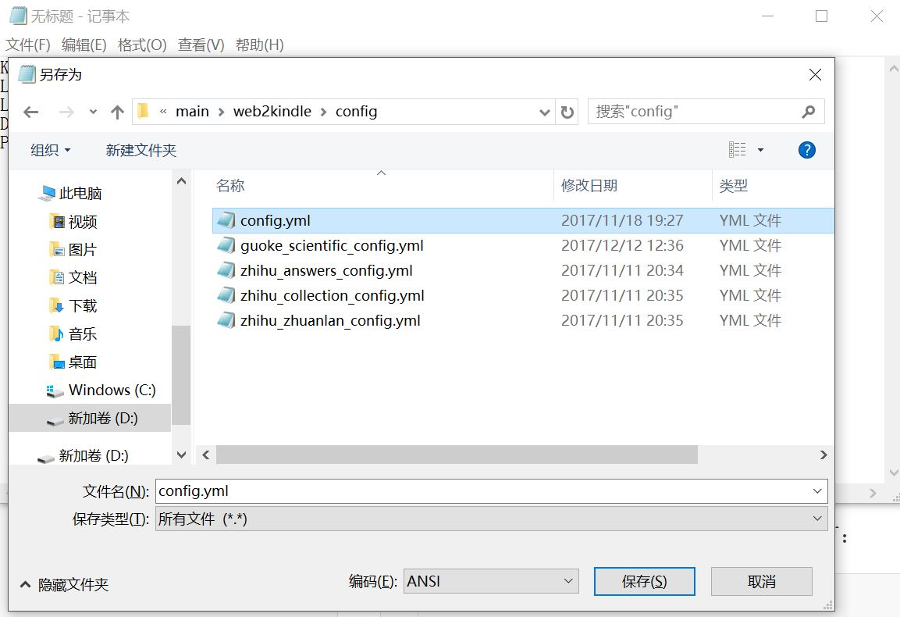

# Web2kindle简介

`Web2kindle`项目提供一系列脚本，将知乎、果壳等网站的内容批量获取并解析打包成`mobi`格式供Kindle阅读。

# 快速开始

## 下载

访问[web2kindle百度云地址](http://pan.baidu.com/s/1kV8Bqpp)下载最新版`Web2kindle`与`Kindlegen`，并解压。

## 配置

进入`Web2kindle`程序的目录，如图所示。这个目录称为程序的`根目录`。



### 放置Kindlegen程序

进入`根目录/web2kindle/bin`文件夹。将下载好的`Kindlegen`程序放入该文件夹内（**不要修改文件名**）。

### 编写配置文件

配置文件是一个个后缀名为`yml`的文本文件。

配置文件放在`根目录/web2kindle/config`文件夹下。

#### 编写`config.yml`

我们在Windows下可以使用记事本来编写配置文件。我们可以到[Web2kindle文档](https://github.com/wax8280/web2kindle#configyml)浏览详细的配置选项。

以`Web2kindle 0.2.0.0`版本为例。配置项就有：

- KINDLEGEN_PATH(可选)：KindleGen.exe程序所在路径
- SAVE_PATH(可选)：全局保存路径。优先使用各个脚本独立的`SAVE_PATH`。

- LOG_PATH(可选)：日志文件的路径
- LOG_LEVEL：日志等级
- WRITE_LOG(可选) : 是否写日志文件，默认否


- DOWNLOADER_WORKER(可选)：启动Downloader的数量，默认为1，建议为1~3。
- PARSER_WORKER(可选)：启动Parser的数量，默认为1，建议为1。
- RESULTER_WORKER(可选)：启动Resulter的数量，默认为1，建议为1


- EMAIL_USERNAME(可选)：发送给Kindle的邮箱地址
- PASSWORD(可选)：发送给Kindle的邮箱密码
- SMTP_ADDR(可选)：发送给Kindle的邮箱SMTP。一般，163邮箱的为`smtp.163.com`；QQ邮箱为`smtp.qq.com`。
- KINDLE_ADDR(可选)：Kindle接受推送的邮箱。

我们尝试编写一个如下的配置文件：

```
# 注意冒号旁的两个空格，且所有符号为半角符号（即英文输入法时打出的符号）
SAVE_PATH : 'd:\Web2kinlde_data'
LOG_LEVEL : 'INFO'
DOWNLOADER_WORKER : 3
```

请确保配置项所指向的`d:\Web2kinlde_data`文件夹不含中文且确实存在。最后我们保存名为`config.yml`的文件。放在`根目录/web2kindle/config`文件夹。如图所示。



## 运行

`win+r`打开运行，输入`cmd`打开命令提示符。

### 切换到程序根目录

一切操作需在程序`根目录`进行。假设程序`根目录`放在`D:\web2kindle 0.1.2.2\main`

输入命令

```
D:
cd D:\web2kindle 0.1.2.2\main
```

### 运行脚本

对于每个网站都要编写不同的脚本来获取、解析、清洗元数据。我们在`根目录`可以通过以下命令来运行脚本。

```
main.exe 脚本名称 参数
```

所有的脚本可以参见[Web2kindle文档](https://github.com/wax8280/web2kindle#脚本)。（因为我们是直接运行exe文件，所以需将文档里面的`python main.py`改为`main.exe`）

这里我们举例如何批量获取知乎收藏夹。

在我们配置好配置文件之后，切换到`根目录`。假设我们需要批量获取https://www.zhihu.com/collection/191640375第五页到最后一页。输入如下命令：

```
main.exe zhihu_collection --i=191640375 --start=5
```

其中`--start`为可选参数，你也可以直接`main.exe zhihu_collection --i=191640375`。即可获取该收藏夹全部内容。

其中`zhihu_collection`就是批量获取知乎收藏夹的脚本名。而`--i=67258836 --start=1 --end=3`即是运行该脚本的参数。

# 更进一步

## 为每个脚本写单独的配置文件

我们可以为每个脚本编写一个单独的配置文件。我们可以在[Web2kinlde脚本](https://github.com/wax8280/web2kindle#脚本)下找到每个脚本所需的配置文件。

如`zhihu_collection`这个脚本的配置：

```
SAVE_PATH : 'C:\Users\web2kinle_save'
```

- SVAE_PATH：保存路径名。会自动在此目录以`collection_num`生产一个子目录，元数据即保存在此子目录中。

如`config.yml`文件一样，我们使用记事本编写好配置文件之后。保存名为`zhihu_collection_config.yml`的文件。放在`根目录/web2kindle/config`文件夹。

## 推送到Kindle

如果需要推送到Kindle，需要在`config.yml`文件里面新增如下配置项。

```
EMAIL_USERNAME : example@163.com
PASSWORD : my_password
SMTP_ADDR : smtp.163.com
KINDLE_ADDR : example@kindle.cn
```

- EMAIL_USERNAME(可选)：发送给Kindle的邮箱的地址。
- PASSWORD(可选)：发送给Kindle的邮箱的密码。
- SMTP_ADDR(可选)：发送给Kindle的邮箱SMTP。一般，163邮箱的为`smtp.163.com`；QQ邮箱为`smtp.qq.com`。
- KINDLE_ADDR(可选)：kindle接受推送的邮箱地址。

在运行的时候，需加上`--email`参数。如：

```
main.exe zhihu_collection --i=191640375 --email
```

注意，该推送将会推送目标文件夹下面所有mobi文件。

## 增量更新

在运行过一次`Web2kindle`之后，在目标文件夹下面出现一个名为`article.db`的数据库文件。`Web2kindle`每次下载的时候都会检查这个数据库，避免重复下载。

举个例子，比如我知乎专门有一个收藏夹收藏要推送到Kindle的文章。每天我在知乎上收藏十篇文章到这个收藏夹，我希望使用`Web2kinlde`每天仅下载新增的十篇文章而不是把全部文章都获取下来。那么在运行一次`main.exe zhihu_collection --i=191640375`获取`191640375`所有内容之后。当我第二天再往这个收藏夹新增十篇文章，当我再次运行，`Web2kindle`会仅仅下载新增的那十篇文章而不会把收藏夹里全部文章重新下载一遍。

这个功能称之为`增量更新`。如果你不需要这种功能，你可以手动删除目标文件夹下面的`article.db`文件。

## 使用批处理添加快捷方式

我们可以编写批处理脚本，这样避免了每次都要敲命令的麻烦。如，结合上面所说的增量更新，我想每天晚上自动推送某个知乎收藏夹。我们可以编写下面如下代码，代码的意思是切换到`Web2kindle`的`根目录`然后运行`Web2kindle`。你可以根据自己的情况编写适合自己的批处理脚本。

```
C:
cd C:\Users\vincent8280\dist
main.exe zhihu_collection --i=191640375 --email
```

用记事本将该批处理脚本保存成后缀名为`bat`的文件。每次有需要运行这个文件即可，免去了敲命令的麻烦。

## 目录结构

在运行过一次`Web2kindle`之后，我们发现目录文件夹下面多出了几个文件。分别是：

- `article.db`：存放已下载文章的数据库
- `kindlegen.log`：kindlegen程序运行日志
- `static`：存放下载的图片的文件夹

